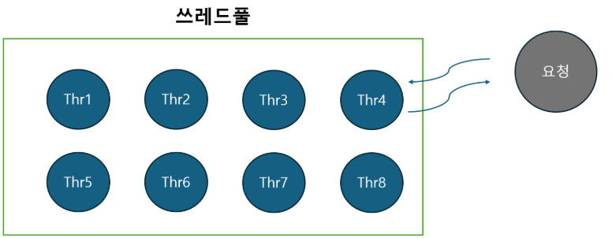
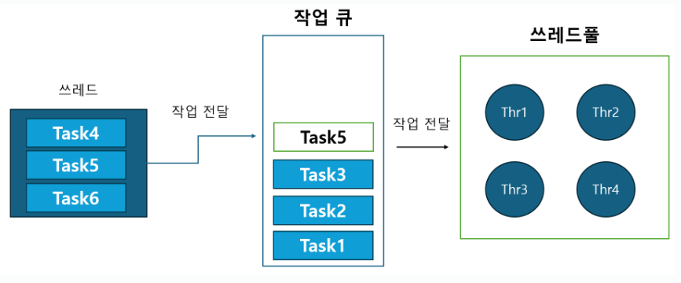

## 쓰레드풀이 필요한 이유?

쓰레드풀은 쓰레드를 미리 할당해놓고 요청이 필요할 때 미리 만들어놓은 쓰레드를 활용해서 요청을 처리하기 위한 도구 중 하나이다.
마치 식당에 비유를 하자면 미리 음식을 만들어놓고 손님이 오면 살짝 데워서 주는 것과 비슷하다.
미리 음식을 만들어놓으면 손질하고 익는데까지 시간이 줄어드는 것처럼, 
쓰레드풀을 미리 할당해놓으면 작업을 함에 있어 쓰레드를 생성하는 과정을 생략하고 작업만 등록해주면 된다.

그런데 생각을 해보면 쓰레드를 새로 생성하는 것이 그렇게 큰 비용이 들까라는 생각이 든다.
우리는 자바 애플리케이션 계층에서 쓰레드를 바라보며, 
그 땐 단순한 쓰레드 객체 단 하나로 보지만 쓰레드를 생성하기 위해선 그 하위 계층에서 더 많은 일을 해주어야 한다.

운영 체제를 배웠다면 PCB(Process Context Block)라는 레지스터 정보와 같은 프로세스 정보를 담는 구조를 프로세스의 할당 과정에서 사용함을 배웠을 것이다.
마찬가지로 쓰레드도 PCB처럼 TCB(Thread Context Block)이라는 쓰레드 정보를 담는 블록을 사용한다.
단지 PCB보다 담는 정보가 적어서 그렇지 메모리를 할당해서 TCB를 생성하고 운영체제의 스케쥴되는 부분에 등록을 해줘야 한다.

위의 과정은 커널을 통해 접근을 해야 하며, 메모리를 할당하는 명령어는 절대 가볍지 않다.
그렇기 때문에 생각보다 시간이 오래 걸리는 작업이다. 따라서, 쓰레드는 미리 할당이 되어야 한다.

시간의 측면에서도 이야기를 하였지만, 메모리의 측면에서도 쓰레드를 생각해봐야 한다. TCB라는 자료구조도 결국엔 메모리다.
메모리는? 과도하게 쓰면 DISK 영역까지 왔다갔다하는 작은 참사에서 서버가 뻗어버리는 대참사까지 일어난다.
특히나 Virtual Memory는 SWAP 영역을 가지고 있기 때문에 쓰레드가 할당돼서 일정한 영역 이상의 메모리를 사용할 시 Page fault handler 과정에서
DISK 접근이 일어난다. 이 과정이 반복되면 메모리 캐시 미스로 인해 컨텍스트 스위칭만 하다가 작업 처리가 안되는 문제가 발생할 수 있다.
이를 Thrashing 현상이라고 한다.

위의 쓰레드를 생성하는 비용 문제와 쓰레드 개수를 한정해 메모리가 고갈되는 현상을 막기 위해 사용되는 방법이 쓰레드풀이다. 
미리 쓰레드를 생성하되 특정 개수만큼 생성해놓고 사용한 뒤 재사용함으로써 쓰레드 풀은 이 목적을 달성한다.

※ 참고 용어
**Thread per request model**
하나의 쓰레드는 하나의 request를 처리할 수 있는 방식이다 .
쓰레드가 요청 때마다 생성이 된다는 특징이 있으며 작업이 과도하게 커지면 쓰레드 개수가 많아져 Thrashing 현상을 겪을 수 있다.

---
# 쓰레드풀에 관한 몇 가지 물음들

## 쓰레드 풀로 설정하기 좋은 작업에는 무엇이 있을까?

이 질문에 관한 답은 말하는 응답과 반대되는 상황을 언급하는 것이 좋을 거 같다. 쓰레드 풀로 작업을 하면 좋은 경우는 아래와 같다.

**작업 간의 의존성이 없는 작업**
작업에 대해서 의존성이 있는 경우엔 쓰레드풀 사용을 다시 생각해봐야 한다. 
쓰레드풀의 특정 쓰레드가 작업 중일 때, 해당 작업이 완료되기 위해서 Task1, Task2가 끝나야 된다는 의존성이 있는데 
하필 그 작업들이 작업 큐에만 존재하고 할당되지 않은 경우엔 쓰레드에 할당된 작업은 끝나지 않는다.

위와 같은 현상은 쓰레드풀의 쓰레드 개수가 적을수록 심해지며 쓰레드 한정 기법이 오히려 데드락과 유사한 현상을 일으키기에 쓰레드 부족 데드락이라 불린다.

따라서, 작업 간의 의존성이 없는 독립적인 작업이 쓰레드풀로 설정하기에 좋은 작업이다. 
특히나 웹에서의 요청은 대부분 무상태이기에 작업 간의 의존도가 적어 유리하다.

**작업을 다른 쓰레드로 전달하는 용도의 작업**
아래에 추가 설명을 할 예정이지만, 자바의 쓰레드는 Runnable이라는 인터페이스 형태로 정의가 될 수도 있다. 
그리고 작업은 Runnable의 형태로 전달이 가능하다.
따라서, 특정 작업이 해당 쓰레드에서 처리될 필요가 없을 때 사용하기 좋다.

**※ 표현 방식**
개인적으로는 작업을 다른 쓰레드로 전달한고 표현했었는데, 작업의 정의 부분과 실행 부분을 서로 분리한다고도 많이 표현하는 것 같다.

이러한 작업의 예는 알람이나 이메일 전송과 같은 작업이 있다.
해당 작업은 끝나는 게 중요하지 않지만 생각보다 동기적으로 처리할 시 작업 시간이 오래 걸린다.
그래서 해당 처리가 끝났는지 확인하도록 구현하면 사용자는 느린 응답 속도를 경험하게 된다.
따라서, 응답용 쓰레드는 해당 처리는 다른 쓰레드로 작업을 전달만 하고 요청을 처리만 해주는 방법을 사용할 수 있는데, 쓰레드풀이 이런 용도로 적합하다.

아래는 해당 상황에서 사용 가능한 구조이다.
쓰레드에선 Task4, Task5, Task6가 있고 Task5가 생각보다 시간이 오래 걸리는 작업이면 해당 작업(Runnable)을 던져버리면 쓰레드풀에 알아서 할당이 된다.

**짧게 실행되는 작업**
앞에서 언급한 긴 작업을 던지는 용도랑은 다르지만 작업이 길게 실행되면 쓰레드풀을 사용하는 것은 매우 위험할 수 있다.
왜냐하면, 미리 할당된 쓰레드는 한정되어 있는데 작업이 늦게 끝나기 시작하면 계속 작업 큐에 계속 작업이 쌓이게 된다.

물론, 쓰레드가 새로 생성되는 것보다 낫겠지만 이 또한 메모리이며 이 과정에서 작업을 버려주지 않으면 메모리는 고갈될 것이고 서버는 불안정해질 것이다.

이 문제는 어떻게 해결할 수 있을까 생각을 해보면 아래와 같은 선택지가 있을 것 같다.

1. 작업을 나중에 복구할 수 있는 경우라면, DB 테이블과 로그를 하나 따로 만들어서 저장하고 수용 불가능한 서버 작업은 버린다.
2. 쓰레드풀의 수를 늘려 처리속도를 높인다. 단, 쓰레드를 무작정 늘린다고 처리속도가 높아지지 않는다는 것을 기억하자.
3. 사실 의존성이 없고 오래 걸리는 작업이라면 완전히 별도의 서버로 작업을 전달해버리는 게 나을 수도 있다.

---

## 쓰레드 풀의 크기는 어떻게 설정해야 될까?
쓰레드풀의 크기를 설정하는 것은 해당 컴퓨터의 코어의 개수와 작업의 특성에 따라서 결정된다. 사실 작업의 특성도 굉장히 많은 분류로 나눌 수 있다.

위에서 작업 사이의 의존도가 있을 때나 시간이 오래 걸리는 작업에 관해서 이야기를 했으므로 아래는 의존도가 없는 경우에 대한 쓰레드 설정을 말한다.

### 코어의 개수
코어의 개수가 중요한 이유는 CPU 내의 코어의 개수만큼 쓰레드가 동시에 스케쥴링되어 동작할 수 있다. 
그런데, 코어의 개수보다 생성해야 하는 쓰레드가 작다면 컨텍스트 스위칭에 관해서 생각하지 않아도 될 것이다.

하지만, 코어의 개수보다 많은 수의 쓰레드가 돌아가면 컨텍스트 스위칭이 일어난다. 
사실 그럴 필요가 없는 작업에서 추가적인 작업이 일어나 오히려 많은 쓰레드가 성능저하를 일으킬 수도 있다.

따라서, 쓰레드를 무조건적으로 많게 만든다고 좋은 건 아니다.

**※ 하이퍼스레딩**
하이퍼스레딩을 지원하는 CPU를 사용하고 있다면 해당 CPU에서 메모리 접근 과정에서 낭비되는 CPU 자원을 활용하기 때문에 한 CPU에서 여러 쓰레드를 동작시킬 수 있다.
따라서, 이런 경우엔 코어 개수 이상으로 만들어도 괜찮을 수도 있다.

### 작업의 특성

**CPU bound 작업인가? I/O bound 작업인가? **

CPU를 얼마만큼 사용하는가에 따라 작업을 CPU bound 작업과 I/O bound 작업으로 분류를 할 수 있다.

**CPU bound 작업**
CPU bound 작업은 CPU만을 사용해서 중간에 쉬는 과정이 없는 부류이다. 예를 들면, 2중 for문을 돌리는 작업 같은 게 있을 것이다.
해당 작업은 중간에 쉬지 않고 계속 동작하는 게 빠르다. 
따라서, 작업이 나뉘어지지 않는다는 조건하에 한 쓰레드 내부에서 쉬지 않고 CPU를 할당받아 처리하는 것이 가장 빠르다.

보통, 이러한 작업에는 코어(논리 프로세서) 수 + 1개의 쓰레드를 생성하면 최적의 성능을 발휘한다고 한다.
왜 + 1이냐 하면 쓰레드에서 페이지 오류와 같은 여러 이유로 잠시 쓰레드가 멈출 수 있기 때문이라고 한다.

**I/O bound 작업**
I/O bound 작업은 CPU만을 사용하는 것이 아니라 디스크 I/O 같은 처리나 네트워크 I/O 처리를 위해 CPU를 쓰는 게 아니라 다른 작업이 완료돼서 끝났다는 응답을 받아서 다시 실행하는 유형의 작업을 말한다.

이 쉬는 기간 동안 CPU는 아무 일을 하지 않은 채로 해당 작업을 기다리면 귀중한 CPU자원을 낭비하는 게 된다.
이를 방지하기 위해 이를 기다리는 동안, 다른 쓰레드로 무조건 컨텍스트 스위칭이 일어난다는 특징이 있다.

따라서, 이런 작업의 유형은 실제 코어(논리 프로세서)의 수보다 많은 쓰레드를 설정해야 한다.
이 때는 코어의 개수 뿐만 아니라 작업 시간과 쉬는 시간 사이의 비율도 함께 생각해야 한다.

따라서, 다음과 같이 작성할 수 있다. 이런 부류의 법칙들이 있는데 암달의 법칙, 구스타프슨의 법칙, 리틀의 법칙 등이 있다.

자바 병렬 프로그래밍에선 다음과 같이 정의를 한다.
- Ncpu = CPU의 개수
- Ucpu = 목표로 하는 CPU 활용도, Ucpu 값은 0~1 사이 값
- W/C = 작업 시간 대비 대기 시간의 비율

위의 수치를 갖고 있을 때 CPU가 원하는 활용도를 유지할 수 있는 스레드풀은 다음과 같이 구할 수 있다.
- Nthreads = Ncpu X Ucpu X (1 + W/C)

**다른 연결 자원과 연동된 경우**
우선 데이터베이스 자원 풀과 연관이 있는 경우를 생각해보자. 
이 경우에 만약 작업 당 데이터베이스 연결 하나가 필요하다면 쓰레드풀의 최대 크기는 이 데이터베이스 연결 풀의 크기로 제한이 된다.

**자원의 연결 사용량을 제한하는 경우**
스레드 풀을 사용해서 메모리, 파일 핸들, 소켓 핸들, 데이터베이스 자원 사용량을 조절할 수도 있다.
이 때는 각 작업에서 실제로 필요한 자원의 양을 모두 더한 값을 자원의 전체 개수로 나눠주면 된다.

---

### 참고자료
https://www.youtube.com/watch?v=B4Of4UgLfWc
https://www.youtube.com/watch?v=v-iM8Wd2Wd4
병렬 프로그래밍, 브라이언 게츠
https://mangkyu.tistory.com/258
https://www.baeldung.com/java-blocking-queue
https://examples.javacodegeeks.com/java-development/core-java/util/concurrent/rejectedexecutionexception/java-util-concurrent-rejectedexecutionexception-how-to-solve-rejectedexecutionexception/