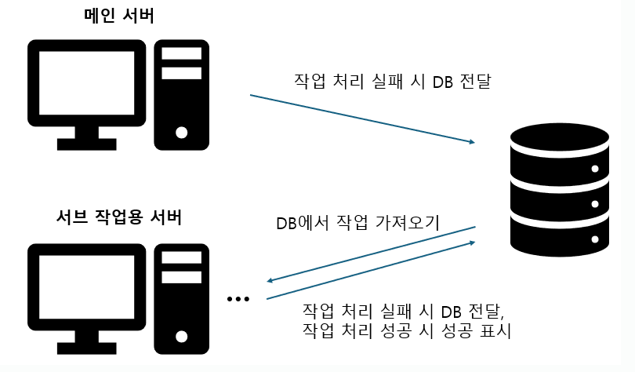

## 쓰레드풀을 Java에서 할당하는 방법?
이 편에선 자바에서 어떻게 쓰레드풀 설정에 관한 지원을 하는가를 설명하려고 한다. Java에서는 쓰레드풀을 쉽게 설정하게 하기 위해서 "Executor-"라는 이름의 형태의 라이브러리로 해당 기능을 제공한다. Executor는 쓰레드풀을 생성할 수 있지만 내부에 여러 가지 설정을 해주는 부분이 있기 때문에 이 부분에 관한 정리가 필요하다.

우선 쓰레드풀에서 작업을 담아놓는 Queue인 BlockingQueue에 관해서 어떤 종류를 지원하고 어떤 특징이 있는 지를 알아볼 것이다.
이후엔 ExecutorService를 사용해서 어떻게 쓰레드를 할당할 수 있는 지를 알아봄으로써 원하는 작업에 적절한 쓰레드풀을 할당하는 방법을 알아보려고 한다.
이후엔 어떻게 하면, 쓰레드풀을 할당하고 나서 문제를 파악할 수 있을 지에 관한 생각을 작성해보려고 한다.

---
## BlockingQueue

BlockingQueue에 관해서 간단하게 언급을 하자면 크기가 한정된 Queue라고 할 수 있을 것 같다.
그래서 사실 꼭 작업이 아니더라도 BlockingQueue 내부에는 다양한 객체들을 담을 수 있다.

단지, 개수를 제한할 수 있는 Queue이고 다양한 타입을 지원하기 때문에 쓰레드풀을 생성할 때에 작업을 담아놓는 용도로 사용될 뿐이다.
따라서, 쓰레드풀에서의 BlockingQueue에서는 작업을 표현할 수 있는 객체인 Runnable, Future, Callable 타입의 형태로 정의가 된다.

또한, BlockingQueue에서 Queue가 어떻게 해당 작업의 순서를 할 것인지에 따라, Queue의 크기를 동적으로 변경할 수 있는가에 따라 분류가 가능하다.
더 많은 종류가 있지만 3가지만 알면 충분하지 않나 싶다.

- PriorityBlockingQueue: 해당 Queue는 추가적인 Comparable 혹은 Comparator를 활용해 우선 순위에 맞게 처리할 수 있게 해준다.

- ArrayBlockingQueue: 해당 Queue는 Array 방식으로 동작하며 값을 설정하면 초기 할당할 사이즈를 설정할 수 있다.
또한, fair라는 설정이 있어서 설정 시 FIFO로 동작한다.
여기선 쓰레드 간 안전성을 위해 ReentrantLock을 Array 전체에 걸어버려서 동기화를 시킨다.

- LinkedBlockingQueue: LinkedList 방식으로 동작하며 FIFO 방식으로 동작하지만 아무런 설정이 없으면 무한하게 커질 수 있다.
메모리 문제를 방지하기 위해 제한을 해줘야 한다. 또한, 삽입하는 곳과 빠지는 곳이 다른 포인트이므로 2개의 ReentrantLock을 사용하여 작업을 처리한다.


---

## ThreadPoolExecutor에서 지원하는 쓰레드풀 생성

ThreadPoolExecutor의 생성 메소드를 보면 다음과 같은 파라미터들을 볼 수 있다.

```
public ThreadPoolExecutor (int corePoolSize,
						   int maximumPoolSize,
                           long keepAliveTime,
                           TimeUnit unit,
                           BlockingQueue<Runnable> workQueue,
                           ThreadFactory threadFactory,
                           RejectedExecutionHandler handler) { ... }
```

위를 보면 다양한 파라미터가 있는데 각각의 파라미터 별로 이야기를 해보려고 한다

**workQueue**
위에서 언급한 Runnable 타입을 가지는 BlockingQueue를 선택하는 것으로 보통은 위에서 언급한 세 가지(ArrayBlockingQueue, LinkedBlockingQueue, PriorityBlockingQueue) 중 하나를 선택하게 된다.

또한, 해당 BlockingQueue의 크기를 제한할 수 있는데, Queue의 사이즈는 corePoolSize와 MaximumPoolSize와 함께 동작한다.

**corePoolSize, maximumPoolSize**
처음에 대략적인 변수명만 봤을 때는 어떤 역할인지는 이해가 될 것이다. 
기본적인 사이즈를 할당하는 게 corePoolSize, 바쁠 때 최대로 할당되는 게 maximumPoolSize이다.

아마도, 대충 생각해보면 기본적으로 쓰레드풀에 corePoolSize만큼이 생성되고,
쓰레드가 감당이 안되면 maximumPoolSize까지 늘어났다가 Queue로 데이터가 들어갈 것 같지만 그렇게 동작하지 않는다.

Javadoc이나 해당 클래스에 관한 설명을 보면 최초 ThreadPoolExecutor를 생성한 이후에 즉시 코어 크기만큼의 쓰레드가 미리 만들어지는 게 아니라 작업이 실행되면서 코어 크기까지 차례로 커진다고 설명이 되어있다.

또한, maximumPoolSize까지 커지는 건 CorePoolSize만큼 모두 동작해서 Queue에 추가되는 시점이 아니다.
미리 제한을 한 Queue가 꽉 차서 더 이상 작업을 저장하지 못할 때에 maximumPoolSize까지의 쓰레드 증가가 시작된다.
이후에 쓰레드 증가 작업에 큐까지 가득차버려는데도 요청이 들어오면 RejectedExecutionException을 뱉는다.

결국엔 ThreadPool의 Queue 사이즈도 조절을 잘해야하며 자동적으로 아무 값을 설정하지 않으면
Queue의 사이즈는 Integer.MAX_VALUE로 설정이 되어있으므로 본인이 설정한 maximumPoolSize까지 증가하지 않게 된다.

**keepAliveTime**
쓰레드풀에서 corePoolSize만큼 동작을 하다가 작업이 한번에 몰리면 maximumPoolSize까지 증가를 시키는 것까지 이해가 됐을 것이다.

그런데 더이상 작업이 몰리지 않는 경우? maximumPoolSize까지 생성된 Thread는 메모리 낭비일 가능성이 높다.
따라서, keepAliveTime 설정을 통해서 더이상 필요없는 쓰레드가 얼마나 오랫동안 쉬었을 때 해당 쓰레드를 없앨지를 결정함으로써 불필요한 리소스를 줄이는 용도로 사용할 수 있다.

---
## 쓰레드풀 설정이 제대로 된 걸 어떻게 판별할 수 있을까?
개인적으로 이 부분은 책이나 글보다는 앞의 내용을 읽고 작성한 부분이라 틀릴 가능성이 높지만 작성해보면 아래와 같은 방법이 있을 것 같다 생각한다.

### 모니터링 시스템 적용
앞에서 언급한 부분 중 작업이 쌓인다고 표현을 했던 부분이 있었다.
쓰레드풀에서도 처리하지 못한 작업은 결국 작업을 Queue에서 대기하게 했다가 가능하면 처리하는 방식으로 돌아간다.

쓰레드풀의 크기를 충분히 키우지 않았다면 당장에는 문제가 없을 것이다.
그러나, 작업의 처리속도보다 작업이 쌓이는 속도가 크다면 메모리가 쌓일 것이고 모니터링 시스템을 활용하면 이를 포착할 수 있을 것이다.

### RejectedExecutionException 등에 관한 예외 처리
BlockingQueue의 크기를 제한하면 해당 크기 이상의 작업이 BlockingQueue에 쌓이지 않는다.
이 때, 작업을 처리하지 못한 것에 대해서 버려지는데 RejectedExecutionException예외를 뱉는다.

그럼, 이 예외를 잡아서 해당 작업을 복구할 로그나 DB 내 테이블에 기록을 해두어야 할 것이다.
모니터링을 달아놓더라도 해당 크기를 작게 설정하면 영향이 미미해서 찾기 어려울 수도 있다.
또한, 애플리케이션 내부에서 여러 쓰레드풀을 설정했다면 어떤 쓰레드풀에서 생긴 문제인지 파악하기가 어렵기 때문에 이 과정은 필수라 생각한다.

이런 처리를 해두면 확장을 하고 재시도처리를 하기도 편하다.
물론 DB의 책임이 커지겠지만 다음과 같이 사용할 수 있지 않을까 싶다.

1. 우선 메인 핵심 서버는 가능하다면 작은 쓰레드 풀에서 처리를 해보고 안되면 DB로 작업을 던진다.
2. 해당 DB에 대한 커넥션을 가진 다른 해당 작업을 처리하는 애플리케이션을 따로 연결해서 붙여 처리 완료되지 않은 작업을 불러와 처리하고 실패하면 아무런 변경하지 않는다.

그럼 아래와 같은 구조로 작업을 관리할 수 있지 않을까?
집중 대응 정책으로 제공된 방식이 있지만 개인적으로 이렇게 사용하는 편이 작업 안정성에 대해서는 더 좋을 것 같다는 생각을 한다.

※ 메인 서버와 서브 작업용 서버에는 해당 작업을 처리할 수 있는 쓰레드풀이 존재한다.



결론적으로는 둘 다 해야 될 것 같다. 메모리 상태를 체크하고 메인 서버에선 작업을 담을 수 없으면 보내되.
서브 작업용 서버에서 쓰레드풀의 작업을 처리할 최적의 쓰레드를 실험해보면서 대응해야 된다.

---
### 참고자료
https://docs.oracle.com/javase/8/docs/api/?java/util/concurrent/BlockingQueue.html
https://www.baeldung.com/java-blocking-queue
https://www.baeldung.com/java-priority-blocking-queue
https://www.baeldung.com/java-arrayblockingqueue-vs-linkedblockingqueue
https://mangkyu.tistory.com/259
https://examples.javacodegeeks.com/java-development/core-java/util/concurrent/rejectedexecutionexception/java-util-concurrent-rejectedexecutionexception-how-to-solve-rejectedexecutionexception/
