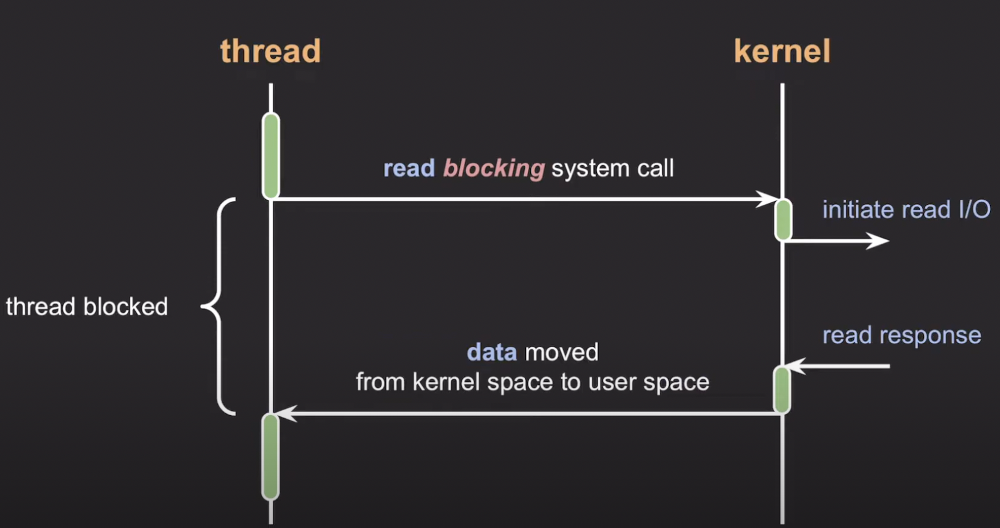
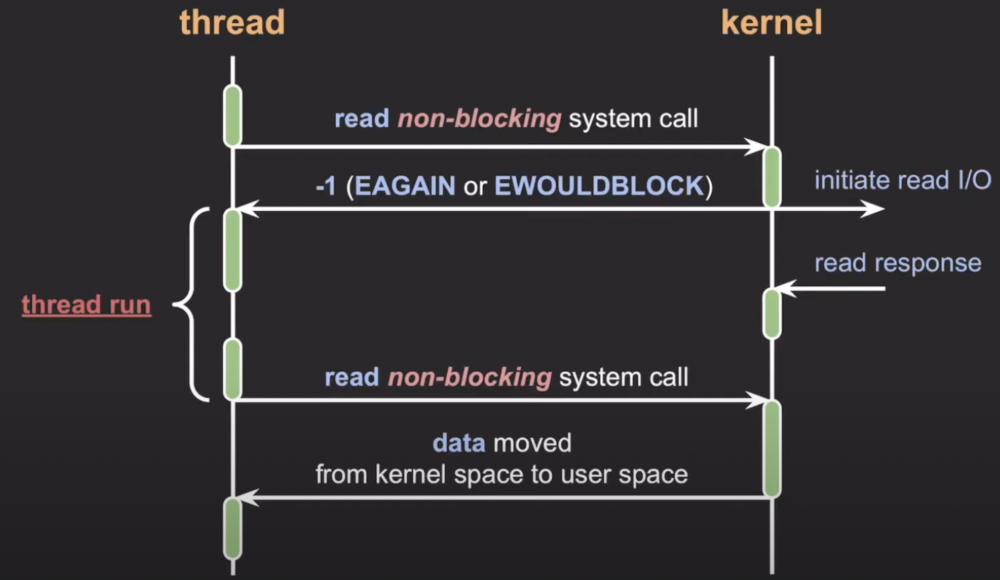
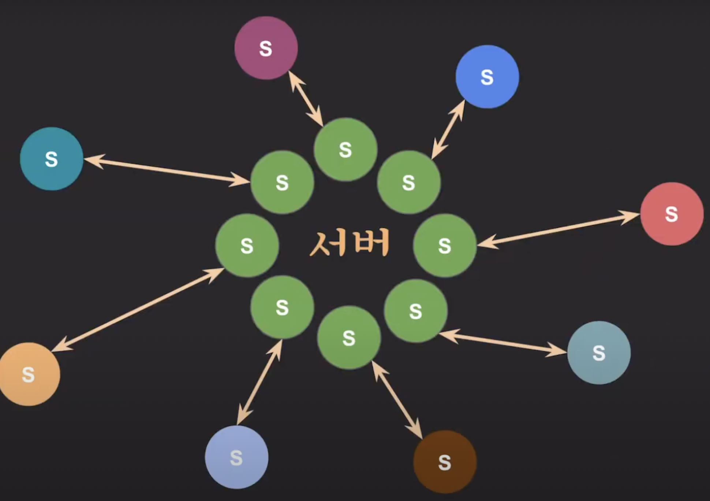
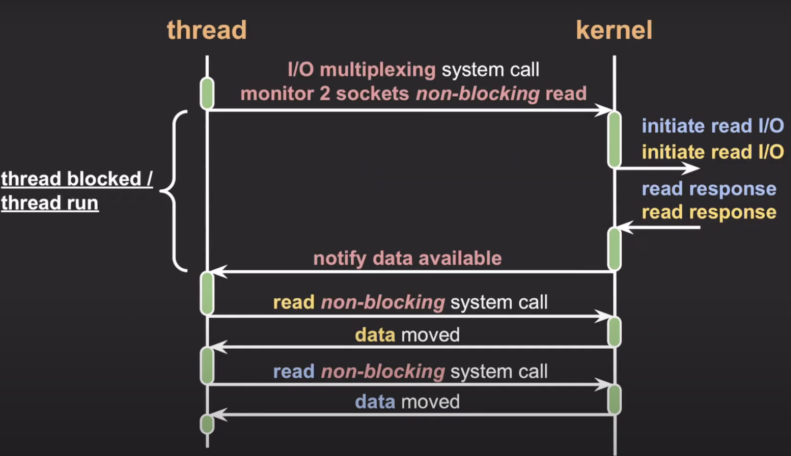

# Block I/O와 Non Block I/O의 특징

## **Block I/O**

- Block I/O는 I/O 작업이 완료될 때까지 해당 작업을 호출한 프로세스가 대기하는 방식이다.
- 읽기/쓰기 작업이 끝날 때까지 프로세스가 블록되어 다른 작업을 수행할 수 없다. (성능 저하 위험)

위의 예에서 read block 시스템 콜을 호출하게 되면 스레드는 커널에서 데이터를 읽을 때까지 block되고 데이터를 다 읽어오고 나서야 다시 실행되게 된다.

## **Non Block I/O**

- Non Block I/O는 I/O 작업이 완료되지 않더라도 프로세스가 블록되지 않고 요청에 대한 정보를 리턴한다.
- 블락되지 않고 즉시 리턴하기 때문에 스레드가 다른 작업을 계속할 수 있다.
- I/O 작업의 상태를 비동기적으로 확인하거나 알림을 통해 완료를 처리할 수 있다.

위의 예에서는 반복적으로 read non-blocking 시스템 콜을 호출하여 데이터를 읽어오게 된다. 읽을 때까지 기다렸다가 리턴하는 게 아니라 읽을 데이터가 없더라도 바로 리턴한다.

## Non Block I/O 완료 처리 방법

Non Block I/O는 I/O 작업이 완료될 때까지 프로세스가 계속해서 다른 작업을 할 수 있으므로, 완료 처리는 비동기 방식으로 이루어진다.

완료된 I/O 작업을 확인하는 방법

- **반복 확인 (Polling)**: 주기적으로 I/O 작업의 완료 여부 확인
- **I/O Multiplexing**: `epoll - linux` `kqueue - mac` `IOCP - windows`등을 사용해 다수의 파일 디스크립터를 감시하고, 완료된 I/O 작업에 대해 처리

## 반복 확인 방식 (Polling) 의 단점

- **CPU 낭비**: 주기적으로 I/O 상태를 확인하여 불필요하게 CPU 자원이 소모될 수 있다.
- **응답 지연**: 확인 주기가 너무 길다면, I/O 작업이 완료된 후에도 즉시 처리되지 않고 지연될 수 있다. (작업 완료 시간과 완료를 확인하는 시간 사이의 갭)
- **비효율성**: I/O 작업이 자주 발생하지 않는 경우에도 반복적으로 확인해야 하므로, 시스템 전체의 효율성을 떨어뜨릴 수 있다.

반복 확인으로 동작할 때 만약 요청이 여러개면 어떻게 될까? 서버에는 다수개의 소켓이 연결되어 있을텐데 해당 소켓마다 주기적으로 polling해서 데이터가 있는 지 확인하는 건 비효율적이고 CPU를 낭비하게 된다. 그렇다고 block i/o를 하게 되면 하나의 소켓에서 read를 시도하고 있는데 요청하는 쪽에서 계속 데이터를 안보내게 된다면 큰 문제가 발생하게 된다. 만약 다른 소켓에 데이터가 들어오게 되더라도 blocking된 부분에서 무기한 대기를 하고 있기 때문이다. 때문에 이를 좀 더 효율적으로 처리할 수 있는 방법이 필요했고 이 방법이 바로 I/O Multiplexing이다.

## I/O Multiplexing의 특징

I/O Multiplexing은 관심 있는 I/O 작업들을 동시에 모니터링하고, 그 중에 완료된 I/O 작업들을 한 번에 알려주는 방식이다.

**특징**

- 여러 I/O 작업을 동시에 처리할 수 있음
- 블로킹 없이 효율적으로 다수의 파일 디스크립터를 관리 가능
- 단일 스레드에서 다수의 I/O 처리를 가능하게 하여 자원 효율성 극대화

위 그림과 같이 특정 스레드에서 여러개의 소켓에 대해서 모니터링을 할 수 있다. 그리고 이 스레드는 동시에 blocking되게 할 수도 있고 non-block으로 자신의 작업을 이어서 실행할 수도 있다. 커널에서는 한번에 여러 소켓에 들어온 데이터를 notify해서 이 스레드에 알려주게 된다.

## epoll에 대해서

**epoll**은 리눅스에서 제공하는 고성능 I/O Multiplexing 방식이다.
`select`나 `poll`보다 성능이 우수하고, 대규모 파일 디스크립터를 관리할 때 효율적이다.

**특징**

- **O(1) 성능**: 감시하는 파일 디스크립터의 수와 상관없이 이벤트 발생 시 성능 일정하게 유지
- **Event-driven 방식**: 파일 디스크립터가 준비되면 이벤트를 발생시키고, 이를 처리하는 방식으로 작동하여 불필요한 반복 확인이 줄어든다.
- **동적 등록 및 제거**: 감시할 파일 디스크립터를 동적으로 추가하거나 제거할 수 있다.

- epoll은 대규모 네트워크 서버에서 많이 사용되고 비동기 I/O 처리에서 큰 장점이 있다.

## 참고자료

* [https://www.youtube.com/watch?v=mb-QHxVfmcs&t=663s](https://www.youtube.com/watch?v=mb-QHxVfmcs&t=663s)