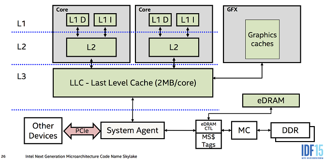

## CPU 캐시와 메모리에 관해서 설명해주세요.

### 6-1. L1, L2, L3 캐시의 차이점과 각 캐시의 동기화 시점

#### L1 캐시:
- 위치 및 크기 : 코어에 가장 가까이 존재하는 캐시로 각 코어마다 하나씩 존재
- 속도 : 가장 빠른 캐시로 CPU의 클럭 속도에 맞게 동작하여 지연 시간이 매우 짧음
- 구조 : 일반적으로 명령어 캐시와 데이터 캐시로 나뉘어져 있음.

#### L2 캐시:
- 위치 및 크기 : 여러 코어가 공유하는 형태로 존재
- 속도 : L1 캐시보다 거리적으로 멀기 때문에 접근 속도가 느리다.
- 구조 : 각 코어 별로 독립적으로 존재하거나 공유될 수 있음.

#### L3 캐시:
- 위치 : 모든 코어가 공유하는 형태로 존재한다.
- 속도 : L2 캐시보다 지연 시간이 길지만 메인 메모리보다는 훨씬 빠름
- 구조 : 모든 코어가 접근할 수 있어 코어 간 데이터 공유에 효율적

※ CPU 벤더에 따라서 L2와 L3 개념이 조금은 다를 수 있습니다.

#### 캐시 동기화(캐시 일관성) 시점:
- 데이터 수정 시 : 한 코어에서 데이터를 수정하면 다른 코어의 캐시에 해당 데이터가 존재할 수 있다.
이를 무효화하거나 업데이트 해야 한다.
- 캐시 미스(Cache Miss) 발생 시 : 상위 캐시에 데이터가 없을 때 하위 캐시나 메인 메모리에서 데이터를 가져오며,
이 과정에서 동기화가 이루어진다.
- 캐시 일관성 프로토콜 사용 : MESI(Modified, Exclusive, Shared, Invalid)와 같은 프로토콜을 통해 캐시 간의 데이터 일관성을 유지

### 6-2. 공간지역성, 시간 지역성, 순차적 지역성

#### 공간 지역성(Spatial Locality)
- 정의 : 특정 메모리 위치에 접근할 때 그 근처의 메모리 위치도 곧 접근할 가능성이 높음
- 예시 : 배열이나 연속된 메모리 구조를 순회할 때 발생
- 활용 : 캐시는 이 특성을 이용하여 메모리 블록을 한 번에 로드

#### 시간 지역성(Temporal Locality)
- 정의 : 최근에 접근한 메모리 위치가 가까운 미래에 다시 접근될 가능성이 높은 특성
- 예시 : 반복문에서 동일한 변수나 데이터에 여러 번 접근할 때 나타난다.
- 활용 : 캐시는 최근에 사용된 데이터를 유지하여 재사용 시 빠르게 접근할 수 있게 한다.

#### 순차적 지역성(Sequential Locality)
- 정의 : 메모리 접근이 연속적인 주소 순서로 이루어지는 특성
- 예시 : 프로그램이 명령어를 순차적으로 실행하거나 데이터 배열을 순서대로 읽을 때 발생
- 관계 : 공간 지역성의 한 형태로 볼 수 있다.

### 6-3. CPU 캐시와 메모리의 데이터 처리 단위
#### 캐시 라인(Cache Line)
- 정의 : 캐시와 메모리 사이에서 데이터를 전송하는 기본 단위
- 크기 : 일반적으로 64 바이트이지만, 아키텍처에 따라 32바이트에서 128바이트까지 다양함
- 동작 방식 : 캐시는 캐시 라인 단위로 데이터를 저장하고 전송, 캐시 미스가 발생 시 필요한 데이터 뿐만 아니라
주변 데이터까지 포함된 캐시 라인을 가져옴.
이는 공간 지역성을 활용해 이후 메모리 접근 시 캐시 히트 효율을 높이기 위함.

#### 블록(Block)
- 정의 : 캐시 라인과 동일한 의미로 사용되며 캐시에서 데이터를 관리하는 최소 단위
- 역할 : 캐시의 주소 매핑 및 교체 알고리즘에서 사용됨.

--- 

## 추가 정리 : Write-Back, Write-through, Allocate, No-allocate

### Write-Through
Write-Through는 Write를 할 때에 Cache Memory와 Main Memory 모두 업데이트 하는 방식이다.
캐시를 뒀을 때의 장점이 이러면 사라지는 것 가지만 이 문제를 해결하기 위해 중간에 Buffer를 둬서 CPU가 직접 메인 메모리에 접근하지는 않게 한다.

- 장점 : 캐시 일관성을 유지할 수 있다.
- 단점 : 처리 속도가 늦어진다. Cache Memory보다 Main Memory가 느리기 때문이다.

### Write-Back
Cache Memory만 업데이트하고 Cache Memory가 새로운 Data block으로 교체될 때 Main Memory에 업데이트 하는 방식이다.
해당 정책에서는 Main Memory의 Data Block이 교체될 필요가 있지 않은 이상, Cache Memory만 계속 수정된다.

- 장점 : Write-through 보다 훨씬 처리속도가 빠르다
- 단점 : 캐시 일관성 유지가 어렵다.

### Allocate
Write Miss가 발생 시 Cache Memory 위치에 곧바로 새로운 데이터 블록을 로드한다. 
Read Miss와 유사하게 동작하며 Cache Memory에 로드가 되어있기 때문에 이후 접근 시 Main Memory에서 찾아올 필요가 없다.

### No Allocate
Write Miss가 발생 시 Cache Memory에 데이터 블록 로드 없이 직접 메모리에 Write한다.
Cache Memory에 로드하지 않기 때문에 Read Miss 시 데이터가 캐시로 로드된다.

참고자료 : https://blog.naver.com/PostView.nhn?blogId=techref&logNo=222282586535