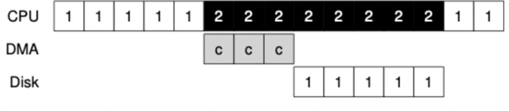

# DMA (Direct Memory Access)

## 정의

메모리 버퍼, 포인터, 카운터를 사용하여 장치 제어기가 CPU의 도움 없이 DMA 컨트롤러를 이용하여 데이터를 직접 메모리로 전송하는 입출력 방식이다.

CPU는 상태, 제어 정보만을 교환하고 데이터 전송은 I/O 장치와 메모리 간에 직접 교환하는 방식이다.

## DMA Controller는 무엇이고 어떤 역할을 하는가?

- I/O 디바이스가 메모리에 직접 접근할 수 있도록 하는 하드웨어 장치이다.
- I/O가 필요할 때 CPU는 입출력에 필요한 정보를 DMA controller에 알려주고 controller가 입출력을 수행하게 할 수 있다. (CPU는 자신의 다른 업무를 수행할 수 있게 된다.)
- DMA와 CPU가 동시에 메모리에 접근하려고 하면 충돌이 일어나기 때문에 CPU와 DMA 간의 메모리 접근 순서를 정해주는 등 통제 역할을 담당한다.

## DMA가 없는 상황에서 발생할 수 있는 문제

고속 I/O 장치의 경우 빈번한 인터럽트가 발생하는데 이는 CPU에 심각한 오버헤드를 발생시킨다.

이는 빈번한 인터럽트를 받아 처리하는 시간, Data I/O 처리가 끝날 때까지 CPU가 대기하는 점 등으로 CPU가 처리해야 하는 다른 작업에 방해될 수 있다.

## DMA를 사용했을 때 해당 문제를 해결할 수 있는 방법

DMA를 사용하면 프로그램 수행 중 인터럽트의 발생 횟수를 최소화 할 수 있다.

- DMA를 사용하면 CPU는 데이터 전송의 시작과 끝에만 관여하게 된다.
- start: CPU와 상태 정보, 제어 정보만을 교환
- finish: 데이터 전송이 완료되면 DMA에서 전송이 완료되었다는 인터럽트를 한 번 걸어준다. (CPU는 한 번의 인터럽트만 받아 처리하면 되므로 인터럽트 횟수가 적어졌다.)

## 참고자료

* [https://habbn-unitystudy.tistory.com/48](https://habbn-unitystudy.tistory.com/48)
* [https://h-devnote.tistory.com/20](https://h-devnote.tistory.com/20)
* [https://icksw.tistory.com/171](https://icksw.tistory.com/171)

