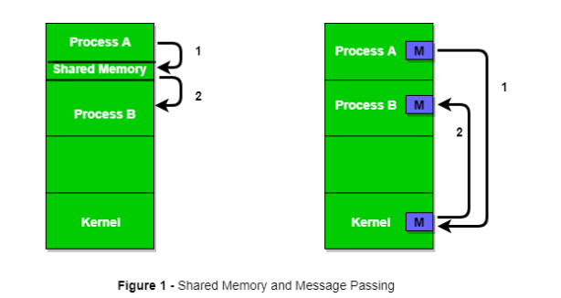

## 질문 내용 : IPC에 관해서 설명해주세요.

프로세스 사이에서 상호작용과 협력을 위해 사용되는 방법을 IPC(Inter-process communication)이라고 부른다.
이 때 적용되는 방식은 효율성과 신속성, 쉬운 소프트웨어 시스템을 설계할 수 있는가이다. 
특히나 프로세스 사이의 협력을 위해선 커뮤니케이션을 위한 메시징과 함께 동기화도 함께 고려되어야 하며, 
이 때 고려되는 IPC는 Shared Memory와 Message Passing 방법이 있다.

1. Shared Memory 방식
shared Memory 방식을 사용하기 위해서는 두 프로세스 사이에 공유하고 있는 변수가 필요하며, 
이미지의 좌측처럼 특정 영역에 대해서 공유를 하고 있다. 
이 때 해당 영역에서 처리되는 공유되는 자원에 대한 race condition과 consumer-producer 문제는 개발자가 직접처리 해줘야 한다.

2. Messaging Passing 방식
이 때는 message passing 방법으로 동작할 때 두 프로세스 사이에선 특정 shared memory가 아니라 communication link를 생성한다. 
그리고 호스트는 목적지에 대해 메시지를 보내고 목적지는 호스트에 대해서 메시지를 수신하는 방식으로 돌아간다. 
이 때, 메시지 사이즈는 고정이나 가변일 수 있다.

또한 일대일이냐 다대다냐에 따라서 다르다. 각각을 Direct Communication 방식, Indirect Communication 방식이라 부른다.

- Direct Communication : 서로 간의 직접적인 연결을 통해 작업을 한다. 출발지와 도착지가 명확하다. 
- Indirect Communication : 다대다인 경우에는 중간에 mailbox라는 것을 두고 서로 메시지를 전송하고 전달 받는다.
메시지 처리는 FIFO나 Priority 같은 방식으로 동작된다.

