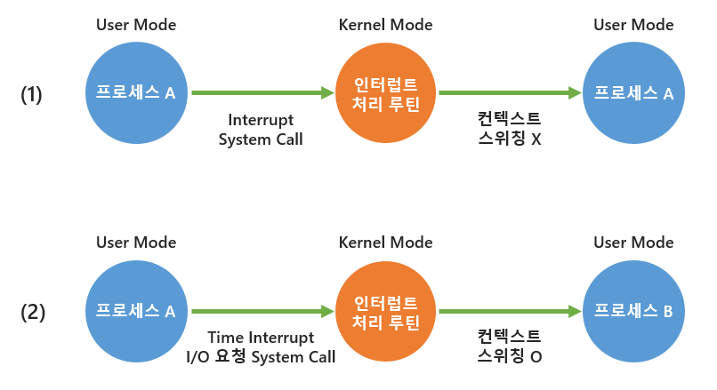

## 질문 내용 : Interrupt란 무엇인가?

### Software Interrupt
Running 상태의 프로세스가 시스템 호출 혹은 예외 상황에 의해서 Trap 상태로 넘어가는 경우를 의미한다.
예시로는 Zero Division, Page Fault와 같은 Exception을 처리 해야 하는 순간으로 인해
제어권을 잃는 문제를 얻는 경우, 혹은 본인이 제어권을 포기하는 yield 같은 system call을 호출하는 순간에 일어난다. 

### Hardware Interrupt
OS 프로세스에 의한 time slice가 끝나는 것도 CPU의 하드웨어 인터럽트에 해당하며 CPU 내부에는 시간 길이 별 타이머가 존재한다.
해당 타이머가 끝나면 제어권을 넘기게 된다.
DISK I/O와 같은 본인에게 할당된 CPU 시간은 남았지만 하드웨어 요청에 의해 CPU를 점유할 필요가 없어졌을 때 또한 의미한다.

둘의 차이는 Timer interrupt는 Ready Queue로 이동하지만, DISK I/O는 Waiting Queue로 들어가 DISK 내에서 I/O 작업이 끝났다는 신호를
보낼 때까지 대기한 후 신호를 받으면 Ready Queue로 이동한다.

### Timer Interrupt가 필요한 이유?
시분할(Time Sharing) 환경에서 특정 프로세스에게 주어진 시간(Time slice) 동안 작업을 완료하지 못했을 경우, 강제로 CPU 제어권을 뺏어 OS에게 넘겨주기 위함이다.

OS는 자신이 임의로 CPU 제어권을 뺏어올 수 없고 Interrupt에 의해서 CPU 제어권을 얻을 수 있다. OS는 Interrupt에 의해서 구동된다.

만약 CPU 제어권을 이렇게 자동으로 OS로 옮기지 않는 경우라면 프로세스가 자발적으로 CPU 제어권을 반납할 때까지 무한정 기다려야 하는 문제가 발생한다.
즉, 특정 프로세스가 CPU 제어권을 독점할 수 있으며, 이로 인해 다른 프로세스가 기아 현상을 겪게 된다. 
이를 막기 위해 일정 시간이 지날 때까지 프로세스가 CPU 제어권을 반납하지 않으면 강제로 빼았는다.

추가로 Time slice 크기가 작게 설정되는 이유 또한, 불공정한 CPU 분배를 방지하고, 최대한 응답속도를 빠르게 하기 위함이다.

### DISK I/O와 같은 Interrupt가 필요한 이유?
프로세스는 CPU 자원만을 사용하는 작업만 하는 게 아니라, DISK 자원을 사용하는 작업도 처리한다. 
이 때, DISK 작업을 하는 동안 CPU가 쉬지만 CPU 자원을 점유하는 것은 CPU 자원을 낭비하는 것이다. 이러한 자원의 낭비도 줄이는 역할 또한 한다.

### 인터럽트의 처리 과정
1. 인터럽트 요청
- 주어진 Time Slice가 모두 소요되었거나 I/O 장치에서 작업 완료를 알리기 위해 Interrupt가 발생한다.
2. 프로그램 실행 중단
- 현재 수행 중이던 연산까지만 처리한 뒤 프로그램을 중단한다.
3. 현재 프로그램 상태 저장
- 인터럽트 당한 시점의 PCB와 Program Counter 정보를 저장한다.
4. 인터럽트 벡터 확인
- CPU 제어권을 OS에게 넘겨 인터럽트 벡터를 확인한다. 인터럽트 벡터는 해당 인터럽트의 처리 루틴 주소를 가지고 있다.
5. 인터럽트 처리 루틴 실행
- 인터럽트 벡터가 가리키는 주소로 이동해 인터럽트 처리 루틴을 실행한다.
6. 상태 복구
- 인터럽트 처리 루틴이 끝나면 저장해뒀던 PCB와 Program Counter 정보를 다시 불러온다.
7. 중단된 프로그램 실행 재개
- 중단되었던 프로그램을 다시 실행한다.

또한 인터럽트가 발생했을 때 항상 컨텍스트 스위칭이 일어나는 것은 아니다. 
1번 같은 경우엔 인터럽트가 발생했지만 기존과 동일한 프로세스로 복귀하여 컨텍스트 스위칭이 발생하지 않는다.
물론 이 경우에도 CPU 수행 정보 등 컨텍스트의 일부 정보를 PCB에 저장해야 하지만 컨텍스트 스위칭보다 오버헤드가 훨신 적다.
반면 Time Interrupt나 I/O 작업을 요청하는 System Call이 발생했을 경우 기존과 다른 프로세스로 복귀하게 되므로 컨텍스트 스위칭이 발생한다.

### Interrupt가 발생해서 Trap 상태에 들어갔음에도 계속 Interrupt가 발생하는 경우엔 어떤 방식으로 처리할 수 있을까?
동시에 여러 장치에서 Interrupt가 발생하거나, 이미 Interrupt 처리 루틴을 수행 중인데 Interrupt가 발생할 수 있다. 
이를 다중 Interrupt라고 하며 Interrupt 처리 루틴의 중단 가능 여부에 따라 다음과 같이 처리할 수 있다.

1. 중단할 수 없는 경우
- 새로 들어오는 Interrupt 요청을 무시한다. 실시간 시스템이나 보안 관련 Interrupt가 이에 해당한다.
2. 중단할 수 있는 경우
- Interrupt의 우선순위를 따져서 처리한다. 현재 실행 중인 Interrupt가 새로운 Interrupt보다 우선순위가 높으면 새로 들어온 Interrupt를 미뤄뒀다가 나중에 처리한다.
반대로 우선 순위가 낮으면 새로 들어온 Interrupt의 처리 루틴을 실행한다.

Interrupt 간의 우선순위는 다음과 같다. 일반적으로 Software Interrupt보다 Hardware Interrupt가, 내부 Interrupt보다 외부 Interrupt가 우선순위가 높다.

> 전원 이상(Power fail) > 기계 착오(Machine Check) > 외부 신호(External) > 입출력(I/O) > 명령어 잘못 > 프로그램 검사(Program Check) > SVC(SuperVisor Call)

추가적으로 싱글 코어 환경과 멀티 코어 환경으로 구분해봤을 때 처리는 다음과 같다.
- 싱글 코어 환경에서의 동시에 여러 프로세스에서 Interrupt 요청이 들어오는 경우에는 동시에 실행할 방법이 없으므로 위의 방법대로 처리가 된다.
- 멀티 코어 환경에서는 동시에 여러 프로세스에서 Interrupt 요청이 들어올 때 둘 다 같이 처리를 할 수 있다. 
그 경우에도 똑같이 처리를 할 수 있지만, 코어 개수만큼 동시에 실행이 가능하다. 또한, 최대한 cache 친화도를 높이는 방식으로 동작을 하는 방식이 추가된다는 점에 있어서 차이가 있다.