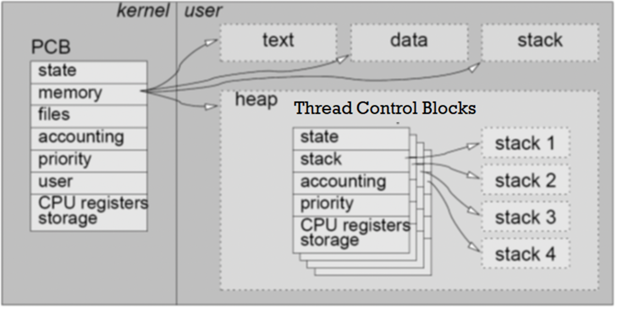

## 질문 내용 : PCB(Process Control Block)이란 무엇인가?

### PCB(Process Control Block)
PCB(Process Control Block)는 운영체제가 각 프로세스의 상태를 관리하기 위해 사용하는 자료 구조이다. 
운영체제는 이 PCB를 참조하여 프로세스를 스케줄링하고, 프로세스 간의 전환(Context Switching)을 수행한다.
PCB는 각 프로세스에 대한 중요한 정보를 담고 있으며, 이러한 정보는 프로세스가 중단되었다가 다시 실행될 때 필요한 데이터를 포함한다.

### PCB는 다음과 같은 주요 정보를 포함하고 있다:

- 프로세스 식별자 (PID, Process Identifier): 각 프로세스를 고유하게 식별하기 위한 ID.
- 프로세스 상태: 프로세스가 현재 실행 중인지, 준비 상태인지, 대기 상태인지를 나타냄.
- 프로세스 카운터 (Program Counter): 프로세스가 다음에 실행할 명령어의 주소.
- CPU 레지스터 값: 프로세스가 사용하고 있는 CPU 레지스터들의 값.
- 메모리 관리 정보: 페이지 테이블, 세그먼트 테이블 등 프로세스의 메모리 상태를 관리하는 정보.
- 입출력 상태 정보: 프로세스가 사용 중인 입출력 장치나 파일에 대한 정보.
- 우선순위: 프로세스의 우선순위 값으로, 스케줄링 시 중요한 요소.
- 계정 정보: 프로세스 소유자와 관련된 사용자 정보.
- TCB(Thread Control Block) 정보"들" 

### TCB(Thread Control Block)

- 쓰레드 식별자, 쓰레드 상태, PC, Register, 쓰레드 우선순위 등

## 질문 내용: 프로세스 컨텍스트 스위칭과 쓰레드 컨텍스트 스위칭의 차이는 무엇인가?

위의 질문은 같은 프로세스 내 쓰레드 사이의 컨텍스트 스위칭과 다른 프로세스에 있는 쓰레드 사이의 컨텍스트 스위칭이 무엇이 다른지에 관한 질문이다.

### 같은 프로세스 내의 쓰레드 사이의 컨텍스트 스위칭
같은 프로세스 내의 쓰레드 간 전환은 경량 컨텍스트 스위칭이라고 불린다. 
이 때, 쓰레드가 "같은 메모리 공간"을 공유하는 쓰레드와 변한 것이므로 메모리 주소 공간이나 파일 디스크럽터 정보를 바꿀 필요가 없다.
따라서, 쓰레드 관련 스택 정보와 쓰레드 별 PC, Register 정보만 바꿔주면 되므로 오버헤드가 작다.

### 다른 프로세스에 있는 쓰레드 사이의 컨텍스트 스위칭
다른 프로세스에 있는 쓰레드 사이의 컨텍스트 스위칭은 무거운 컨텍스트 스위칭이라 불린다.
이 때, 서로 다른 프로세스는 독립적인 메모리 공간과 리소스를 사용하고 있으므로 더 많은 변경과 복구사항이 있다.

- 변경 시 오버헤드로 작용되는 것들 : 메모리 주소 공간, 페이지 테이블 정보, 파일 디스크럽터 및 입출력 정보

이런 추가적인 물리적 교체 비용이 발생하는 것과 더불어 프로그램을 돌리며 RAM에 저장된 메모리 캐시 효과를 모두 날려야 하는 문제도 존재한다.
프로세스 사이에는 공유하는 메모리가 없으므로 cache hit이 극도로 순간적으로 낮아지며 순간적으로 성능저하가 일어난다.
따라서, 물리적으로 인한 변경과 캐시 문제를 겪으므로 다른 프로세스에 있는 쓰레드 사이의 컨텍스트 스위칭은 매우 비싸다.

### 차이점 요약

| 항목                     | 같은 프로세스 내 쓰레드 스위칭 | 다른 프로세스 쓰레드 스위칭 |
|--------------------------|-----------------------------|-----------------------------|
| 메모리 공유               | 공유                        | 독립적                      |
| 컨텍스트 스위칭 속도      | 빠름                        | 느림                        |
| 오버헤드                  | 낮음                        | 높음                        |
| 전환 시 필요한 정보       | CPU 레지스터, 프로그램 카운터 | 메모리 주소, 페이지 테이블, 파일 디스크립터 등 |
