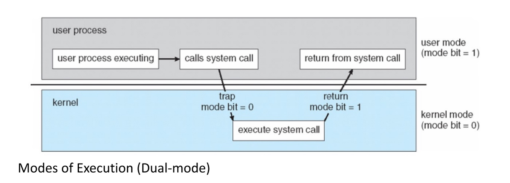
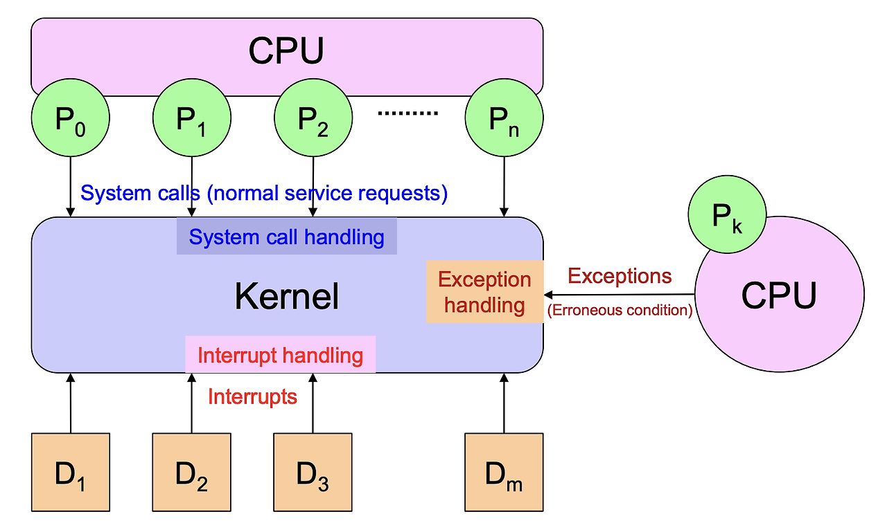

## Trap의 역할과 System Call의 역할은 무엇인가?

### OS의 듀얼 모드(Dual-Mode)
- CPU는 두 개의 서로 다른 모드를 가지고 있으며, CPU Mode를 표현하는 1-bit 레지스터가 있다.
- User mode는 일반적인 애플리케이션이 동작되는 환경
- Kernel mode는 커널이 구동되는 환경으로 이 모드에서는 OS 시스템에 영향을 줄 수 있는 명령을 내릴 수 있다.
- 사용자 단계에서 시스템에 함부로 접근할 수 없도록 하기 위해서 모드를 구분한다.
- 일반적으로 trap과 interrupt가 발생할 때, mode가 바뀐다.

### User Mode
- User Application이 실행되고 있을 때 CPU는 User mode이다.

### Kernel Mode = Privilege Mode, Supervisor Mode
- 커널이 구동되고 있을 때 (Kernel Code가 실행되고 있을 때) CPU는 Kernel Mode이다.
- Trap이 발생하거나, Interrupt가 발생하면 User Mode에서 Kernel Mode로의 Mode Switch가 발생한다.
- Interrupt와 Trap의 Handling이 끝나면, CPU Mode는 다시 Kernel Mode에서 User Mode로 돌아간다.

### Interrupt
- CPU에 예상하지 못한 외부적인 시그널이 발생하는 경우 'Interrupt'라고 한다.
- 주로 외부의 하드웨어에서 발생하는 문제이다. (일부 소프트웨어에서 발생하기도 하나 많지 않음)
- CPU는 Interrupt가 발생하면 하던 일을 중지하고 Interrupt Handling을 한다.
- Kernel로부터 Interrupt Handler를 불러들여서 Handling을 한다. (이 때, CPU의 Mode Switch 발생)
- 주로 I/O Device에서 발생한다.

### Trap
- Software에서 발생하는 interrupt를 'Trap'이라고 한다.

#### 1) Exception (실행 프로그램의 에러)
- CPU가 프로그램을 실행하던 중 '오류(에러)'가 발생하여 그 프로그램을 더 실행할 수 없는 상황이 발생한 경우를 Exception이라고 한다.
- 이 때 Kernel의 Exception Handler가 불러들여지므로, CPU Mode가 전환된다.
- ex. ZeroDivisionException, NullPointerException 등

#### 2) System Call (사용자 프로그램의 요청)
1. System Call이란, 운영체제가 application/process에게 제공하는 서비스로서, 운영체제와 application/process 간의 Interface를 의미한다.
  (ex. CPU가 프로그램을 실행하던 중 입출력을 하고 싶으면 Kernel의 System Call Handler를 콜한다.)
2. System Call이 발생하면 CPU Mode Switch가 일어난다.
3. System Call Functions은 수많은 운영체제의 function들 중 application들이 직접 호출할 수 있는 function들을 의미한다.
4. System Call Interface란 OS와 Application 사이의 Interface를 의미한다.
  - System Call 함수를 호출할 때에는 Trap이라는 Instruction(기계어 명령)을 사용한다.
  - 특정 cpu 레지스터에 system call 함수마다 번호를 붙이고, 레지스터에 번호를 넣고, trap 명령을 실행하면 
  아래의 5번 함수의 종류에 해당하는 system call이 호출된다.
5. System Call 함수의 종류
   - 프로세스 관리 제어 : 프로세스 생성, 종료, 프로세스의 이미지 로딩, 대기
   - 파일 관리 : 파일 생성, 삭제, 열기, 닫기, 읽기, 쓰기, 찾기
   - 디바이스 관리 : 입/출력 장치에 요청, 요청 거두기, 읽기, 쓰기
   - 정보 관리 : 시간/날짜 정보 세팅, 프로세스 파일/디바이스 속성 가져오기
   - 커뮤니케이션 : 네트워크를 통해서 연결을 생성/삭제, 메시지 보내기/받기 등

## 정리
### 1. Trap의 역할은 무엇인가?
#### 프로그램이 예외 상황에 직면했을 때 이를 처리할 수 있게 커널 모드로 전환하는 역할
- Trap은 실행 중인 프로그램이 특정 상황에 직면했을 때, 하드웨어나 소프트웨어가 운영 체제의 도움을 요청하는 메커니즘이다.
- 일반적으로 Exception이나 Interrupt가 발생했을 때 운영체제의 커널 모드로 전환하여 예외 처리 루틴을 실행하도록 한다.

### 2. System Call의 역할은 무엇인가?
#### 사용자 프로그램이 운영체제의 기능을 사용할 수 있도록 인터페이스를 제공하는 역할
- 시스템 콜은 사용자 프로그램이 운영 체제의 기능을 사용하기 위해 커널에 요청하는 인터페이스이다.
- 응용 프로그램이 하드웨어 자원(예: 파일 시스템, 네트워크, 메모리 등)에 직접 접근하는 대신, 운영 체제가 제공하는 함수를 호출하여 자원을 사용할 수 있도록 해준다.
- 시스템 콜을 통해 사용자 프로그램은 운영체제의 보호된 자원에 안전하게 접근할 수 있다.(접근 안전성)

#### 참고 자료
- https://velog.io/@dreamcomestrue/OS-Dual-Mode-Interrupt-Trap-Privileged-Instructions
- https://velog.io/@tlsdmsgp33/OS-%ED%8A%B8%EB%9E%A9%EA%B3%BC-%EC%8B%9C%EC%8A%A4%ED%85%9C%EC%BD%9C
- https://www.youtube.com/watch?v=v30ilCpITnY&list=PLcXyemr8ZeoQOtSUjwaer0VMJSMfa-9G-&index=11
- https://icksw.tistory.com/68
