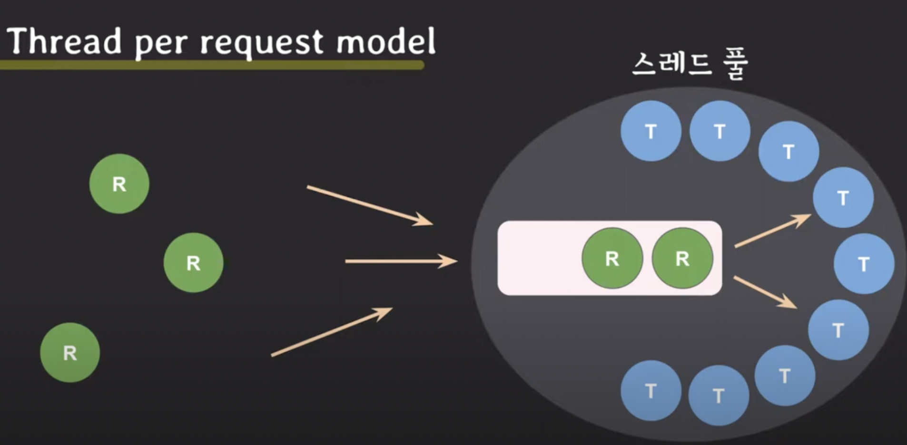

# Thread pool (스레드 풀)


스레드 풀이란 스레드를 미리 생성해두고 필요할 때 꺼내서 사용하는 방식을 말한다.


### 그렇다면 왜 스레드 풀을 사용할까?

* 만약 요청마다 스레드를 생성해서 처리하고 처리가 끝난 스레드를 버리는 방식으로 동작하면 실제 요청이 실행되는 시간뿐 아니라 스레드를 생성하는데 시간이 걸리기 때문에 응답속도가 느려진다. 
* 스레드는 kernel에서 생성하기 때문에 단순한 CPU 연산 작업보다 시간이 오래 걸린다. 만약에 서버의 처리 속도보다 더 빠르게 요청이 들어오게 된다면 스레드의 수가 계속 증가하게 된다. 이는 빈번한 Context Switch로 이어지고 CPU 오버헤드가 증가하게 된다.
* 요청이 많이 들어와서 스레드 생성의 임계점을 넘어서게 되면 메모리가 고갈되고 서버가 응답하지 못하게 된다.


### 스레드 풀의 동작

스레드 풀에서는 내부적으로 관리하는 큐와 미리 생성해둔 스레드가 있다. 요청은 이 큐로 들어오게 되고 스레드에 할당되어 실행된다. 그리고 작업이 종료되면 스레드는 버려지는 게 아니라 다시 스레드 풀로 돌아온다. 때문에 스레드 생성 시간으로 인한 오버헤드가 없어져 더 빠른 요청 처리가 가능해진다. 그리고 제한된 스레드 개수를 운용하기 때문에 무제한 스레드 생성으로 인한 메모리 고갈을 피할 수 있다.

### 스레드 풀의 사용처

- 위에서 말했던 Thread per request model에서 스레드 풀을 사용할 수 있다.
- task를 subtask로 나눠서 동시에 처리가 가능하다. ex) 덧셈 나눠서 처리
- 순서에 관계없는 task를 동시에 실행하여 처리할 수 있다.

### 스레드 개수

- CPU-bound process가 주인 경우 코어 개수만큼, 그보다 조금 많은 정도로 설정하면 좋다.
- IO-bound process가 주인 경우 작업들의 특성을 고려하여 **적절하게** 코어 개수보다 많게 설정하면 좋다.

### 스레드 풀 운영 팁

스레드 풀에서 실행될 task 개수에 제한이 없는 경우 반드시 스레드 풀 큐 사이즈에 제한을 줘야 한다. 자바에서는 Executors라는 클래스를 사용하여 다양한 스레드 풀 생성 방식을 제공한다. 그런데 아래와 같이 newFixedThreadPool() 생성 메서드를 보면 내부적으로 LinkedBlockingQueue를 생성하는데 이 부분이 바로 스레드 풀 안에 있는 큐이다. 그런데 LinkedBlockingQueue의 기본 생성자를 보면 Integer.MAX_VALUE를 인자로 넘기는데 이게 바로 큐의 사이즈이다. 즉 트래픽이 몰리게 된다면 요청이 큐에 계속 싸이면서 메모리를 고갈시킬 위험성이 있다.

```java
public static ExecutorService newFixedThreadPool(int nThreads) {
  return new ThreadPoolExecutor(
    nThreads, 
    nThreads, 
    0L, 
    TimeUnit.MILLISECONDS, 
    new LinkedBlockingQueue<Runnable>()
  );
}

public static LinkedBlockingQueue() {
  this(Integer.MAX_VALUE); // <- 기본 생성할 때, 큐 사이즈를 Integer.MAX_VALUE로 설정!!
}

public LinkedBlockingQueue(int capacity) {
  if (capacity <= 0) throw new IllegalArgumentException();
  this.capacity = capacity;
  last = head = new Node<E>(null);
}
```

따라서 일부 요청이 유실되더라도 전체 서버가 죽는 것보다는 낫기 때문에 요청 개수 제한이 없다면 반드시 큐의 사이즈를 설정해 줘야 한다.


## 참고자료

- https://www.youtube.com/watch?v=B4Of4UgLfWc&list=PLcXyemr8ZeoQOtSUjwaer0VMJSMfa-9G-&index=13