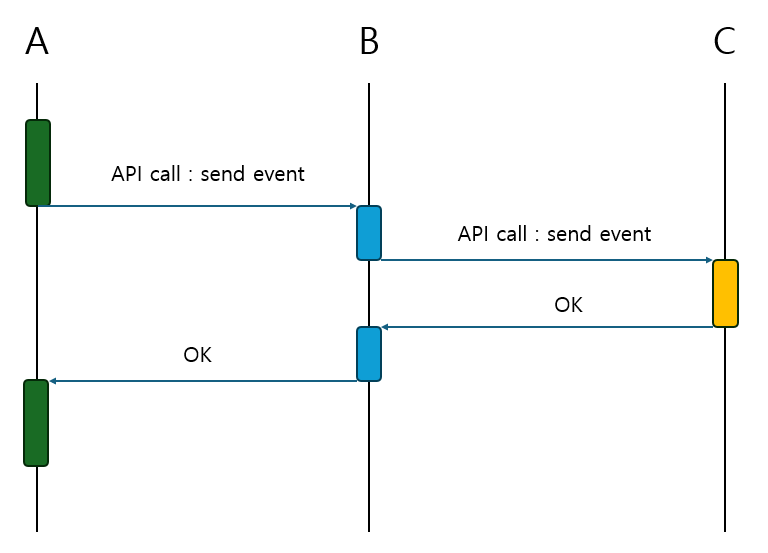
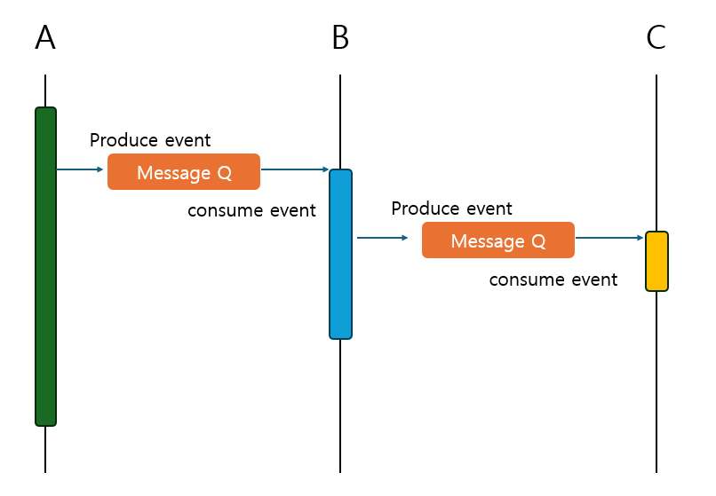

## 질문 내용 : 동기처리와 비동기처리에 관해서 설명해주세요.

- 동기(Synchronous) : 여러 작업들을 순차적으로 실행하도록 개발하는 것
- 비동기(Asynchronous) : 여러 작업들을 독립적으로 실행하도록 개발하는 것.
- Asynchronous Programming : 여러 작업들을 동시에 실행하는 프로그래밍 방법론(이 중에 Multithreading이라는 방법론이 있음.)

Synchronous communication(동기 처리와 같은 순차적 처리를 여러 서비스와 거치는 경우 생기는 문제점)

위의 그림과 같이 A, B, C라는 마이크로 서비스가 있다고 가정하자.
위의 이미지를 설명하면 A가 B의 응답을 기다리고 B가 C의 응답을 기다리는 동기적 처리를 표현한 것이다.
위의 시스템의 문제점은 순차적으로 event를 던지고 OK 응답을 기다리는 시스템이 늘어났을 때 발생한다.
만약 C에서 문제가 발생하면 B와 A는 C 신호를 기다리게 된다.
이 때, C의 응답에 관해서 적절한 처리가 없다면 A와 B는 무한히 C의 응답을 기다리다가 시스템이 뻗어버림.

해당 처리 과정에서 문제를 해결하기 위해서 타임아웃을 인터럽트를 통해 해결하는 방법이 있다.

Asynchronous communication (비동기 처리를 통한 시스템 결합도 낮추기)

위의 그림에서 이제는 A, B, C 사이에 Message Queue 같은 중간 계층을 볼 수 있다.
그럼 이제는 A에서 B로 요청을 보낼 때 응답을 기다리는 게 아니라 Message Queue에 넣고 본인의 할 일을 한다.
이젠 C의 작업이 제대로 되지 않으면 B와 A가 기다리다가 서버가 뻗는 일이 발생하지 않는다.

위의 방법은 시스템 간의 결합도를 낮추는 장점이 있고 별도로 기다려서 불필요한 대기 시간을 없앨 수 있다는 장점이 있다.
하지만, 위의 작업에서 유의해야 할 점은 Message Queue에서 작업을 소모할 때에 작업이 실패할 수도 있기 때문에
오류 시 작업 복구 방법을 고민하거나 실패하는 것들에 대해 로그를 남기는 처리가 필요하다.

참고자료 :   https://www.youtube.com/watch?v=EJNBLD3X2yg&list=PLcXyemr8ZeoQOtSUjwaer0VMJSMfa-9G-&index=15
 가상 면접 사례로 배우는 대규모 시스템 설계 기초

---

## 질문 내용 : 비동기 요청은 무조건 동기 요청보다 빠른가?

위의 질문에 대해서 답하기 위해선 가정이 필요하다.

1. 수행하려는 작업이 I/O Bound 작업일 때
2. 싱글 코어 환경에서 CPU Bound 작업일 때

### 비동기 요청의 목적
비동기 요청은 다음과 같은 목적을 위해서 사용된다.

1. 동시성 향상
   - I/O Bound 같이 작업 대기 시간을 다른 작업을 할 때 사용함으로써 많은 작업을 동시에 처리할 수 있다.

2. 응답시간 단축
    - 동기 요청에서는 앞선 작업이 끝나야 뒤의 작업이 시작된다.
    - 늦게 들어오는 요청일 수록 응답 시간이 늦어진다.

긴 시간 I/O Time 동안 CPU를 놀리지 않기 위해, 비동기 요청으로 효율성을 올릴 수 있다.

### 만약 CPU Bound Task라면?
CPU Bound Task는 애초에 CPU가 놀지 않는다. 
비동기 요청은 CPU를 놀리지 않게 하기 위함이 주목적이라 볼 수 있는데 CPU가 놀지 않는 Task에서 비동기를 적용하는 것은 어불성설이다.

오히려 수행속도가 저하될 수 있는데, 태스크를 쪼개고 병합하는 과정에서 오버헤드가 발생하기 때문이다.