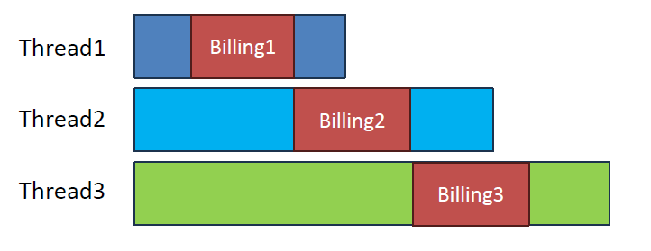
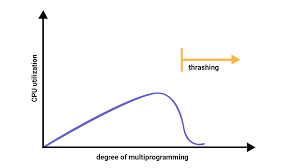

## 질문 내용 : 작업을 처리하는 쓰레드의 개수가 많으면 좋은가?

쓰레드의 개수가 많으면 성능이 좋아질 것 같다는 생각이 든다. 하지만 쓰레드가 많아진다고 무조건 좋아지는 건 아니다.
우선, 답부터 이야기를 하면 쓰레드의 개수는 '적절한' 것이 좋다.

첫 번째로 제시하고자 하는 관점은 CPU 점유의 관점이다. CPU에는 여러 개의 코어가 있고 그 코어를 최대한 활용해야 한다.
CPU 자원을 사용하지 않으면서 CPU를 점유하는 현상이 일어나서는 안된다.

이 관점에서 CPU 점유와 관련된 비효율이 발생하는 원인은 쓰레드의 임계영역이 존재하는 경우 혹은 쓰레드가 I/O 작업을 하는 경우가 있다.
정합성을 위해 임계영역을 가지는 경우 쓰레드의 임계영역은 멀티 쓰레드 환경에서 실행하더라도 '순차적'으로 실행된다.
또한, DISK 작업이 있을 때는 CPU 점유가 필요 없기 때문에 그 동안 CPU 권한을 내려놓고 다른 처리를 할 수 있다.

따라서, 아래의 그림과 같이 임계영역이 존재하는 경우에는 쓰레드가 second / 임계영역이 처리되는 시간만큼의 TPS를 처리할 수 있을 때까지만
쓰레드 개수가 증가할 때 성능이 증가하고 이 이후엔 증가하지 않을 것이다. 만약 임계영역이 처리되는 시간이 5ms라면 초당 200개의 처리까지
성능이 증가하고 이후엔 해당 작업에선 성능이 증가하지 않을 것이다. 잡다한 비용은 제거한 체 계산된 값이다.

반대로 I/O 작업이 많은 쓰레드는 모든 처리를 하는 동안 CPU 작업을 하지 않는다. 
그 작업을 내려놓는 동안 CPU를 다른 작업이 대체할 수 있다. 따라서 만약에 전체 작업 길이 중 25%가 I/O 작업이고 
나머지가 CPU 작업이라면 점유율만 고려했을 때 적정 쓰레드의 수는 CPU 코어의 개수 * (100 / 75)일 것이다.

두 번째로 제시하고자 하는 관점은 캐싱에 관한 관점이다. 
이 현상은 Thrashing 현상으로 설명되는데, Thrashing 현상은 사용하는 프로세스가 많아질 때 
어느 한계점까지는 CPU 이용률이 증가하다가 한계점 이상부터 CPU 이용률이 떨어지는 것으로 다음과 같은 그래프로 설명된다.

이러한 현상이 일어나는 이유는 page fault가 증가하기 때문이며, 쓰레드의 개수가 늘어날 때마다 최대 메모리에 담을 수 있는 용량을
벗어나게 됐을 때 디스크에 페이지 정보를 저장하게 되기 때문이다. 이 때, 해당 디스크에 저장된 페이지가 더 이상 캐시에 존재하지 않아
디스크에 접근하면서 성능저하가 일어난다.

세 번째로는 분리하는 비용에 관한 관점이다. 병렬 처리 시스템을 보면 작업을 쪼갠다고 무조건 빨라지지 않는다.
비동기적으로 처리한다? 쓰레드 개수가 많을 수록 처리가 빠른 작업은 암묵적으로 작업을 분리했을 때 서로 공유하고 영향을 주는 게 없어서 동시에 실행할 수 있다는 가정을 전제로 한다.
작업을 여러 쓰레드로 나눠서 처리하는 건 작업을 나누는 비용 + 작업을 합치는 비용이 추가적으로 발생하며 얼마까지 쪼개서 순차적으로 처리하느냐에 관한 고민도 필요하다.

한 예로 단어 개수 찾기 프로그램이 있다. 이 경우 병렬로 처리 가능하지만, 병렬로 작업 처리할 때 단순히 글자 전체를 길이로 자르면 실제 원하는 결과와
다른 결과가 나올 수 있다. 이런 경우엔 추가적인 작업이 필요하다. 이러한 이유 등으로 보통은 작업의 크기가 엄청 크지 않은 이상
나눠서 병렬적으로 처리를 바꾼다고 득을 보는 경우는 적다.

참고 자료:
  https://junshock5.tistory.com/147
  https://inpa.tistory.com/entry/%F0%9F%91%A9%E2%80%8D%F0%9F%92%BB-Is-more-threads-always-better