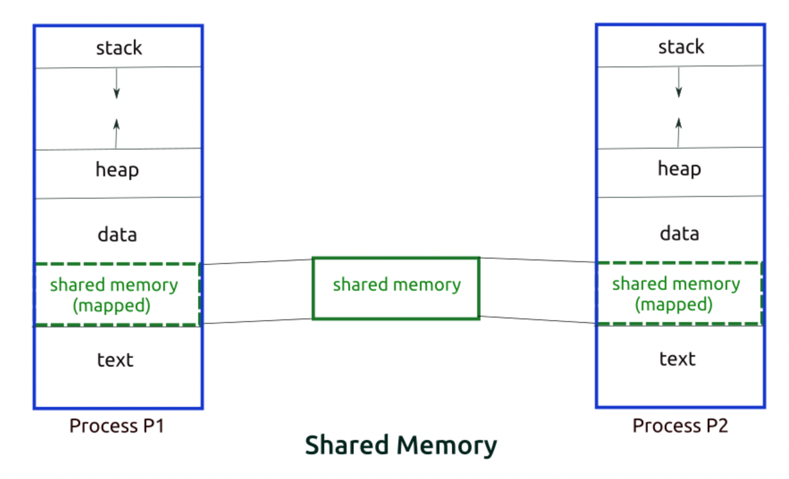
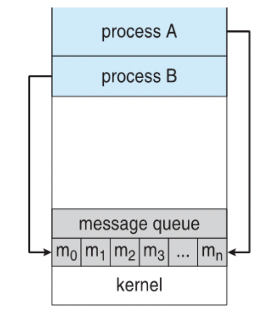

# 프로세스의 경쟁과 협력


## 프로세스 사이의 관계

프로세스 사이의 관계에는 경쟁, 공유를 이용한 협력(shared memory), 통신을 이용한 협력(Message Passing) 방식이 있다. 

## 경쟁

프로세스 간에 서로를 인식하지 못하며, 협력하지 않고 경쟁 관계를 가진다. 주로 실행되는 타이밍에 영향을 받는다. CPU, 디스크, 파일, 프린터, 메모리와 같은 공유 자원에 대해서 동시에 접근하려고 할 때 문제가 발생한다. 발생할 수 있는 문제로는 교착상태, 기아, 데이터 일관성 문제가 있다.

결국 여기서 핵심은 임계 영역에 접근하는 프로세스들간의 접근을 적절하게 처리해줘야 하는 게 중요하다는 것이다.

### 임계 영역

임계 영역이란 공유되는 자원, 동시 접근하려고 하는 자원에서 문제가 발생하지 않도록 실행되는 프로세스에게 독점을 보장해줘야 하는 영역을 말한다.

그렇다면 어떻게 임계 영역 내에 하나의 프로세스만 실행되도록 할 수 있을까? 총 3가지 조건을 만족시키면 된다.

1. **Mutual exclusion (상호 배제)** : 임계 영역에는 반드시 하나의 프로세스만 접근 가능해야 한다. 어떤 프로세스가 임계 영역에서 실행하고 있으면 다른 프로세스는 해당 영역에 진입할 수 없다. 이 조건은 추후에 정리할 데드락 조건과도 연관된다.

2. **Progress (진행)** : 임계영역에서 실행중인 프로세스가 없을 때 별도의 동작 없는 프로세스들이 진입 후보로 참여할 수 있다.
3. **Bounded waiting (한정적 대기)** : 프로세스가 임계 영역에 접근을 시도하고 들어갈 때까지의 대기 시간에는 한정이 있어야 한다. 

4. Shared Memory 방식
   shared Memory 방식을 사용하기 위해서는 두 프로세스 사이에 공유하고 있는 변수가 필요하며, 이미지의 좌측처럼 특정 영역에 대해서 공유를 하고 있다. 이 때 해당 영역에서 처리되는 공유되는 자원에 대한 race condition과 consumer-producer 문제는 개발자가 직접처리 해줘야 한다.


## 공유를 이용한 협력

프로세스 간에 서로를 간접적으로 인식하며, 자원을 공유하며 협력 관계를 가진다. 한 프로세스의 수행 결과는 다른 프로세스가 공유 자원에 처리한 작업에 따라 영향을 받을 수 있다. 가장 대표적으로는 shared Memory 방식이 있다.



프로레스가 공유 메모리 할당을 커널에 요청하면, 커널이 해당 프로세스에 메모리 공간을 할당해준다. 이후 어떤 프로세스도 여기에 접근할 수 있게 된다. 처음 공유 메모리를 할당받을 때를 제외하면 커널의 관여 없이 통신이 가능하다는 특징을 가진다.

### 장점

- 처음 공유 메모리 할당받는 것을 제외하면 커널의 관여 없이 메모리를 직접 사용하여 빠르게 IPC 통신이 가능하다. 
- 프로그램 레벨에서 통신 기능을 제공하여, 자유로운 통신이 가능하다.

### 단점

- 메시지 전달 방식이 아니기에 데이터를 읽어야 하는 시점을 알 수 없다.
- 때문에 별도의 동기화 기술이 필요하다.
- 동시에 같은 메모리 위치를 접근하는 경우가 발생할 수 있기 때문에 공유 메모리에 접근할 프로세스 간의 Lock 메커니즘이 필요하다.
- 커널 설정에 종속적이기 때문에 사용하기 전 커널에서 사용하고 있는 공유 메모리 사이즈를 확인해야 한다.


## 통신을 이용한 협력

프로세스 간에 서로를 직접적으로 인식하며, 통신을 주고받으며 협력 관계를 가진다. 한 프로세스의 수행 결과는 다른 프로세스와의 통신 결과에 따라 영향을 받을 수 있다. 이때 발생할 수 있는 잠재적인 제어 문제로는 교착상태, 기아가 있다. Message Queue나 Socket을 사용한 IPC가 대표적인 예시이다.

 

Message Passing의 경우 서로 메모리를 공유하지 않고 프로세스 간 메시지 전달로 데이터를 공유하게 된다. 두 프로세스가 메시지를 전달하려면 2가지 과정을 거치게 된다.

1. 두 프로세스 사이에 **통신 회선**을 구축해야 한다.
2. 이 후 메세지를 교환한다.

이 통신 회선을 어떻게 구축하고 메세지를 어떻게 전송하는지에 따라 Message Passing도 여러 방법으로 나눌 수 있다.

첫번째로는 **직접(Direct)/간접(Indirect) 통신**으로 나눌 수 이다. 직접 통신의 경우 어떤 프로세스에게 보낼지, 그리고 누구로부터 받을지를 명시해줘야 한다. send와 receive 시스템 콜을 사용하여 통신하게 된다.

```c
send(p, message); // 프로세스 p에게 message 전달
receive(q, message);
```

직접 통신의 경우 두 프로세스 사이에 단 하나의 회선이 자동으로 구축된다.

간접 통신 방식의 경우 프로세스에게 직접 메세지를 보내는 것이 아닌 우편함(mailbox)이라는 간접적인 매체를 통해 전송된다. 각 mailbox는 고유한 id를 가지고 있어서 프로세스가 어떤 mailbox로 메시지를 보낼 지 선택할 수 있다. 직접 통신 방식과 다르게 3개 이상의 프로세스 사이에서 데이터 공유가 가능하다.

```c
send(a, message); // mailbox a에 message를 전달
```


두번째로는 동기화 여부로 나눌 수 있다. 여기서는 일반적으로 많이 사용되는 조합인 **동기-블로킹**, **비동기-논블로킹** 조합에 대해서 생각해보자.

동기-블로킹 방식으로 동작하면 메시지를 전송하거나 메시지를 받을 때, 해당 작업이 완료될 때까지 기다리게 된다. send의 경우 메시지를 전송하고 다른 프로세스가 메시지를 받을 때까지 기다리고 receive의 경우 다른 프로세스로부터 메시지가 올 때까지 기다린다.

반대로 비동기-논블로킹 방식에서는 기다리는 거 없이 바로 다른 작업을 실행하게 된다. send의 경우 다른 프로세스가 메시지를 받는 여부에 상관없이 바로 다른 작업을 수행하고 receive도 마찬가지로 메시지가 와있으면 받고 없다면 기다리지 않고 바로 다음 작업을 수행한다.


## 참고자료

* [https://milktea24.github.io/posts/os-IPC/](https://milktea24.github.io/posts/os-IPC/)

* [https://yamyam-spaghetti.tistory.com/50](https://yamyam-spaghetti.tistory.com/50)