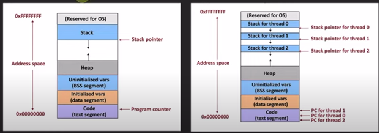
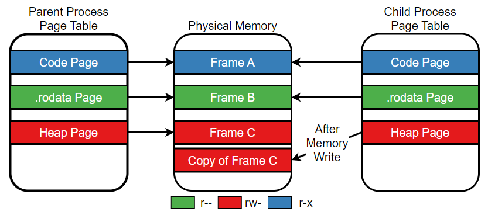
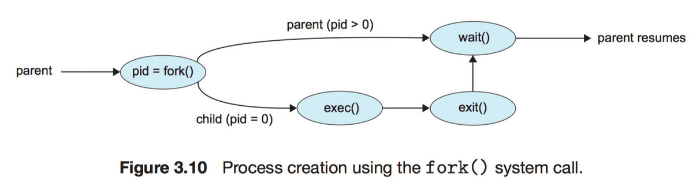
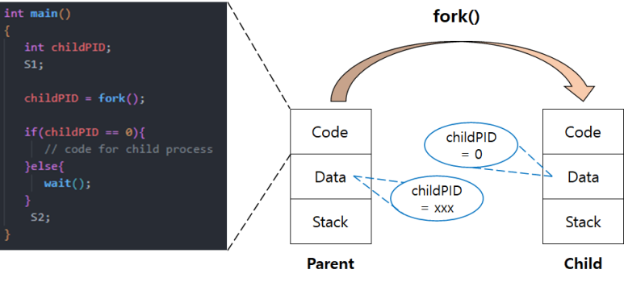

## 질문 내용 : 프로세스와 쓰레드의 차이는 무엇인가?

최근 CPU에서 CPU 자체의 클럭과 집적도를 높이는 난이도가 높아졌고, 멀티 코어 형태로 CPU를 파는 경우가 많아졌다.
멀티 코어 환경에서 최대한 여러 프로세스를 동시에 돌리는 게 가능하지만 문제는 프로세스 사이에서는 공유하는 게 없다.

### 프로세스만을 가진 시스템의 문제점
1. IPC(Inter process communication)을 필요로 한다. --> 비용 및 프로그래밍 난이도가 증가한다.
2. 프로세스는 본인만이 차지하는 공간이 매우 크다. --> 프로세스 사이의 컨텍스트 스위칭 과정에서 오버헤드가 커진다.

따라서, 위의 두 문제를 해결하기 위해 기존에 있던 스택 영역을 분리해서 쓰레드로 만들고 힙을 공유 데이터처럼 사용하는 방법을 택했다.
이를 쓰레드라고 하며, 아래와 같은 이미지로 설명된다.

### 요약:
1. 프로세스는 힙, 스택, 코드, 데이터 개별 영역을 갖고 쓰레드는 개별 스택만을 가진다.
2. 개별 스택만 가진 것이 컨텍스트 스위칭과 IPC로 인한 비용을 낮춘다.

--- 

## 질문 내용 : 자식 프로세스와 부모 프로세스 사이에는 무엇을 공유하는가?

### fork()시 복사되는 영역(부모 프로세스에서 자식 프로세스로)

- Stack
- Heap
- Data
- PCB(Process Control Block)
  - fork() 시스템 콜을 호출하면 부모 프로세스의 PCB가 복제되어 자식 프로세스의 PCB가 만들어진다.
  - 자식 프로세스는 부모의 메모리 상태를 복사하지만, PCB 내의 정보는 독립적으로 관리된다.
  - PCB에는 CPU에서 수행되던 레지스터의 값들이 저장되어 있고, Program Counter의 정보도 존재한다. 
  이로 인해, fork() 이후의 위치부터 프로그램이 실행된다.
- 텍스트(text, 프로그램 코드) 영역은 읽기 전용이므로 공유한다.

### fork()와 Copy-On-Write(COW) 정책

#### 가상 메모리와 페이지 테이블
- 가상 메모리
  - 프로세스마다 독립된 메모리 공간을 제공하는 방식
  - 각 프로세스는 자신만의 고유한 메모리 주소 공간을 가지는 것처럼 동작한다. 
  하지만, 실제로는 여러 프로세스가 하나의 물리 메모리를 공유한다.
- 페이지 테이블
  - 가상 메모리와 실제 물리 메모리 사이를 연결해주는 mapping 테이블
  - 운영체제가 페이지 테이블을 통해 가상 주소를 물리 메모리의 적절한 주소로 변환해 접근을 제어한다.

#### fork()의 기본 동작
- fork()는 부모 프로세스를 복제하여 자식 프로세스를 만든다.
이 때, 자식 프로세스는 부모의 메모리 구조(코드, 데이터, 힙, 스택 영역)을 복사받는다.
- 실제로 자식 프로세스가 부모의 메모리를 즉시 물리적으로 복사하지 않는다.
일단 자식 프로세스는 부모 프로세스와 동일한 페이지 테이블을 복사 받아 동일한 물리 메모리 공간을 참조한다.
그리고, 쓰기가 일어났을 때 별도의 메모리 영역으로 복사하여 분리한다.

#### Copy-On-Write(COW) 정책
- 물리 메모리 공유 상태에서 부모나 자식 프로세스가 메모리 데이터를 읽기만 할 때는 공유하여 성능 상의 이점을 누릴 수 있다.
- 자식 또는 부모 프로세스가 해당 메모리 공간에 쓰기 작업을 시도하는 순간, 운영 체제는 Copy-On-Write(COW) 정책을 통해 해당 페이지를 실제로 복사한다.
- 쓰기 작업이 발생할 때만 물리 메모리를 복제하여 독립된 메모리 공간을 가지게 된다.

#### 페이지 테이블의 역할
- 페이지 테입르은 가상 메모리 주소와 물리 메모리 주소 간의 매핑 정보를 담고 있다.
따라서, 처음에는 부모와 자식이 동일한 물리 메모리를 가리킨다.
- 쓰기 작업이 일어나면 운영 체제는 해당 페이지에 대해 실제 물리 메모리 복사를 수행한다.
이 때, 복사된 메모리 주소를 자식 프로세스의 페이지 테이블에 반영한다.
- 이 과정을 통해 부모와 자식은 서로 독립된 메모리 공간을 가지게 되고, 메모리 자원을 효율적으로 관리한다.
- Copy-On-Write 정책을 적용하면 쓰기 작업이 발생할 때, 필요한 부분만 복사하므로 메모리와 CPU리소스를 절약한다.

#### 완벽하게 Copy-On-Write가 최적화를 해주는가?
fork()시 메모리 정보를 지연하는 것이 최적화처럼 보이지만, 특정 작업에 따라 다를 수 있다.
한 예로 Redis의 RDB 방식은 fork를 활용해서 현재 메모리 정보를 복사해 디스크에 저장하는데 사용한다.
이 때, fork()를 통해 독립적으로 동작하여 Redis 프로세스가 중단되지 않는다는 장점이 있다.

하지만, 문제점은 변경이 일어났을 때 메모리를 한 번 더 복제한다는 점이다. 실제로 서버에서 일어나는 경우
Write 작업이 계속 일어나게 된다면 메모리를 두 배 사용하게 되므로 최대 메모리의 30-40%만을 잡고 인메모리 DB를 사용하는 게 좋다.

#### 참고자료
- https://structuring.tistory.com/130
- https://rannnneey.tistory.com/entry/%EC%9A%B4%EC%98%81%EC%B2%B4%EC%A0%9C-%ED%94%84%EB%A1%9C%EC%84%B8%EC%8A%A4-%EC%8B%9C%EC%8A%A4%ED%85%9C-%EC%BD%9Cfork-exec-wait-exit-IPCInter-Process-Commuication#google_vignette
- http://www.kocw.net/home/search/kemView.do?kemId=1046323
- https://wslog.dev/fork-exec
- https://cs-pub-ro.github.io/operating-systems/Lab/Compute/copy-on-write/

## fork() System Call 보충

### 프로세스의 생성
부모 프로세스가 자식 프로세스를 생성할 때 복제 생성을 한다. (자식 프로세스는 부모 프로세스와 같은 나이를 가짐)
프로세스 자체가 프로세스를 생성할 수 없으므로 OS 에 System Call(fork)을 걸어 요청한다.

#### PID(Process ID)
- 부모 프로세스와 자식 프로세스는 pid를 통해 구분한다. (fork()의 return 값을 통해 구분)
- 부모 프로세스에서 return을 하면 자식 프로세스의 pid를 반환하기 때문에 양수를 반환
- 자식 프로세스는 자식이 없으므로 0을 반환
- pid의 구분을 통해 부모와 자식이 서로 다른 작업을 수행할 수 있다.

주의 사항: fork() System Call을 통해 복사된 자식 프로세스는 메인 함수의 시작 부분부터가 아닌,
부모 프로세스에서 fork()된 바로 다음 위치부터 실행된다.

#### 부모 프로세스
- fork() 호출 후 부모 프로세스는 자식 프로세스의 PID를 return
- 이 때, 자식 프로세스의 PID는 항상 양수이다.
- 부모 프로세스에서 fork()가 성공하면 자식 프로세스의 고유한 PID가 return 되기 때문이다.

#### 자식 프로세스
- 자식 프로세스는 fork()가 성공하면 0을 반환 받는다.
- 자식 프로세스도 실행될 때 자신의 고유한 PID가 존재하지만, fork()시 반환되는 값은 0이다.
- 자식 프로세스가 자신의 PID가 필요한 경우, getpid()를 호출해 자신의 PID를 얻을 수 있다.

#### 오개념 주의!
- 부모 프로세스와 자식 프로세스는 각자 본인의 고유 pid를 가지고 있다.
하지만, fork() 호출 후 return 할 때 돌려주는 pid가 본인의 pid가 아닌 자식의 pid임을 유의해야 한다.
- 자식 프로세스의 고유 pid가 0이라는 식의 설명을 주의하자!

