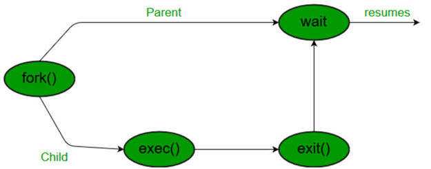

## 질문 내용 : 프로세스의 상태(State)들에는 어떤 것이 있는가?

### 프로세스의 상태
- 생성(New)
  - 프로세스가 새로 생성되기 위해 준비하는 상태로 PCB가 생성된다.
  - 메모리가 부족하면 보류하고, 메모리가 충분하면 Ready 상태로 변경한다.
  

- 준비(Ready)
  - 프로세스가 실행될 준비가 완료된 상태로 CPU가 할당되기를 기다리는 상태이다.
  - 실행 대기 큐(Ready Queue)에서 대기를 한다.

- 실행(Running)
  - 프로세스가 CPU를 할당받아 실행 중인 상태를 의미한다.
  - Interrupt(소프트웨어 인터럽트): Running 상태의 프로세스가 시스템 호출 혹은 예외 상황에 의해서 Trap 상태로 넘어가는 경우를 의미한다.
  - Block(하드웨어 인터럽트): Disk I/O 같이 본인에게 할당된 CPU 시간은 남았지만 하드웨어 요청에 의해 CPU를 점유할 필요가 없어졌을 때를 의미한다.
  이 때, 작업이 끝날 때까지 제어권을 잃고 Waiting Queue에 들어가 특정 신호를 기다리게 된다. 특정 프로세스에게 할당된 CPU 시간이 끝나서
    trap 상태로 넘어가 제어권을 잃고 다음 프로세스에게 제어권을 넘기는 과정 또한 CPU 타이머에 의한 하드웨어 인터럽트에 해당된다. 이 땐 Ready Queue로 이동한다는 차이가 있다.

- 대기(Waiting) 또는 블록(Blocked)
  - 프로세스가 특정 이벤트를 기다리는 상태이다.
  - 특정 입출력 작업이나 DISK 작업이 완료되면 신호를 받아서 준비 상태로 전환된다.

- 종료(Terminated)
  - 프로세스가 실행을 모두 마치고 종료된 상태
  - 운영체제는 프로세스의 자원을 해제하고 시스템에서 제거 된다.

## 질문 내용 : 좀비 프로세스와 고아 프로세스는 무엇인가?

### 프로세스와 관련된 시스템 콜의 종류와 특징

- fork(): 프로세스 생성을 위한 system call로 fork() 명령어로 자식 프로세스가 생성되면 자식 프로세스는 고유한 PID(Process ID)와
고유한 메모리 공간을 가진다. 또한 부모의 file descriptor의 복사본을 가진다. 
또한, 부모에 관한 PPID(Parent Process ID) 정보는 fork()를 호출해 해당 프로세스를 만든 PID의 정보를 가진다.

- exec(): 해당 system call은 현재 프로세스를 새 프로그램이나 실행 파일로 대체하는 데 사용된다.
현재 프로세스의 메모리에 새 프로그램을 로드해 기존 프로그램의 코드, 데이터 및 스택을 덮어씌운다.
exec() system call 이후의 코드는 동작하지 않으며 대상의 동작은 모두 바꿔치기 된다.

- wait(): 해당 system call은 자식 프로세스가 있는 경우 자식 프로세스가 종료되었음을 signal로 받고 
종료된 자식 프로세스를 식별해 PCB에 남겨진 종료된 자식 프로세스의 정보를 제거한다.

### 좀비 프로세스: 
좀비 프로세스는 프로세스가 종료되었음에도 메모리에서 죽지 않고 살아있는 프로세스를 의미한다.
자식 프로세스가 끝났어도 wait() 명령어를 통해 PCB 정보를 제거하지만 않아 메모리만 점유하고 있다.
그래서 좀비 프로세스는 CPU 자원을 사용하지 않으며 불필요한 PCB가 있어 추가적인 프로세스 생성에 방해를 주기만 한다.

### 고아 프로세스:
고아 프로세스는 자식이 종료되기 전에 부모 프로세스가 종료된 프로세스를 의미한다.
고아 프로세스는 운영체제에서 돌아가는 데몬 쓰레드인 init 프로세스가 대신 관리해주며 주기적으로 wait() system call을 통해
종료된 프로세스를 제거해준다. 고아 프로세스는 종료가 되지 않은 프로세스이므로 계속 실행되면서 CPU 자원을 소모한다.

