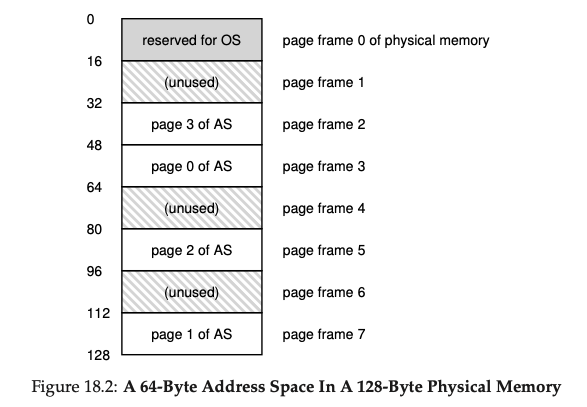
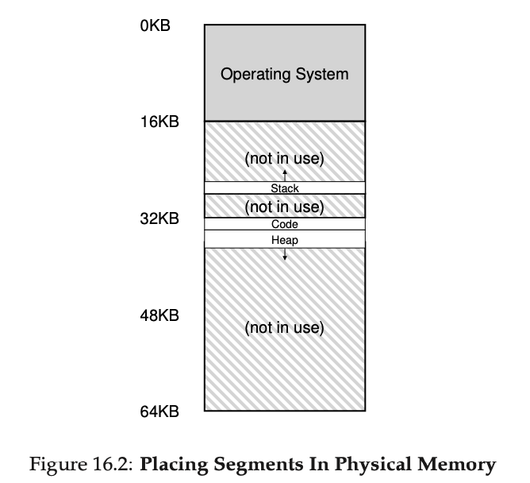
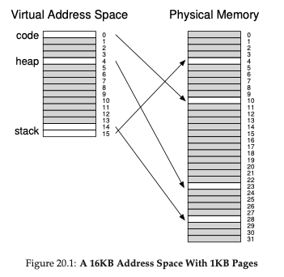
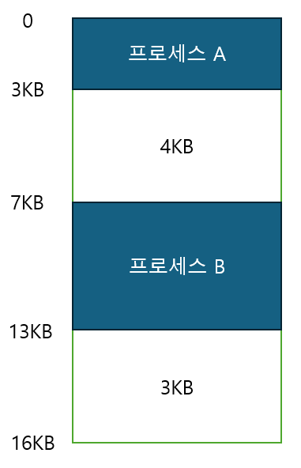
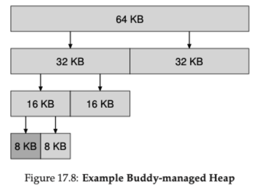
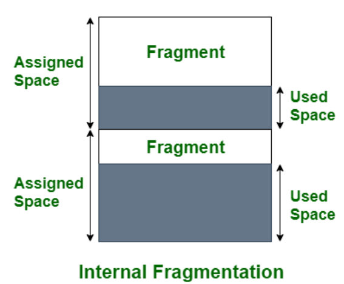

## 질문 내용 : 페이징 기법과 세그먼트 기법(Segmentation)의 차이는 무엇인가요?

### 페이징(Paging)

프로세스의 가상 메모리 공간을 고정된 동일 크기로 분할해서 관리하는 방식이다.
이 때 나누어진 단위를 페이지(Page)라고 한다. 그리고 이를 실제 물리 메모리에 할당하면 프레임(Frame)이라는 단위를 사용한다.

#### 장점
- 유연성 : Heap과 Stack이 쌓이는 방향이나 메모리의 빈 공간을 관리하는 방법 등을 고민할 필요가 없다.
- 외부 단편화 발생 불가 : 물리 메모리의 빈 공간과 할당할 메모리의 크기가 항상 동일하다.

#### 단점
- 더 많은 연산과 메모리 접근 : 주소 변환 과정에서 세그멘테이션보다 더 많은 변수를 사용한다. 
이 때 페이지 번호와 물리적 프레임 번호를 변환하는 과정에서 메모리에 접근이 필요한데, 이는 접근 속도가 느린 편이다. 
따라서, 이를 CPU단에서 캐싱해 페이지 테이블을 메모리에서 참조하는 대신 TLB를 사용하면 이 과정을 개선할 수 있다.
- 페이지 테이블 저장 공간 : 각 프로세스마다 모든 페이지에 대한 주소 변환 정보를 저장하기 위해서는 많은 양의 공간이 필요하다.
Multi-Level Page Table이나 Inverted Page Table을 사용해 개선할 수 있다.
- 내부 단편화 발생 가능 : 전체 크기가 페이지 크기의 배수가 아닐 경우 마지막 페이지에 남는 공간이 생긴다.

### 세그멘테이션(Segmentation)

프로그램을 의미 단위로 분할해서 관리하는 방식이다. 보통은 Code, Heap, Stack 영역으로 나눈다.
이 때 나누어진 단위를 세그먼트(Segment)라고 한다.

#### 장점
- 단순한 주소 변환 : 주소 변환 과정이 페이징 방식보다 단순하다.
- 동일 코드 재사용 : 같은 내용의 코드는 하나만 저장해 메모리를 절약할 수 있다.
- 보안 강화 : 의미 단위로 접근 권한을 다르게 설정해 보안을 강화할 수 있다.

#### 단점
- 외부 단편화 발생 : 세그먼트의 크기가 모두 다르기 때문에 할당을 반복하다보면 외부 단편화가 발생한다.
- 복잡한 가용 공간 관리 : 메모리의 빈 공간들이 서로 다른 크기로 여기저기에 흩어져 있다. 
따라서 적절한 빈 공간을 찾기 위한 과정이 복잡하고, 전체 빈 공간이 세그먼트 크기보다 크더라도 세그먼트를 할당하지 못하는 경우가 생긴다.
- 
### 페이지드 세그멘테이션(Paged Segmentation)

페이지드 세그멘테이션은 세그멘테이션과 페이징 두 가지 메모리 관리 기법을 결합한 방식이다.
각 세그먼트 영역 별로 나눈 뒤 영역 별로 페이지 단위로 분할한다. 즉, 하나의 세그먼트가 여러 개의 페이지로 구성된다. 
세그먼트 테이블의 엔트리 값을 세그먼트의 베이스 주소가 아니라 해당 세그먼트에 속하는 페이지 테이블의 주소로 설정한다. 

의미 단위인 세그먼트로 먼저 분할했기 때문에 동일한 코드 부분을 재사용하고 보안을 강화할 수 있다. 
그리고 페이징 방식을 적용해 외부 단편화를 줄일 수 있다. 
또한 세그먼트의 크기에 따라 필요한 만큼의 페이지만 할당할 수 있어 메모리 공간을 보다 효율적으로 사용할 수 있다.

---

## 질문 내용 : 단편화에 관해서 설명해주세요.

### 외부 단편화
외부 단편화는 메모리를 가변 크기로 할당할 때 생기는 문제이다.  
예를 들어 아래의 그림과 같이 16KB 공간에 프로세스 2개가 할당되어 있다고 생각을 해보자. 
이 때, 프로세스 A와 프로세스 B의 크기를 보듯이 프로세스의 크기는 일정하지 않다. 
일정하지 않은 크기의 메모리를 할당하기 시작하면 할당된 메모리 사이의 할당되지 않은 비연속적인 빈 메모리 공간이 생긴다. 
이러한 공간을 외부 단편화(external fragmentation)라고 한다.

#### 외부 단편화의 해결방법
외부 단편화를 해결하는 방법은 고정된 크기를 가지는 메모리로 나눠서 처음 메모리를 할당해주는 것이다.
대표적인 예시로 Buddy Allocation이나 Paging이 있다. 
아래의 Buddy Allocation 이미지처럼 메모리 공간을 특정한 크기로 나눠서 할당해주기 때문에 할당된 메모리 사이의 빈틈은 존재하지 않게 된다.
그리고 할당 후 해제할 때 쪼개진 메모리를 합병하기도 굉장히 쉬운 장점이 있다.

혹은 외부 단편화를 내버려두고 일정한 주기마다 할당된 메모리 공간을 정리해서 빈 공간을 합쳐주는 방법도 있다. 
해당 방식을 Compaction이라고 한다. 
해당 방식의 문제점은 사용하고 있는 메모리를 이동시키면서 발생하는 동안 프로세스를 중단시켜야 하는 오버헤드가 발생한다.

#### 결론
외부 단편화는 고정되지 않은 크기로 메모리를 할당하면서 발생한다. 해결방법은 고정 크기 메모리 형태로 나눠서 주면 된다.

### 내부 단편화
4-1의 답변에서 고정 크기로 메모리를 할당함으로써 외부 단편화 문제를 해결하고자 했다. 
하지만, 일정한 크기의 메모리 영역을 할당하더라도 실제 내부에서 사용하고 있는 메모리 양은 할당된 크기에 비해서 작을 수 있다. 
그러한 경우를 내부 단편화 (internal fragmentation)이라고 한다. 
아래의 그림을 보면 할당된 공간에 비해서 실제 사용하는 공간은 작은 것을 확인할 수 있다.

#### 내부 단편화 해결방법
내부 단편화를 줄이기 위해서는 고정 크기로 할당되는 블록의 크기를 줄이면 된다. 
하지만 페이징 기법을 생각해보자. 
페이지를 관리함에 있어서 PTE는 페이지의 크기를 너무 작게 관리하게 되면 동일 메모리 대비 PTE가 차지하는 메모리의 양이 커진다. 
이러한 오버헤드도 있기 때문에 고정 크기로 메모리를 할당하더라도 적절한 크기로 주어야 한다.

#### 결론
내부 단편화는 반대로 고정된 크기의 메모리 할당에 의해서 발생한다. 해결 방법은 고정 크기 메모리의 크기를 조정하는 것이다.
아니면 페이징 기법에서는 단일 Linear한 형태의 페이징 관리 테이블이 아닌 실제로 사용 중인 페이지에 대해서만
PDE(Page Directory Entry) 방식을 사용하기도 한다.

---

## 질문 내용 : 페이징 기법에서 페이지 크기에 따른 Trade-Off에 관해서 설명해주세요.

### 페이지 크기가 클 때
#### 장점
- 페이지 테이블 크기 감소
  - 동일한 가상 메모리 공간을 커버하기 위해 필요한 페이지 수를 줄여줌.
- 페이지 테이블 관리 오버헤드 감소
  - PTE의 수가 줄어들어 주소 변환에 필요한 시간과 관리 오버헤드가 줄어듦.
- 디스크 I/O 효율성 향상
  - 페이지 교체 시 더 큰 단위로 데이터를 전송하므로 디스크의 순차적 접근 특성을 활용하여 입출력 효율이 향상
- TLB 효율 증가
  - TLB Miss가 발생했을 때, 더 큰 메모리 범위를 페이지가 커버하므로 TLB 효율이 증가

#### 단점
- 내부 단편화 증가
  - 프로세스가 페이지의 일부만 사용하면 사용되지 않는 메모리가 낭비되어 페이지가 클수록 내부 단편화가 더 크게 발생
- 페이지 부재 시 추가 오버헤드
  - 불필요한 데이터까지 메모리에 로드하여 메모리 캐시의 효율이 떨어짐

### 페이지 크기가 작을 때의 장단점
#### 장점
- 내부 단편화 감소
  - 페이지가 작을 수록 원하는 데이터를 정확하게 가져올 가능성이 높으므로 내부 단편화가 감소

#### 단점
- 페이지 테이블 크기 증가
  - 동일한 가상 메모리 공간을 커버하기 위해 더 많은 페이지가 필요하므로 페이지 테이블의 크기가 증가
- 페이지 테이블 관리 오버헤드 증가
  - 주소 변환 시 더 많은 PTE를 처리해야 하므로 CPU 오버헤드가 증가
- TLB 효율 감소
  - TLB가 커버하는 메모리 범위가 작아져 TLB 미스가 증가할 수 있음
- 디스크 I/O 비효율성
  - 페이지 교체 시 작은 단위로 데이터를 전송하므로 디스크 입출력의 효율이 떨어짐

### 작업의 특성에 따른 개인적 의견
개인적으로 어떤 작업의 페이지를 불러오느냐에 따라서 차이가 있을 것 같음.
장점에서 설명한 것처럼 ArrayList 같은 연속적으로 할당된 메모리에 순차적인 작업인 경우에는
페이지 하나에서 데이터를 가져오니까 효율이 증가할 수 있을 것이라 생각함.
근데 어떻게 보면 공간이 작아도 올라가는 메모리 공간은 똑같아서 단순히 순차적 접근이 페이지가 연속적인 공간을 많이 담아서는 아니라 생각함.
실제로는 동일하게 메모리에 이미 올라가 있으면 똑같을 거 같긴 함.
대신 한번에 디스크에서 조금 가져오는 게 아니라 많이 가져와서 디스크 접근 효율이 높아져서 효율이 좋을 거 같다는 생각이 듦.

대신 완전히 랜덤 엑세스를 해버리거나 DB 같은데서 실제 물리 데이터 저장 공간과 논리적 저장 공간의 차이가 커서
서로 물리적 거리가 먼 데이터를 계속 접근하는 경우에 취약할 것으로 보임.
게다가 동일 메모리 대비 올릴 수 있는 페이지 수도 적어서 더 디스크에서 메모리로 올리는 작업이 많이 일어날 것으로 예상함.

### PTE 크기 계산

#### 페이지 테이블 엔트리(PTE)
PTE는 페이지의 주소 매핑 정보, 접근 권한, 상태 비트 등을 포함하는 자료 구조이다. 
일반적으로 32비트 시스템에서는 4바이트(32비트) 크기를 사용한다.

### 페이지 크기와 페이지 테이블 엔트리 크기(예제 1)
- 페이지 크기: 4KB(4 * 2^10 Byte)
- PTE 크기 : 4바이트(32비트)
- 오프셋 크기 : 4KB = 2^12Bit => 12비트
- 가상 페이지 넘버(VPN) : 32 - 12 => 20비트
- 페이지 테이블의 크기 = PTE의 수(2^20) * PTE 크기 = 1M * 4Byte = 4MB

### 페이지 크기와 페이지 테이블 엔트리 크기(예제 2)
- 페이지 크기 : 4MB(4 * 2^20 Byte)
- PTE 크기 : 4바이트(32비트)
- 오프셋 크기 : 4MB = 2^22Bit => 22비트
- 가상 페이지 넘버(VPN) : 32 - 22 => 10비트
- 페이지 테이블의 크기 = PTE의 수(2^10) * PTE 크기 = 1K * 4Byte = 4KB

#### 참고 자료
https://icksw.tistory.com/148
https://icksw.tistory.com/145
https://icksw.tistory.com/150