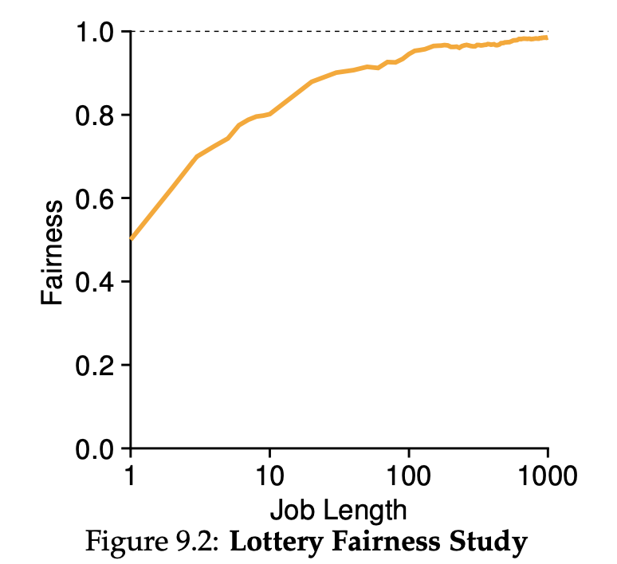

스케줄링 방식의 성능을 판단하는 기준으로 반환 시간, 응답 시간, 형평성, 처리량, 마감 시간이 있다. 이 중 공평한 분배(형평성)를 중점으로 하는 스케줄링 방식에는 Lottery, Stride, CFS 스케줄링 방식이 있다.

## **Lottery 스케줄링**

각 프로세스에게 티켓 번호들을 부여해 놓고 다음에 어떤 프로세스가 실행될지 로또처럼 뽑는 스케줄링이다. 특정 프로세스에게 더 많은 CPU 점유권을 주고 싶다면 더 많은 번호를 부여하면 된다.

Lottery 스케줄링의 장점은 구현이 간단하다는 것이다. 무작위로 티켓을 뽑는 로직, 티켓 정보를 포함한 프로세스 정보를 저장하기 위한 자료구조, 그리고 총 티켓 수만 있으면 구현이 가능하다.

또한 무작위로 선택하기 때문에 선택 횟수가 많을수록, 즉 작업 시간이 길수록 fairness가 1에 수렴하게 된다. 반대로 말하면 작업 시간이 짧을 경우 공평하지 않을 수 있다. 이러한 문제를 해결하기 위해 Stride 스케줄링과 CFS 스케줄링을 사용한다.

## Stride 스케줄링

Lottery 스케줄링 기반으로 티켓 수와 반비례하는 **stride** 변수를 사용해 fairness 문제를 해결한다. 먼저 프로세스에게 티켓 번호를 부여하고, 모든 프로세스의 **pass value**를 0으로 설정한다. 이후 프로세스가 수행될 때마다 해당 프로세스의 pass value에 stride가 더해진다. Stride 스케줄러는 이 pass value 값이 가장 작은 프로세스를 다음 프로세스로 선정한다. 이렇게 되면 티켓 수가 많을수록 stride 변수와 pass value가 작아져 우선순위가 높아지게 된다. 또한 무작위로 선택하는 것이 아니기 때문에 작업 시간의 영향을 받지 않는다.

하지만 나중에 추가된 프로세스의 pass value를 0으로 설정하면 한동안 해당 프로세스가 CPU를 독점하게 된다는 문제가 있다. 이를 해결하려면 적절한 초기 설정값을 찾아야 하는데, 그 과정에서 CPU 사용 시간을 소모하게 되며 효율이 떨어진다.

## CFS (Completely Fair Scheduler)

CFS는 각 프로세스가 CPU를 점유한 누적 시간을 **virtual runtime**으로 관리한다. 그리고 virtual runtime이 가장 작은 프로세스를 다음 프로세스로 선정한다. 즉, 모든 프로세스가 공평하게 비슷한 CPU 사용 시간을 유지할 수 있다.

CFS는 고정된 time slice를 가지지 않고, **sched latency**를 그때그때 실행되는 프로세스 수로 나누어 time slice를 결정한다. 이때 프로세스 수가 너무 많아지면 time slice가 작아져 잦은 context switching으로 인한 성능 저하가 발생한다. 이 문제를 해결하기 위해 **min granularity**라는 값을 두어 time slice가 이 값보다 낮아지지 않도록 한다. 보통 sched latency는 48ms, min granularity는 6ms로 설정한다.

UNIX의 **nice** 매개변수를 사용해 특정 프로세스에 높은 우선순위를 줄 수 있다. 이 값은 -20 ~ 19 사이의 값을 가지며 낮을수록 우선순위가 높다. 즉 nice는 virtual runtime과 비례하고 time Slice와 반비례한다.

CFS는 빠르게 다음 프로세스를 찾기 위해 **Red-black Tree**를 사용한다. log 시간에 연산이 가능하기 때문에 다른 스케줄링에 비해서 효율적으로 스케줄링이 가능하다. 이때 Red-black Tree에는 실행 중(Run)이거나 실행 가능한(Ready) 프로세스 정보만 들어있다. 그리고 Stride 스케줄링에서 발생하는 기아 문제를 해결하기 위해 프로세스가 다시 시작될 때 해당 프로세스의 virtual runtime을 Red-black Tree에서 가장 작은 값으로 변경한다.

CFS는 실시간 프로세스 스케줄링에 적합하지 않다. 실시간 프로세스의 경우 특정 시간 내에 반드시 실행되어야 하는데, CFS 스케줄링 방식은 이를 보장해 줄 메커니즘이 존재하지 않는다. 물론 UNIX의 메커니즘을 사용하여 특정 프로세스에게 높은 CPU 점유율을 줄 수는 있지만 이것만으로 마감 시간 안에 프로세스를 끝내야 하는 요구사항을 만족시키지는 못한다.

---

**참고 자료**

- https://icksw.tistory.com/125
- https://eunajung01.tistory.com/67
