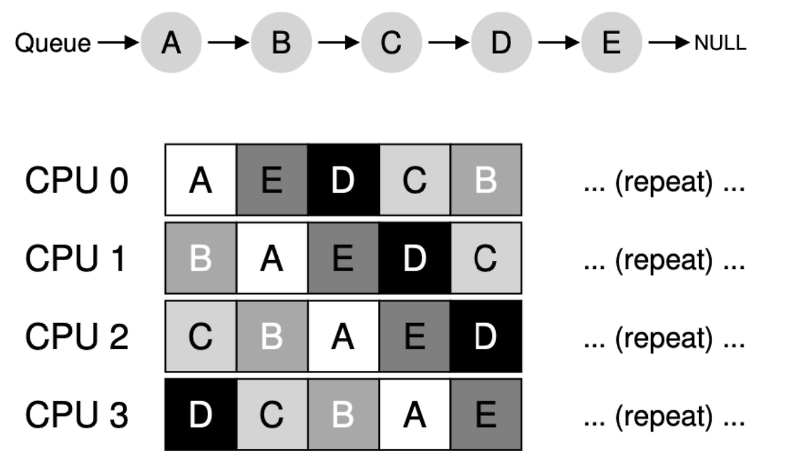
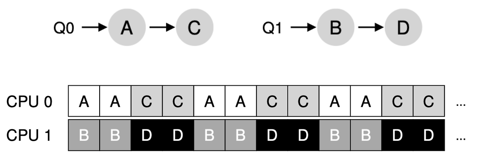

## **싱글 큐 스케줄링** (Single Queue Multiprocessor Scheduling)

하나의 Ready Queue에 모든 프로세스를 넣어서 관리하며, 여러 프로세서가 하나의 Ready Queue를 공유하는 상태가 된다. 작업의 균등한 분배가 비교적 용이하기 때문에 부하 균형을 유지하기 쉽다. 하지만 다음과 같은 2가지 문제가 발생한다.

첫 번째는 **확장성 부족** 문제이다. 만약 어떤 프로세서가 Ready Queue에 접근하고 있으면 다른 프로세서들은 접근할 수 없도록 Lock을 걸어야 한다. 이때 다른 프로세서들이 Lock을 획득하기 위해 대기하는 시간이 발생하기 때문에 성능이 저하된다. 이 현상은 자원을 공유하는 대상, 즉 프로세서의 수가 늘어날수록 더욱 심해지며 프로세서의 확장성이 떨어진다.

두 번째는 **캐시 친화도** 문제이다. time slice마다 각 프로세서에 매번 다른 프로세스가 배정될 수 있으며, 이 경우 캐시 친화도가 전혀 적용되지 않는다. 즉, 프로세스가 여러 프로세서 사이에서 빈번하게 이동하므로 캐시 데이터를 재사용하기가 어렵다. 이를 해결하기 위해 최대한 한 프로세서에 같은 프로세스를 배정하는 방식을 사용하지만, 모든 프로세스에 대해 캐시 친화도를 적용할 수는 없다.

## **멀티 큐 스케줄링** (Multi Queue Multiprocessor Scheduling)

각 프로세서는 하나 이상의 Ready Queue를 가지며 독립적으로 스케줄링을 처리한다. Ready Queue 별로 특정한 스케줄링 방식을 사용할 수 있다. 프로세스가 들어오면 여러 Ready Queue 중 하나에 배정된다.

서로 다른 프로세서가 동시에 같은 Ready Queue에 접근할 일이 없기 때문에 Lock으로 인한 문제는 발생하지 않는다. 그리고 프로세스는 특정 Ready Queue에 배정되어 특정 프로세서에서만 동작하게 되므로 캐시 친화도 또한 잘 적용된다.

하지만 **부하 불균형** 문제가 발생할 수 있다. 특정 프로세서의 큐에 있는 작업이 먼저 종료되었다면, 다른 프로세서에만 부하가 집중되게 된다.

이를 해결하기 위해 **Job Stealing**을 적용한다. 이는 멀티 큐 스케줄링에서 부하 불균형을 해소하기 위한 기법으로, 유휴 상태의 프로세스가 다른 프로세스의 큐에서 작업을 훔쳐와서 실행하는 것을 말한다.

하지만 Job Stealing이 너무 빈번하게 일어나게 되면 사실상 SQMS와 큰 차이가 없어진다. 즉, 확장성 부족이나 캐시 친화도와 같은 SQMS의 문제가 그대로 발생한다. 따라서 Job Stealing이 적당한 횟수만큼만 발생하도록 세부적으로 조정해야 한다.

---

**참고 자료**

- https://icksw.tistory.com/127
- https://yeongjaekong.tistory.com/58
