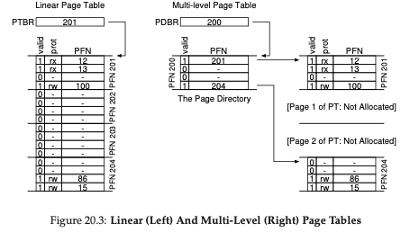
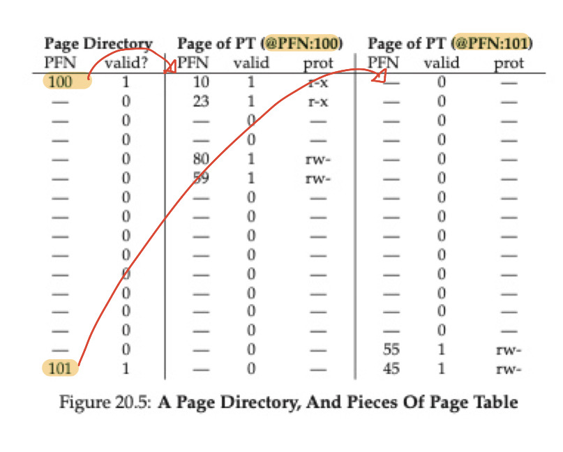
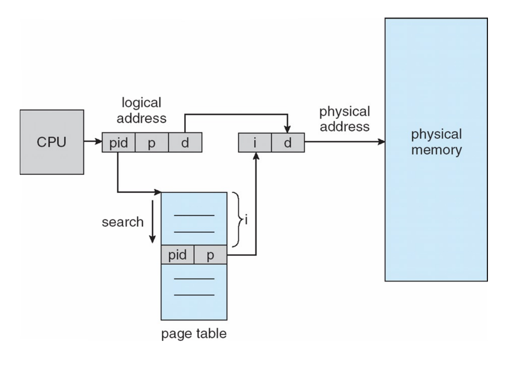

## 1. Multi-Level Page Table

### 1-1. 구조와 동작 방식

- **구조:** Page Table을 여러 단계로 나누어 구성, 첫 번째 레벨에서는 Page Directory이며 각 디렉토리 엔트리는 하위 페이지 테이블을 가리킨다. 하위 페이지 테이블의 엔트리는 실제 물리적 메모리 프레임을 가리킨다.
- **동작 방식:** Page Directory는 Page당 하나의 Page Entry만을 가지고 있음. 이는 Page Table의 시작 부분을 가리키며 Page Directory는 Valid 비트를 가지고 있으며 Page 단위에서 하나라도 사용 중이라면 Valid 비트는 1을 가리킴

### 1-2. 장단점

**장점**

- Page 테이블의 메모리 공간을 줄일 수 있음
  - 실제로 사용 중인 Page 테이블에만 메모리를 할당하기 때문
- 메모리 관리가 쉬워짐
  - Page Table의 각 부분을 Page 단위로 나눠 관리 하므로
  - Page Table의 일부를 가리키는 Page Directory를 사용하므로 실제 메모리의 원하는 곳에 Page Table Page를 배치할 수 있음

**단점**

- 메모리 접근이 두 번 발생함
  - Directory에 접근한 후 실제 페이지 테이블 페이지에 접근해야 하기 때문에, 기존의 선형 페이지 테이블보다는 복잡한 구조를 지님

### 1-3. MLPT가 메모리 사용량을 줄이는 방법

- 대부분의 페이지는 Invalid한 상태에서 Page Table로 관리된다고 함.
- 14 비트 가상 주소 공간이 있고 주소 공간은  크기를 가짐
  214=16KB
- Page는 64Byte를 갖는다. offset은 6비트 VPN은 8비트이다.
- 선형 페이지 테이블은 $2^8$개의 Entry로 구성
- Valid 한 페이지 테이블 페이지만 메모리에 적재하면 되므로 메모리 사용량을 줄일 수 있다.

## 2. Inverted Page Table

### 2-1. 테이블 구조

Inverted Page Table은 모든 프로세스의 주소 변환 정보를 하나의 테이블로 관리한다. 여러 프로세스가 같은 테이블을 참조하기 때문에 프로세스를 구분하기 위한 pid 정보도 추가로 저장한다.

Inverted Page Table은 물리 메모리와 그대로 매핑되는 구조이다. 즉, 물리 메모리의 frame 하나가 Page Table에서 하나의 entry가 되며, N번째 인덱스의 entry가 N번째 frame의 정보를 담게 된다. 따라서 Page Table은 물리 메모리에 있는 frame 수만큼의 entry를 갖는다.

### 2-2. 동작 방식

주소 변환을 할 때는 테이블을 처음부터 탐색하며 pid와 page number가 모두 일치하는 entry를 찾는다. 이때 찾은 entry의 인덱스가 곧 물리 메모리의 frame number가 된다.

하지만 주소 변환을 위해 테이블을 전부 탐색해야 한다는 단점이 있다. 이는 associative register를 사용한 병렬 탐색으로 보완할 수 있다.

### 2-3. Page table과 비교

기존의 Page Table이 메모리 용량을 많이 차지한 가장 큰 이유는 각 프로세스마다, 모든 논리적 주소 공간에 대해 page를 만들어 관리했기 때문이다. 즉, 해당 page가 물리 메모리에 있든 없든 Page Table에서 하나의 entry를 차지한다.

반면 Inverted Page Table는 실제 물리 메모리에 존재하는 page에 대해서만 entry 정보를 관리한다. 따라서 물리 메모리에 없는, 즉 주소 변환이 필요 없는 page를 위해 테이블 공간을 낭비하지 않는다.

---

참고 자료

- https://icksw.tistory.com/150
- https://itstory1592.tistory.com/103
- http://www.kocw.net/home/m/search/kemView.do?kemId=1046323
