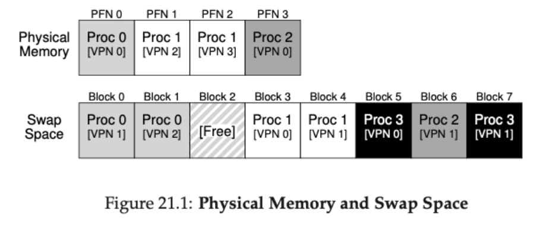
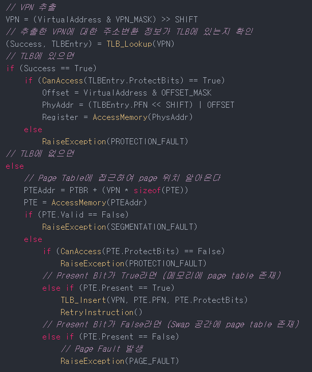
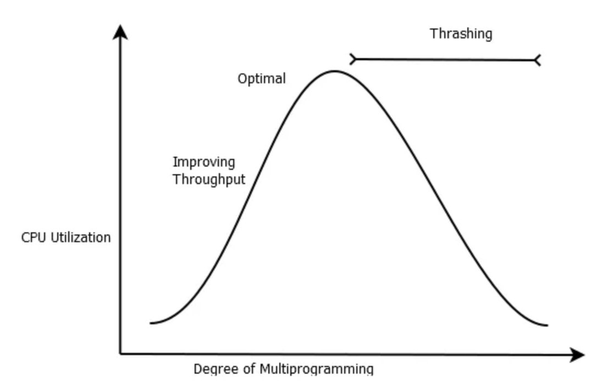
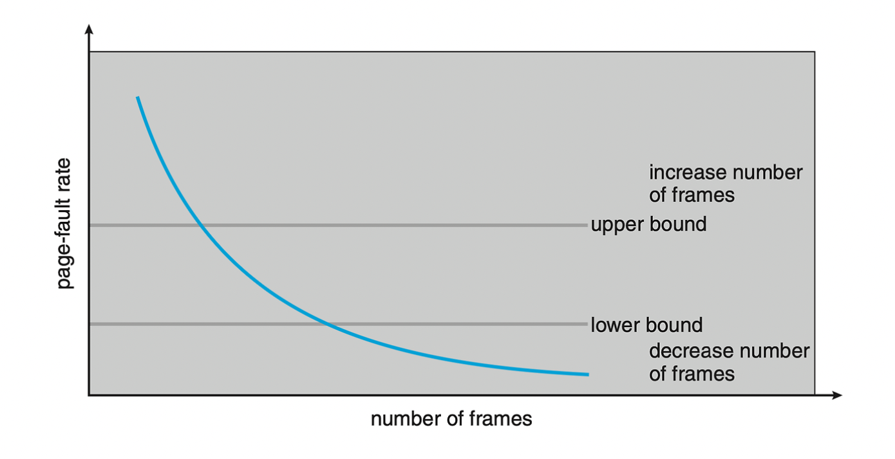
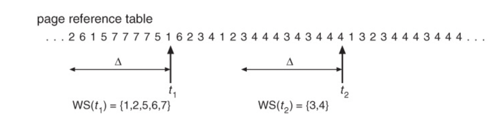

## 1. SWAP Space

실제 메모리는 작고 비싼 편이다. 따라서, 더 많은 프로세스에게 더 많은 메모리 공간을 디스크를 활용하여 "제공되는 것처럼" 보이게 하는 방법을 제공한다. 해당 방법을 Swap Space라고 한다.

아래의 이미지처럼 Swap 공간은 실제 메모리 + disk 공간으로 구성되어 있다. 또한, swap 공간에서는 해당 페이지가 메모리에 존재하는 지 나타내는 Present Bit를 가지고 있다.

## 2. Page Fault

### 2-1. 발생 배경

TLB가 있는 시스템에서 Swap 공간을 처리하는 과정은 다음과 같다.

1. 가상 메모리 참조 시 가상 주소에서 VPN을 알아냄.
2. TLB 내에 해당 VPN과 매핑된 PFN이 있는 지 확인해서 있으면 구하고 없으면 변환해서 페이지 주소를 알아냄.
3. Present Bit를 확인해서 메모리에 존재하면 TLB에 적재 후 가져오고, 아니라면 디스크에서 가져옴.

이 때 3번 과정에서 디스크에 있어서 가져오는 동작을 PAGE_FAULT라고 한다. 아래의 그림은 위를 슈도코드로 나타낸 것이다.

### 2-2. PAGE_FAULT_HANDLER 처리 과정

PAGE_FAULT가 뜨면 Trap 영역으로 넘어가게 되는데 Trap 영역에서 PAGE_FAULT_HANDLER가 이를 처리해준다. PAGE_FAULT_HANDLER의 동작 처리 과정은 다음과 같다.

1. Address Validation : 해당 페이지가 disk 같은 secondary storage에 있는지 아니면 접근 가능한 메모리 영역인 지를 확인한다.
2. Page Replacement : OS에서 정책에 따라, 당장 처리해야 되는 데이터를 대신해서 없어질 페이지를 선정한다.
3. Loading the Page : 디스크에 있는 필요한 페이지를 메모리로 가지고 온다.
4. Updating Page Tables : OS가 로딩된 페이지를 업애고 새로운 페이지를 처리한 걸 Page Table Entry에 반영한다.

## 3. 스레싱

### 3-1. 정의

가상 메모리를 통해 동작할 때, 필요한 데이터가 실제 물리 메모리에 없는 경우 Page Fault가 발생하고 디스크로부터 페이지를 읽어오게 된다. 이 과정은 단순히 메모리에 접근하는 것보다 훨씬 느린 작업이다. 만약에 동시에 실행되는 프로세스의 개수가 늘어나게 되면 어떻게 될까? 각 프로세스마다 차지할 수 있는 물리 메모리의 크기가 줄어들어 더 많은 Page Fault가 발생할 것이다. 특정 시점부터는 CPU 사용률이 급감하고 계속해서 디스크 작업만 발생할 것이다. 이러한 현상을 스레싱이라고 한다.

### 3-2. 원인

실제 물리 메모리의 크기가 작거나 동시에 실행되는 프로세스의 개수가 많아지게 되면 스레싱이 발생하게 된다. 그리고 위의 그래프처럼 일정 임계값을 넘어서게 되면 디스크 스왑 과정 때문에 CPU 이용률 떨어지는데 CPU 스케줄러는 사용률을 높이기 위해서 새로운 프로세스를 Ready Queue에 추가하게 된다. 하지만 새로 시작하는 프로세스도 실행중인 프로세스로부터 프레임을 가져오려고 하기 때문에 더 많은 Page Fault를 발생시키고 악순환이 발생하게 된다.

### 3-3. 해결 방안

#### (1) PFF

스레싱이 발생하는 이유는 근본적으로 Page Fault가 많이 발생하기 때문이다. Page Fault 비율이 높다면 해당 프로세스가 더 많은 프레임을 필요로 한다는 것을 의미하고 Page Fault 비율이 낮다는 것은 해당 프로세스가 너무 많은 프레임을 가지고 있다는 것을 의미한다.

따라서 임의의 프로세스에 대해서 Page Fault 상한, 하한선을 정해놓고 부재율이 상한을 넘으면 프레임을 할당하고 하한선을 넘어서면 프레임을 회수하는 방식으로 문제를 해결할 수 있다.

#### (2) Working Set Model

작업 공간 모델은 운영체제가 메모리 관리를 할 때 **지역성**을 활용하는 모델을 말한다. 지역성을 잘 고려하여 현재 시점으로부터 이전에 실행된 일정한 메모리 참조만을 working set으로 구분하고 working set을 메모리에 할당한다. 이 구간을 working set window라고 한다.

위와 같이 델타값에 해당하는 값이 working set window가 되고, 이 페이지 집합을 working set이라고 한다. window를 계속 이동하면서 working set 내용을 갱신한다. 이를 통해 Page Fault는 working set window가 이동할 때만 발생하게 된다.

---

참고 자료

- https://www.geeksforgeeks.org/page-fault-handling-in-operating-system/
- https://itstory1592.tistory.com/103
- http://www.kocw.net/home/m/search/kemView.do?kemId=1046323
