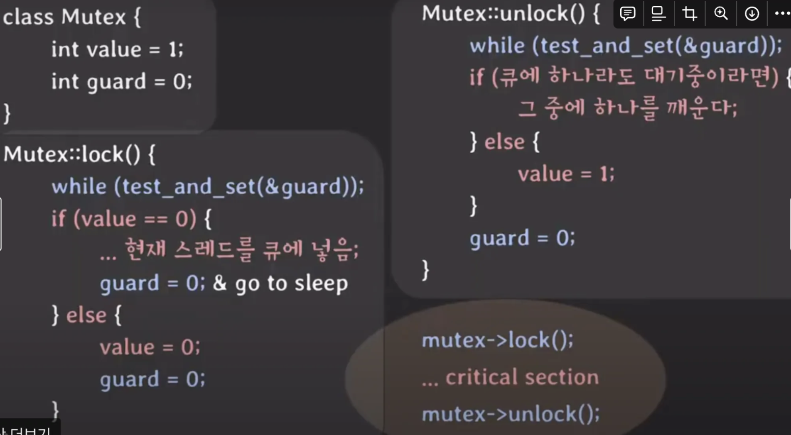

## Lock이란?

Lock이란 멀티스레드 환경에서 자원에 대한 접근에 제한을 강제하기 위한 동기화 메커니즘이다.


## Lock의 평가 기준

**상호배제 (mutual exclusion)**

상호 배제란 하나의 스레드가 임계 영역에 접근하고 있는 동안 다른 스레드에서 임계 영역에 들어가지 않아야 한다는 요구사항을 의미한다.

**공정성 (fairness)**

스레드들이 공정하게 락을 획득하여 굶주림(starvation) 현상이 발생하지 않도록 해야 한다.

**성능 (performance)**

Lock을 사용할 때 자원을 얼마나 빠르고 효율적으로 관리하는지를 말한다. 단일 CPU, 다중 CPU 환경에서 여러 스레드가 Lock을 획득하기 위해 경쟁하는 경우의 성능을 살펴볼 필요가 있다.


## 스핀락이란?

스핀락은 임계 영역에 진입이 불가능할 때 진입이 가능할 때까지 루프를 돌면서 재시도하는 방식으로 구현된 락을 말한다.

이를 구현하기 위해 Test-And-Set, Atomic exchange 명령어를 사용할 수 있다.


## Test-And-Set

Test-And-Set은 락의 flag를 확인하는 것과 값을 바꾸는 것을 동시에 진행하는 것을 말한다. 이게 가능한 이유는 하드웨어의 지원을 받기 때문이다.

```c
// 소프트웨어 코드로 변환하면 아래와 같다.
int TestAndSet(int *old_ptr, int new) {
    int old = *old_ptr;
    *old_ptr = new; // 새로운 값으로 변경
    return old; // 이전값 반환
}


typedef struct __lock_t { int flag; } lock_t;

void init(lock_t *lock) {
    lock->flag = 0;
}

void lock(lock_t *lock) {
    while(TestAndSet(&lock->flag, 1) == 1)
    
    lock->flag = 1;
}

void unlock(lock_t *lock) {
    lock->flag = 0;
}
```

비슷하게 Spin wait을 사용하는 Compare-And-Swap 연산도 있다. 마찬가지로 하드웨어의 지원을 받아서 연산의 원자성을 보장한다.


## Spin Lock 평가

- 상호배제 측면

  Test-And-Set 과 같은 하드웨어의 지원을 통해서 상호배제는 잘 제공한다.

- 공정성 측면

  Spin Lock 방식에서는 프로세스의 도착 순서와 무관하게 임계 영역에 진입할 프로세스가 정해지기 때문에 Bounded Waiting을 보장할 수 없다. 즉 공정성을 보장할 수 없고 기아 현상(starvation)이 발생할 수 있다.

- 성능 측면

  단일 CPU와 다중 CPU 상황을 고려해서 판단해볼 수 있다. 단일 CPU의 경우 while 문을 돌면서 락을 얻기 위해 busy wait하는 쓰레드들에 의해서 CPU 사용이 낭비되게 된다.

  다중 CPU 환경에서는 Spin Lock이 효율적일 수 있다. 임계 영역의 작업이 컨텍스트 스위치보다 빨리 끝날 경우 스핀락이 뮤텍스보다 이점이 있다.

  

## Spin Lock과 Mutex차이점



Spin Lock 방식에서는 CPU를 계속 점유하면서 락 획득 시도를 했었다면 Mutex 방식은 큐에 작업을 넣고 대기함으로써 불필요한 CPU 점유가 사라진다. 그뿐만 아니라 Spin Lock에서 제공하지 못했던 작업의 순서도 큐를 사용함으로써 보장할 수 있다.

위 그림에서 볼 수 있듯이 value 변수를 얻어야(1)만 임계 영역에서 실행할 수 있다. 이 value 변수 역시 여러 스레드에서 획득하려는 공유 자원이기 때문에 guard라는 변수를 통해서 임계 영역에서 안전하게 바꿀 수 있도록 보장한다. 이 때도 역시 하드웨어의 지원을 받아서 원자적으로 연산을 수행한다.