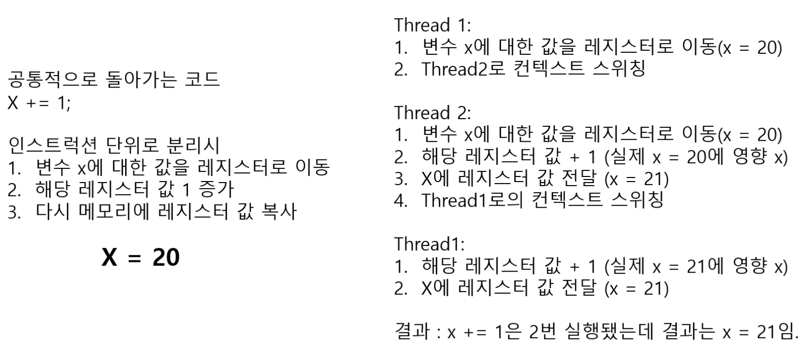

# Race Condition

## Race Condition 이란?

경쟁 상태란 공유자원에 대해 여러 개의 프로세스가 동시에 접근을 시도할 때 접근의 타이밍이나 순서 등이 결과값에 영향을 줄 수 있는 상태를 말한다. 동시에 접근할 때 자료의 일관성을 해치는 결과가 나타날 수 있다.

## 발생 원인

여러 프로세스나 스레드가 동시에 실행되면서 **공유 자원**에 접근할 때 발생할 수 있다. 원자적이지 않은 연산을 실행하고 있을 때 다른 프로세스가 같은 자원에 접근하게 되면 의도하지 않은 결과가 발생할 수 있다. 락이나 세마포어 등 동기화 메커니즘을 사용하여 적절하게 제어하는 것이 중요하다.

예를 들면 아래와 같이 예들 수 있다.

X++연산은 3개의 연산으로 쪼개진다. 즉 원자적 연산이 아니기 때문에 연산 도중에 다른 스레드에서 끼어들게 되면 Race Condition 문제가 발생하게 된다. 따라서 여러 스레드가 동시에 접근할 수 있는 자원들에 대해서는 락 또는 불변 처리와 같은 스레드 세이프한 적절한 동기화 과정이 요구된다.

## 임계 영역

임계영역은 공유 자원에 접근하는 코드의 일부로 동시에 두 개 이상의 스레드 또는 프로세스가 실행되어서는 안 되는 코드 구역을 말한다. 상호 배제를 통해 동시성 문제를 방지하고 하나의 스레드가 임계영역에 접근할 때 다른 스레드가 해당 자원에 접근하지 못하도록 해야 한다.

임계 영역의 범위가 증가할수록 타 스레드가 해당 임계영역에 접근할 때 대기하는 시간이 길어진다. 따라서 Lock 혹은 Semaphore를 통해 Mutual Exclusion으로 보장되는 범위는 최대한 좁게 설정해야 한다.

여기서 중요한 점은 "읽기", "쓰기" 모두에 걸어야한다는 점이다. 왜냐하면 지속적으로 쓰기가 일어나는 환경에서 읽기에 대한 동기화가 없으면 쓰기를 하는 쪽에서 이미 데이터를 변경했음에도 아직 변경되지 않은 데이터를 읽을 수도 있다. 또한, 읽기와 쓰기 사이의 거리가 먼 경우 해당 값을 기준으로 바꾸게 되면 정합성이 안맞을 가능성이 있다

## Race Condition 해결

다양한 방법으로 Mutual Exclusion을 만족시키면 되는데 여기서는 Java에 대해서 설명하겠다. AtomicBoolean, AtomicInteger와 같은 자료구조는 락이 아니라 CAS(Compare and swap) 방식으로 원자적으로 연산을 처리함으로써 Race Condition을 예방한다.

Mutex의 경우 락을 획득하지 못하면 즉시 Sleep으로 스레드를 넘겨서 다른 스레드가 즉시 작업을 할 수 있게 한다. 단점은 중간에 다른 어떤 누군가가 들어와서 락을 해제해주지 못한다.

Semaphore는 여러 개의 스레드가 동시에 설정한 수만큼 접근할 수 있게 한다. 따라서 꼭 자신이 락을 해제하지 않아도 다른 스레드가 락을 해제시켜줄 수 있다. 동시에 여러 스레드가 설정한 수만큼 접근할 수 있다는 특징 때문에 스레드 풀과 커넥션 관리 같은 곳에 사용된다.

