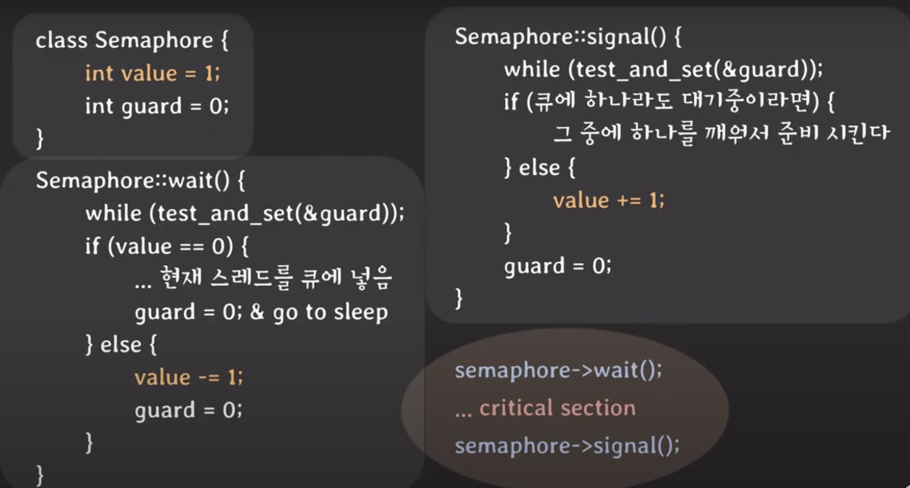
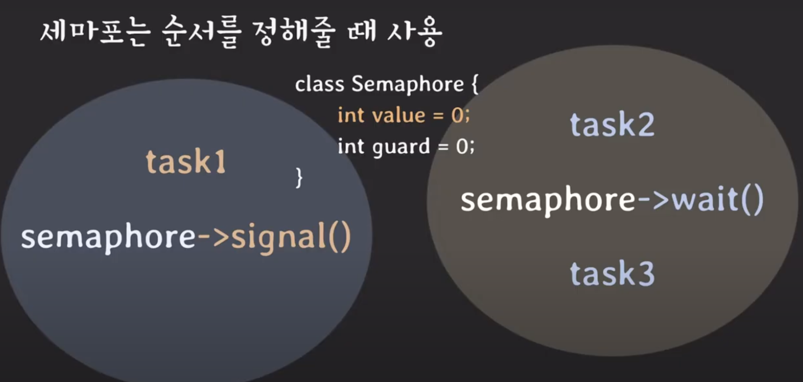

# **Semaphores**

## 정의

세마포어는 Signal mechanism을 가진 하나 이상의 프로세스/스레드가 Critical Section에 접근 가능하도록 하는 장치이다.


## 동작



value와 guard 변수를 가진다. 

### wait 연산

value가 0이면 현재 스레드를 큐에 넣고 sleep을 하게 되고 0이 아니라면 value값을 차감시킨다. 여기서 value 값의 의미는 공유 자원에 접근할 수 있는 자리의 수라고 생각하면 된다. 이 값 또한 여러 스레드에 의해서 동시에 접근될 수 있는 공유 자원이기 때문에 guard 변수를 통해서 보호해준다.

### signal 연산

큐에 대기하고 있는 스레드가 있다면 해당 스레드를 깨워서 실행시키고 없다면 value값을 1증가시킨다.

### 

## 작업 순서



세마포어는 작업간의 순서를 정할 때도 사용할 수 있다. 위 예에서 task3는 task1이 수행된 후에 실행되게 된다.

1. task2가 task1보다 먼저 실행된 경우를 생각해보자. task2가 실행되고 wait()을 호출해서 해당 스레드는 sleep 상태가 된다. 그리고 task1이 실행되고 signal()을 호출하여 sleep 상태의 스레드를 깨운다. 이후 task3가 실행된다.

2. task1이 task2보다 먼저 실행되는 경우를 생각해보자. task1이 실행되고 signal()을 호출한다. 그러면 value값이 1이 된다. 이후 task2가 끝나고 wait()을 호출하는데 value가 1이니까 1을 차감하고 바로 task3를 실행하게 된다.

-> 위와 같이 Semaphore를 사용하게 되면 각 작업간의 실행 순서를 보장할 수 있게 된다.


## **(2) Conditional Variable**

```c
sem_t s;

void *child(void *arg) {
	// 작업 수행
	sem_post(&s); // 작업이 끝나면 자원을 반납
	return NULL;
}

int main (int argc, char *argv[]) {
	sem_init(&s, 0, 0); // 0으로 초기화	
	pthread_t c;
	Pthread_create(&c, NULL, child, NULL); // 자식 스레드 생성
	sem_wait(&s); // 자식 스레드가 자원을 반납할 때까지 대기	
	return 0;
}
```

세마포어를 사용해 부모 스레드와 자식 스레드의 실행 순서를 제어할 수 있다. 먼저 세마포어의 값을 0으로 초기화한다. 그리고 부모 스레드는 자식 스레드를 생성한 뒤 자원을 획득한다. 이때 세마포어의 값이 음수가 되기 때문에 부모 스레드는 sleep 상태로 전환된다. 이후 자식 스레드에서 주어진 작업을 마치고 자원을 반납할 때 부모 스레드를 깨운다. 이렇게 하면 항상 부모 스레드보다 자식 스레드가 먼저 실행되도록 할 수 있다.


### 3. 이진 세마포어

0과 1의 두 가지 값만을 갖는 세마포어이다. 잠금과 해제를 통해 하나의 프로세스나 스레드만이 공유 자원에 접근할 수 있도록 하는 뮤텍스와 유사한 기능을 한다. 하지만 뮤텍스와 다르게 잠금 메커니즘이 아닌 신호 메커니즘을 사용한다. 뮤텍스는 반드시 lock을 얻은 프로세스가 unlock을 해야 하지만, 세마포어는 wait와 signal을 서로 다른 프로세스가 사용할 수 있다. 이 점을 활용해 위처럼 프로세스 간의 작업 순서를 지정할 수 있다.

### 4. 카운팅 세마포어

2 이상의 값을 갖는 세마포어로 여러 개의 자원에 대한 접근을 제어한다. 이는 세마포어와 뮤텍스의 가장 큰 차이점이다.