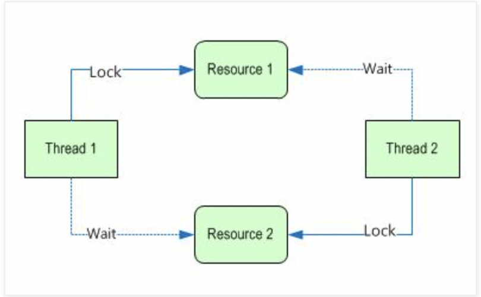
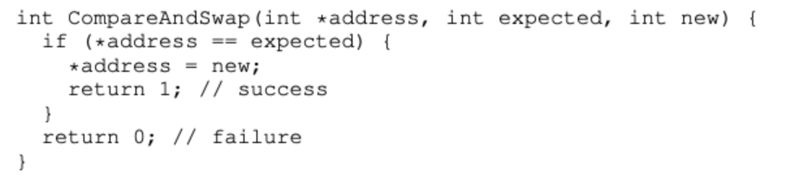
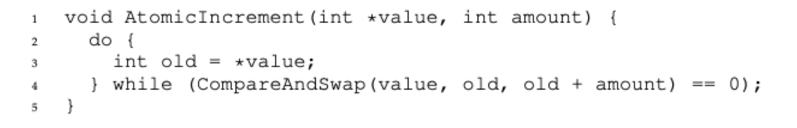
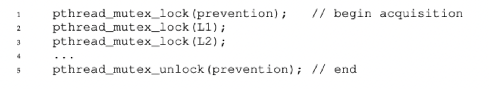
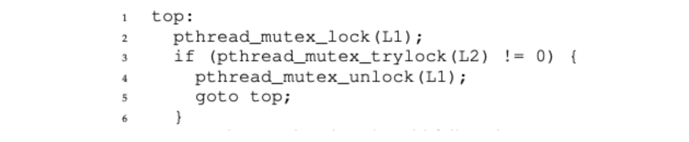
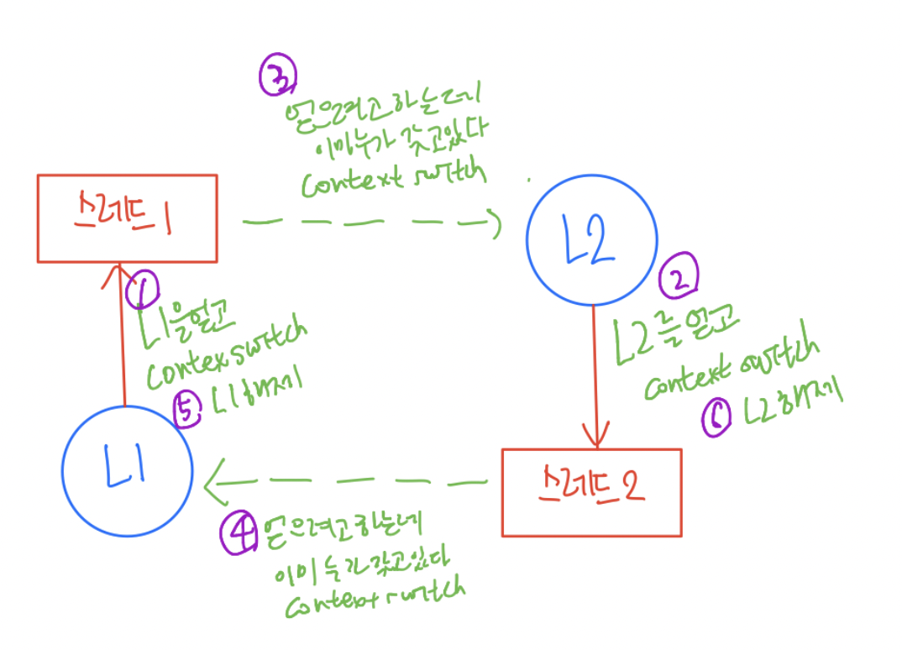
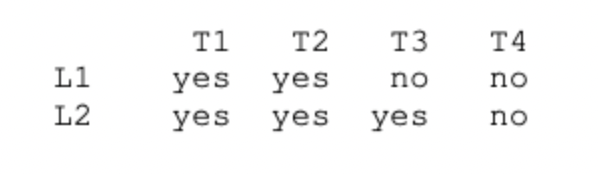
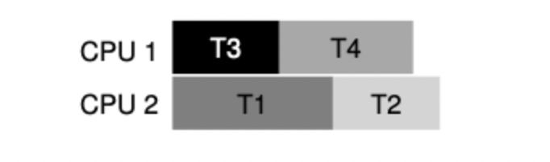
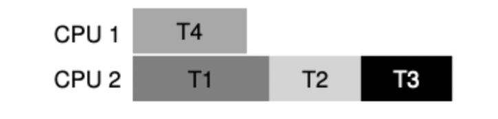

# 데드락에 관해서 설명해주세요.

## 데드락이란?

두 개 이상의 작업이 자원을 점유한 상태에서 서로의 자원을 필요로 할 때 상대방의 작업이 끝나기 기다리며 아무것도 하지 못하는 교착상태를 의미한다.

자원당 하나의 인스턴스만 있는 경우에는 데드락이고, 여러 인스턴스가 존재하는 경우엔 데드락일 수도 있고 아닐 수도 있다.
(Cycle이 존재하지 않으면 데드락 X)

※ 인스턴스의 의미:  
개별적 사용 가능 단위를 의미하는 걸로 이해를 함. 
자원당 하나의 인스턴스가 있다는 의미는 해당 자원 당 1개의 인스턴스(종류)가 있다고 보는 게 맞는 것 같음.
그러니까, 만약에 Product를 변경하고 Order를 변경할 때 Product도 1개로 Order도 1개라고 해보자.
그럼 Product를 잡고 Order를 요구하는 A와 Order를 잡고 Product를 요구하는 B가 있으면 반드시 데드락임.

반면에 Product에 여러 종류의 상품이 있고 Order도 여러 종류의 주문이 있으면 A가 Product 1번을 잡고 Order 2번을 요구하고
B가 Order 1번을 잡고 Product 2번을 잡는 경우 자원의미상으로는 순환이 있지만, 데드락이 걸리진 않음.

테이블 단위면 모를까 레코드 단위라면 다름. 그런 의미로 쓰지 않았을까해서 추가 주석을 넣음.

## 데드락의 발생 조건
데드락은 아래의 4가지 조건을 모두 만족시켜야 한다.

- Mutual Exclusion(상호 배제) 
  - 공유 자원에 접근할 때 한 시점에 하나의 스레드만 접근이 가능하다.
- Hold-and-wait(점유 대기)
  - 자원을 추가적으로 얻으려고 시도할 때 기존에 가지고 있던 자원을 그대로 점유하고 있는 것을 말한다.
- Non Preemption(비선점)
  - 스레드의 자원을 강제로 뺏을 수 없는 것을 말한다.
- Circular wait(순환 대기)
  - 각 스레드가 원하는 자원이 서로 물고 물리는 상태를 말한다.

위와 같이 Thread1과 Thread2가 각각 Resource 1, Resource 2를 점유하고 있는 상태에서 서로가 가지고 있는 자원을 요구하고 있다.

## 데드락 예방
위에서 설명한 것처럼 데드락은 위의 4가지 조건 중 하나라도 만족시키지 않으면 발생하지 않는다. 
즉 4가지 조건 중 하나를 만족 시키지 않도록 해주면 된다.

### 1. Mutual Exclusion 예방
상호 배제는 자원의 일관성과 충돌을 방지하기 위해서 반드시 필요한 개념이다.
이를 하지 않고도 원하는 결과를 얻는 방법은 하드웨어 연산 명령어를 이용한 방법이다.
CAS 연산과 같은 것은 하드웨어 단에서 원자적으로 동작하기 때문에 상호 배제를 고려하지 않아도 동시성 문제를 해결할 수 있다.

#### CAS 연산

위와 같이 하드웨어가 제공하는 CAS 연산은 값을 읽어와서 기대값과 같으면 값을 갱신하게 된다.

단, 이러한 하드웨어 연산은 제한적인 상황에서만 사용이 가능하다는 단점이 있다.

## Circular Wait 예방

Lock을 획득할 때 모든 스레드에 동일한 획득 규칙을 적용하면 된다.

예시로 Lock1, Lock2가 있을 때, 모든 스레드에서 Lock1 -> Lock2 순으로 락을 획득할 수 있도록 규칙을 만들면 된다.
Lock이 많을 경우 부분 정렬을 할 수 있다. 락이 많아질수록 케이스가 많아져서 어렵다.

※ 개인적으로 정렬 방식과 락: 
락을 한번에 잡는 게 많을수록 낙관적 락을 사용하면 오히려 락잡고 롤백하는 과정이 계속 반복돼서 성능이 나쁠 가능성이 높다.

## Hold And Wait 예방

위와 같이 L1, L2를 획득하기 위해서 prevention 락을 먼저 획득하도록 하면 된다.
이를 통해서 L1, L2를 획득할 때 원자성을 보장할 수 있다.

## No Preemption
pthread_mutex_trylock()을 사용하여 lock 획득 시도를 하고 실패하면 가지고 있던 자원을 반환하고 나중에 다시 시작하도록 하면 문제를 해결할 수 있다.

위의 코드를 보면 락 획득을 시도하고 실패하면 가지고 있던 락을 반환하고 처음으로 돌아간다.

하지만 위와 같은 방식의 문제는 동작할 때 livelock의 문제가 발생할 수 있다.
livelock은 Lock을 획득하고 해제하는 일만 계속해서 반복한다는 특징이 있다.
이 때, 데드락으로 둘이 정지하지는 않지만 락을 잡으려 시도하고 놓는 과정만 반복하면서 자원을 사용하게 된다.

이를 방지하고 싶다면, 어느정도의 지연시간을 락을 해제한 뒤에 주고 다시 잡게 하는 것이 좋다.

## CPU 스케줄링을 통한 데드락 회피
서로 같은 공유 자원을 사용하는 스레드는 같은 코어에서 실행되도록 하면 데드락을 회피할 수 있다.
하지만 이를 위해서는 어떤 스레드가 어느 공유 자원을 사용하는 지에 대한 정보가 있어야 한다.

#### 사용자원

#### 스케줄링

하지만 위 방식의 경우 부하가 균등하게 분산되지 않아서 성능 저하로 이어질 수 있다.

위의 예에서 (T1, T2, T3), (T4)가 각각 별도의 코어에서 실행되는데 CPU2에 작업이 몰려 성능 저하가 발생할 수 있다.

## 데드락 해결

### Detect and Recover
교착 상태가 발생하는 게 매우 적다면 그냥 재부팅하는 게 좋다. 실제로 OS에서는 타조 알고리즘이라고 그냥 블루스크린 띄워버리고 재부팅한다.

### Resource allocation graph
Resource allocation graph를 만들어서 교착상태가 발생하는 스레드를 kill해서 문제를 해결하는 방법도 있다.
그런데 매번 이 관계를 탐색하는 게 효과적이긴 하나 얼마 간격으로 하냐, 어느정도로 있냐에 따라 오버헤드가 꽤 큰 문제이다.