# 하드디스크에 관해서 설명해주세요.

## 하드디스크의 구조
하드디스크는 여러 개의 원판(플래터)가 스핀들 모터에 고정되어 돌아가는 방식으로 되어있다. 
이 때 액츄에이터 암의 끝의 헤더에서 데이터를 돌아가는 원판에서 읽어 전달하는 구조로 되어있다.

하드디스크 장치를 뜯어서 위에서 보면 다음가 같이 생겼다.

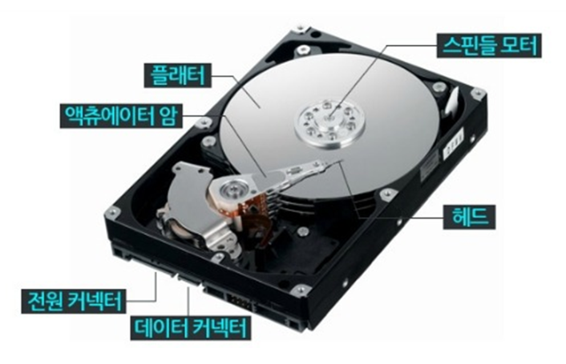

하드디스크의 플래터 덩어리를 아래 측면에서 보면 다음과 같이 생겼는데, 원판이 층층이 쌓인 것을 확인할 수 있다.

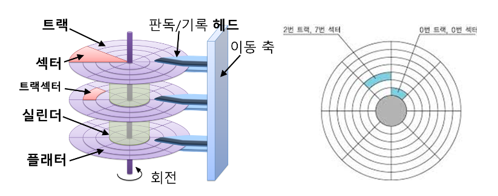

그럼 디스크 원판을 구분해보면 다음과 같이 정리할 수 있다.
위쪽 이미지가 옆면을 보기는 좋은 것 같아 올리지만 실제 디스크 전체 영역에 대한 구분은 아래의 이미지가 더 좋은 것 같다.

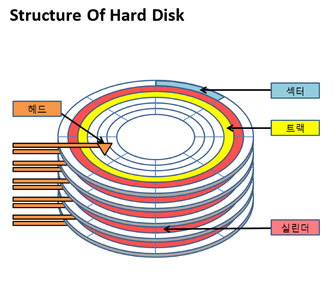

- 트랙: 중심축에 대해 동심원으로 나눠진 곳으로 해당 부분에 데이터가 적힌다.
- 섹터: 트랙의 작은 부분으로 된 부채꼴 모양의 부분이며 입출력의 기본 단위이다. 일반적으로 512Byte의 크기를 가진다.

## 하드디스크에서 데이터를 읽고 쓰는 과정에서 Seek Time, Rotation Time, Transfer Time은 무엇을 의미하나요?

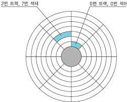

위의 이미지를 참고해보면 디스크를 읽는 시간을 총 세 가지로 구분을 할 수 있다.

1. 원판을 돌려서 적절한 섹터를 찾아가는 시간(Rotation Time, Rotation Delay)
- 해당 시간은 디스크 중심의 RPM 속도에 의존한다. 
또한 상황 별로 다르므로 계산을 할 때에 RPM을 기준으로 디스크를 반만 돌렸을 때의 시간을 기준으로 계산한다.

- 따라서 특정 디스크의 RPM이 15000이면 60초당 15000회 회전하는 것이므로 4ms 당 1회씩 회전한다. 
이것의 절반인 2ms가 RPM이 15000인 디스크의 Rotation Time이다.

2. 원판의 중심을 기준으로 적절한 트랙을 찾아가는 시간 (Seek Time)
- 해당 시간은 직접적으로 보통 스펙상 주어진다.

3. 위치를 찾은 뒤 데이터를 읽어내는 시간(Transfer Time)
- 해당 시간은 읽어야 하는 데이터의 Max Transfer 값을 기준으로 환산해주면 된다.

만약에 125MB/s로 전송이 가능한 디스크가 있다고 해보자. 이 때 전송해야 하는 데이터가 4KB라면 대략 31us가 걸린다.  
- 계산 식: 128000KB : 1s = 4KB : x

따라서 아래 스펙의 Cheetah 15K.5 디스크에서 랜덤엑세스의 방식으로 4KB의 데이터를 읽는데 걸릴 것으로 예상되는 시간은 대략 6ms가 된다.
- T = T(seek) + T(rotation) + T(transfer) = 4ms + 2ms + 31us ~ 6ms

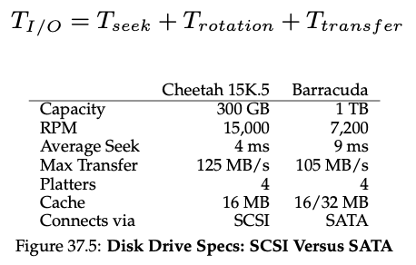

## 디스크 스케줄링에 관해서 3가지 이상 설명해주세요.

1. FCFS(First Come First Served) Scheduling
- 먼저 도착한 요청을 우선적으로 서비스한다. 들어온 순서에 맞게 처리가 된다는 특징이 있다.

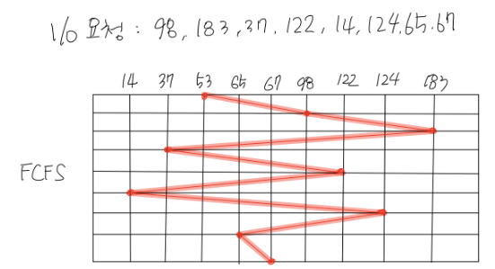

장점: 공평성이 보장되고, 프로그래밍을 하는 난이도가 낮다. 
단점:
- 탐색 패턴에 대한 최적화가 적용되지 않아 효율성 측면에서 좋지 않은 방법이다.
- 우선 순위가 높은 디스크 접근에 대한 처리가 어렵다.

2. SSTF(Shortest Seek Time First) Scheduling
- 현재 헤드의 위치에서 가장 가까운 요청을 먼저 서비스한다. 뒤에 들어온 것이라도 거리가 가깝다면 먼저 처리된다는 특징이 있다.

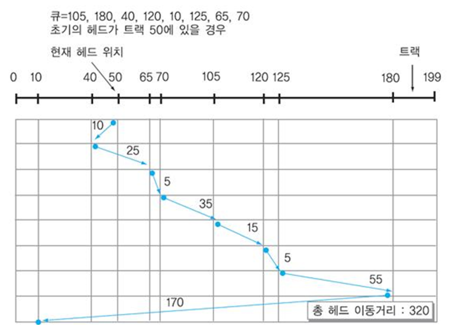

장점:
- FCFS에 비해서 디스크 처리율이 높고, 평균 응답 시간이 짧다.
- 처리량이 많은 일괄 시스템에 적절하다.

단점:
- 기아 현상이 발생될 수 있다. 
현재 헤더를 기준으로 가장 가까운 걸 선택하기 때문에 현재 헤더에 가까운 요청만 계속 들어온다면 먼 거리에 있는 요청은 계속 뒤로 밀린다.
- 서비스의 특성과 런타임 시점의 동작에 따라 특정 작업의 응답 시간이 상황에 따라 크게 달라질 수 있다.

3. SCAN 방식
- 헤드 이동을 함에 일괄적으로 처리하는 방법으로 트랜 번호가 증가하는 방향 혹은 감소하는 방향 한 방향으로만 이동한다.
이 때, 중간에 아직 지나가지 않은 경우 들어온 요청이 경로에 있다면 해당 요청도 함께 처리한다.

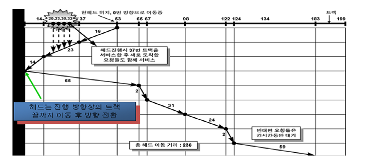

장점: SSTF 방식의 문제였던 바깥쪽 기아현상을 제거하고 응답 편차를 줄일 수 있다. 
단점: 양 끝점은 상대적으로 중간에 위치한 트랜에 비해 응답 대기 시간이 느려진다.
또한, 구간 별로 응답 시간 차이가 발생한다.

4. C-SCAN 방식
- SCAN 방식과 유사하나 헤드 방향이 한 방향으로만 읽는다. 
설명보단 하단의 그림이 더 이해가 빠르다. 점선 부분은 읽지 않고 이동만 한다.

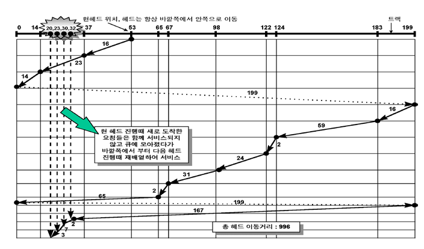

장점: 응답시간의 편차가 매우 적고 시간 균등성이 좋다. 
단점: 불필요한 헤드의 이동이 발생해 비효율이 발생한다.

5. LOOK 방식
- SCAN 방식의 단점은 처리하지 않더라도 헤더를 끝까지 이동한다는 문제점이 있다. 
따라서 끝까지 가지 않고 필요한 부분만 가자는 아이디어가 LOOK 방식이다.

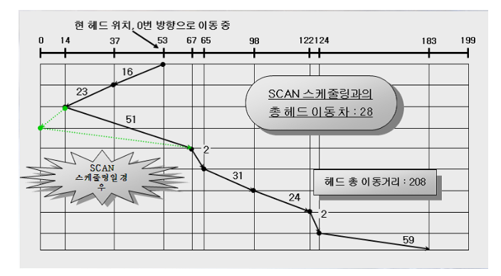

6. C-LOOK 방식
- C-LOOK에선 특정 방향에 대해 요청한 곳 끝까지 갔다가 돌아올 때도 반대편 끝 요청한 지점까지만 헤더를 이동한다.

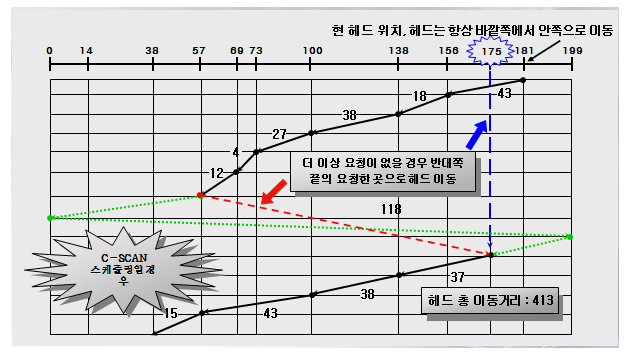

## 하드디스크의 한계
하드디스크 드라이브는 데이터를 섹터 단위로 읽고 쓰며, 하나의 섹터는 512바이트 크기의 블록이다.
여러 섹터가 모여 하나의 트랙을 이루고, 여러 트랙이 모여 하나의 플래터를 구성한다.
데이터를 읽거나 쓰기 위해서는 디스크 헤드가 이동하여 목표 트랙에 도달하고, 플래터가 회전하여 목표 섹터와 디스크 헤드가 만나야 한다.

이처럼 하드디스크는 읽거나 쓰기 위해 물리적인 움직임이 필요하기 때문에, 인접한 주소 공간에 접근하는 것이 빠르고 멀리 떨어진 주소 공간에 접근하는 것은 느리다.
즉, 연속적인 읽기 및 쓰기 작업에는 유리하지만, 위치를 자주 변경하는 랜덤 접근에 대해서는 불리한 구조이다.

이러한 단점을 보완하기 위해서 캐시, 쓰기 지연, 로그 구조 파일 시스템 등과 같은 기법을 통해 랜덤 쓰기 작업을 연속적 쓰기로 바꿔 속도를 높일 수 있다.

### 쓰기 지연(Deferred Write)
데이터 변경 사항이 발생한 즉시 디스크에 기록되지 않고, 일시적으로 캐시나 메모리 등에 저장되었다가 적절한 시점에 한 번에 디스크에 기록되는 기법이다.
이 과정에서 디스크의 물리적 헤드 이동이 줄어들어 랜덤 쓰기의 비효율성을 줄이고, 연속적인 쓰기 작업으로 변환하여 성능을 높일 수 있다.

#### 동작 방식
1. 데이터 임시 저장
- 쓰기 작업이 발생하면 디스크에 직접 기록하지 않고 우선 캐시나 메모리에 저장한다.
2. 지연 및 병합
- 이후 추가적인 쓰기 작업이 발생하면 이를 임시 저장된 데이터와 병합하여 기록할 준비를 한다.
자주 변경되는 데이터는 여러 번 디스크에 기록되지 않게 한다.
3. 디스크에 기록
- 캐시에 있는 데이터가 일정 용량을 초과하거나 지연 시간을 초과할 경우, 데이터를 한꺼번에 디스크에 기록한다.

#### 장점
- 성능 개선: 디스크에 접근하는 빈도를 줄이면서 여러 개의 랜덤 쓰기를 병합해 처리하므로 랜덤 쓰기 성능이 개선된다.
- 자주 변경되는 데이터 최적화: 자주 변경되는 데이터가 여러 번 기록되는 걸 막아 효율적으로 처리할 수 있다.

#### 단점
- 데이터 유실 위험: 지연 중 전원이 차단되면 메모리에 임시 저장된 데이터가 유실될 수 있다.
이를 보완하기 위해 비휘발성 메모리나 배터리 백업 장치를 활용할 수 있다.
- 데이터 동기화 문제: 지연 중인 데이터는 아직 디스크에 기록되지 않았기 때문에, 시스템이나 애플리케이션에서 최신 데이터가 반영되지 않을 수 있다.
이러한 문제를 해결하기 위해 지연 쓰기를 제한하거나 특정 데이터에 대해서는 실시간 쓰기를 적용하기도 한다.

### 로그 구조 파일 시스템(Log-Structured File System, LFS)
데이터를 로그처럼 순차적으로 기록하여 디스크의 랜덤 쓰기 성능을 높이는 파일 시스템 설계 기법이다. 
기존 파일 시스템과 달리, 쓰기 작업을 연속적으로 모아 디스크에 기록함으로써 디스크의 효율을 최대화한다.

#### 동작 방식
1. 데이터 기록
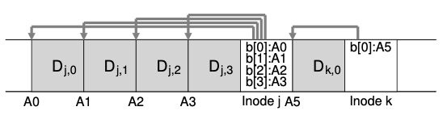

쓰기 작업이 발생하면 데이터를 기존의 위치에서 수정하는 것이 아니라 항상 새로운 위치에 순차적으로 기록한다.
모든 데이터와 inode를 연속적으로 기록하며, 데이터를 메모리에 버퍼링했ㄷ가 일정 크기(세그먼트)가 되면 디스크에 한 번에 연속으로 쓴다.
이렇게 데이터를 순차적, 연속적으로 쓰기 때문에 디스크 헤드의 이동을 최소화할 수 있다.

2. 메타데이터 관리
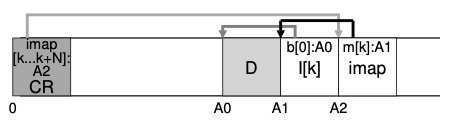

모든 Inode들이 특정 위치에 저장되지 않고 흩어지기 때문에 Inode Map이라는 자료구조를 통해 각 Inode의 위치를 관리한다.
Inode map은 디스크에 영구적으로 저장되어 Checkpoint Region(CR)이라는 위치에 의해서 관리된다.

3. Garbage Collection
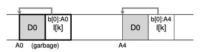

A0에서 시작하는 파일이 업데이트 되어 A4에 다시 쓰였다. 이 경우 이전의 데이터는 불필요하게 된다.
이렇게 새로운 데이터가 쓰일 때마다 이전 데이터가 남기 때문에 점점 불필요한 데이터가 쌓이게 된다.
따라서 주기적으로 세그먼트를 확인해 유효하지 않은 데이터를 제거하고, 필요한 블록으로만 재구성하여 디스크 공간을 절약한다.

#### 장점
- 성능 개선: 모든 쓰기 작업이 순차적, 연속적으로 수행되기 때문에, 디스크 헤드 이동이 거의 없고 쓰기 성능이 크게 향상된다.

- 복구 용이성: 일반 파일 시스템에서는 데이터가 다양한 위치에 산발적으로 기록되기 때문에 손상된 데이터를 찾는 데 시간이 오래 걸릴 수 있다. 
하지만 LFS에서는 데이터가 순차적으로 기록되기 때문에 마지막으로 기록된 위치만 알면 데이터를 순차적으로 되돌릴 수 있다. 
이 때문에 시스템이 예상치 못한 오류나 충돌을 겪더라도 데이터 손실을 최소화하며 빠르게 복구할 수 있다.

#### 단점
- Garbage Collection 비용: 디스크 사용량이 많아지면 Garbage Collection 작업이 잦아져 성능에 영향을 줄 수 있다. 
GC는 유효한 데이터를 식별하고 유효하지 않은 데이터를 삭제하는 과정에서 CPU 작업과 디스크 I/O 등의 비용을 소모하기 때문에 효율적인 정책 설계가 중요하다.

- 일관성 보장 문제: 쓰기 작업 도중 시스템이 중단되면 데이터 일관성 문제가 발생할 가능성이 높다. 
일반 파일 시스템에서는 데이터가 순차적으로 업데이트되기 때문에 마지막 업데이트 시점의 데이터는 저장되어 있는 상태지만 LFS에서는 데이터를 한 번에 연속적으로 기록하기 때문에 쓰기 도중 장애가 발생하면 최신 데이터가 유실될 수 있다.

#### 참고자료
https://icksw.tistory.com/177 
https://icksw.tistory.com/208