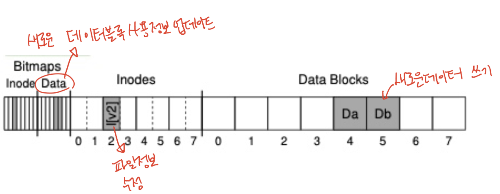
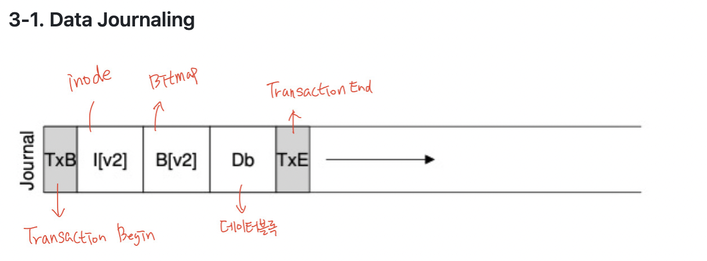
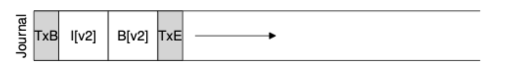

# FSCK와 Journaling

## **1. 충돌 시나리오**

하나의 데이터 블록을 기존 파일에 추가하려면 데이터 블록, inode, 비트맵을 모두 수정해야 한다. 만약 중간에 충돌이 발생해 3가지 중 일부만 작업이 완료되는 경우 파일 시스템의 데이터 일관성이 손상될 수 있다. 이때 발생할 수 있는 시나리오는 다음과 같다.

1. **데이터 블록만 작업 완료**

   데이터는 기록되었으나 inode와 비트맵에 정보가 없어 해당 데이터는 참조될 일이 없다. 즉, 쓰여진 데이터를 아무도 모르는 상태로 일관성에는 영향을 주지 않는다.

2. **inode만 작업 완료**

   inode에 새로운 파일에 대한 포인터가 저장되었으나 실제 데이터 블록에는 해당하는 데이터가 존재하지 않아 garbage data를 읽게 된다. 또한 inode와 비트맵이 나타내는 정보 사이에 모순이 생겨 inconsistency(불일치)가 발생한다.

3. **비트맵만 작업 완료**

   비트맵에는 데이터 블록이 할당되었다고 표시되었으나 이를 가리키는 inode가 없으므로 inconsistency(불일치)가 발생한다. 또한 사용하지 않는 블록이 사용 중인 것으로 표시되어 space leak(공간 낭비)가 발생한다.

4. **inode와 비트맵만 작업 완료**

   메타 데이터 일관성은 유지되지만, 데이터 블록에는 해당하는 데이터가 존재하지 않아 garbage data를 읽게 된다.

5. **inode와 데이터 블록만 작업 완료**

   비트맵과 inode가 나타내는 정보 사이에 모순이 생겨 inconsistency(불일치)가 발생한다.

6. **비트맵과 데이터 블록만 작업 완료**

   비트맵과 inode가 나타내는 정보 사이에 모순이 생겨 inconsistency(불일치)가 발생한다. 또한 inode가 해당 데이터 블록을 가리키지 않아 파일의 존재를 확인하거나 읽을 수 없다.

## **2. FSCK (File System Check)**

파일 시스템의 메타 데이터 불일치를 찾아서 고치는 도구이다. 기본적으로 불일치가 발생하더라도 일단 고치지 않고 나중에 수정하는 방식으로 일관성을 유지한다. 메타 데이터의 일관성만 고칠 수 있으며 데이터 블록 자체의 손상은 복구하지 못한다.

### 2-1. 동작 과정

1. **Superblock**

   슈퍼블록에 저장된 파일 시스템의 크기와 할당된 블록 수 등을 비교하고 심각한 문제가 감지될 경우 슈퍼블록의 사본으로 대체한다.

2. **Free Blocks**

   inode와 블록들을 스캔하여 실제로 사용 중인 블록을 파악하고 이를 바탕으로 비트맵을 수정한다.

3. **node state**

   각 inode의 유효성을 검사하고 심각하게 손상된 inode는 삭제하며 이와 관련된 정보를 비트맵에 갱신한다.

4. **inode link**

   루트 디렉터리부터 모든 디렉터리를 탐색하면서 해당 파일 혹은 디렉터리에 대한 실제 참조 수를 확인한다. inode에 기록된 링크 수가 실제 참조 수와 일치하지 않으면 이를 수정한다.

5. **Duplicate**

   서로 다른 inode가 동일한 블록을 참조하고 있을 경우 하나를 삭제하거나 사본을 생성해 각각 고유한 블록을 참조할 수 있도록 한다.

6. **Bad Block**

   inode에서 비정상적인 포인터가 발견되면 inode의 포인터를 삭제한다.

7. **Directory Check**

   디렉터리 구조를 검사하고 각 디렉터리가 하나의 디렉터리에 대해 하나의 링크만 갖도록 조정한다.

### **2-2. 장점**

- 로그 저장을 위한 별도의 공간이 필요하지 않기 때문에 디스크 자원을 아낄 수 있다.
- 비교적 간단한 구조로 구현되며 다양한 파일 시스템에 쉽게 적용할 수 있습니다.

### **2-3. 단점**

- 전체 파일 시스템을 검사하므로 시간이 오래 걸리고 성능이 저하된다.
- 데이터 내용은 보호하지 않으며, 메타 데이터의 불일치만 수정한다.

## **3. Journaling**

파일 시스템이 변경 작업을 수행하기 전에 미리 로그에 기록하는 방식이다. 데이터가 디스크에 기록되기 전에 작업 내용이 로그에 기록되므로, 오류 발생 시 로그를 통해 복구할 수 있다.

### 3-1. **Data Journaling**

Data Journaling은 위와 같은 구조로 inode, 비트맵, 데이터 블록에 대한 변경 사항을 기록한다. 이때 기록 도중 오류가 발생해 일부 값만 누락되는 경우를 방지하기 위해 다음과 같은 방식으로 원자성을 보장한다.

1. **Journal Write**

   저널 공간에 TxB, inode, 비트맵, 데이터 블록과 관련된 정보를 기록한다.

2. **Journal Commit**

   변경 작업의 종료를 표시하는 TxE 블록을 추가하여 기록을 완료한다.

3. **Checkpoint**

   저널 공간의 정보를 바탕으로 실제 디스크를 업데이트한다.

4. **Free**

   디스크 업데이트가 완료되면 저널 공간에 기록된 트랜잭션을 제거해 공간을 확보한다.

만약 저널 공간의 트랜잭션이 완료되기 전에 오류가 발생한다면 작업을 취소하고, 실제 디스크 업데이트 도중 오류가 발생한다면 저널 공간의 정보를 바탕으로 다시 작업을 시도한다. 또한 여러 업데이트 내용을 모았다가 한 번에 처리함으로써 동일한 블록에 대한 수정을 줄일 수 있다.

### 3-2. **Metadata Journling**

메타 데이터만 기록함으로써 저널링의 성능을 높이는 방법이다. 먼저 데이터 블록을 디스크에 작성한 뒤 inode와 비트맵만 저널링하여 디스크에 반영한다. 만약 저널링 도중 오류가 발생해 작업을 취소해도 단지 데이터 블록을 작성한 시간이 낭비되었을 뿐 데이터 일관성은 손상되지 않는다.

### **3-2. 장점**

- 변경 작업이 원자적으로 처리되어 데이터 일관성을 보장할 수 있다.
- 충돌 발생 시 복구 속도가 빠르다.

### **3-3. 단점**

- 작업을 2번씩 기록하므로 성능이 저하된다.
- 로그를 저장하기 위한 별도의 공간이 필요하다.

------

참고 자료

- https://icksw.tistory.com/205