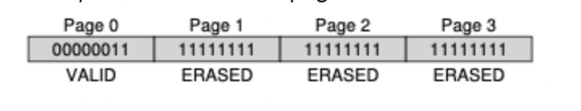

## SSD

## 4-1. HDD와 SSD의 차이점

- **HDD**는 자기 디스크(플래터)를 읽고 쓰기 위해 회전하는 디스크와 헤드가 필요하다.
- HDD는 디스크가 회전하면서 데이터를 읽기 때문에 물리적인 제한으로 인해 속도가 느리다.
- **SSD**는 **플래시 메모리**와 **컨트롤러**만으로 구성되어 있고, 물리적 움직임 없이 전기적으로 데이터를 읽기 때문에(트랜지스터) HDD보다 훨씬 빠른 데이터 접근과 전송이 가능하다.
- 그러나 플래시 칩 자체의 특성을 살펴봤을 때 한계가 존재하기 때문에 SSD는 최종적으로 이를 보완한 방식으로 구성되어있다.

## 4-2. Flash 메모리의 특성과 이를 보완하는 SSD의 방식

### **Flash 메모리의 특성**

1. **쓰기 횟수 제한**: 플래시 메모리는 셀에 저장할 수 있는 쓰기 횟수에 제한이 있어서 반복적인 쓰기가 발생할 경우 셀의 수명이 단축된다. 플래시 블록을 썼다 지웠다를 반복하게 되면 점점 마모가 되며, 블록의 수명은 MLC 기반 블록이 10000번의 쓰고 지우기를 할 수 있으며 SLC 기반 칩은 10만 번의 쓰고 지우기를 할 수 있다.
2. **블록 단위 삭제**: 플래시 메모리는 블록 단위로 데이터를 삭제하고, 한 번 쓴 셀은 직접 덮어쓸 수 없기 때문에

### Flash

- Basic Flash Operations (3가지)

1. **Read (읽기, 페이지 단위)**
   - 지정된 페이지 번호를 통해 데이터를 읽는 작업
   - 속도가 매우 빠르며, 위치와 관계없이 **일관된 성능**을 발휘 (약 10ms), 모든 위치에서 같은 속도로 접근 가능해 랜덤 액세스 디바이스로 간주됨.
2. **Erase (삭제, 블록 단위)**
   - 페이지에 새로운 데이터를 쓰기 전에 전체 블록을 먼저 삭제한다.
   - 전체 블록이 초기화되며 필요한 정보는 삭제 전에 **다른 위치로 백업**해야 한다.
3. **Program (쓰기, 페이지 단위)**
   - 삭제된 블록에 데이터를 기록하는 작업
   - Erase보다는 빠르지만 Read보다는 느림 (약 **100ms**)
   - 페이지의 1을 0으로 변경하면서 데이터를 기록한다.

- 작업 동작 예시
  1 block 당 4 page로 구성된 flash 동작 예시 (page 1번을 수정하고 싶을 때 초기 상태)

수정 후, 같은 block 내의 다른 page들이 모두 erase 된 상태이다.

해당 작업에서 데이터 손실을 막기 위해서는 전체 erase 상태가 되기 전에 다른 page 들의 정보를 다른 위치에 적절히 옮겨주는 작업이 필요하다.

#### 한 page를 수정할 때 전체 block이 다 수정되는 이유가 뭘까?

플래시 메모리에서 한 블록의 모든 페이지를 삭제하는 방식으로 동작하는 이유는 플래시의 저장 방식과 물리적 구조 때문이다.

- 플래시 메모리는 전자적으로 데이터를 저장하며, 저장 단위가 셀(Cell)입니다. 셀은 여러 페이지로 나뉘고, 페이지는 여러 개의 블록으로 나뉘어져 있다.
- 이 구조에서 **각 셀은 한번 데이터를 쓰면(Program) 전자가 채워진 상태**로 남는다. 하지만, 저장된 데이터를 덮어쓰는 것은 물리적으로 불가능하기 때문에 덮어쓰려면 기존 데이터를 완전히 지워야 한다.
- 물리적 한계로 인해, **페이지 단위가 아닌 블록 단위로만 전자를 제거할 수 있다**. 이는 모든 페이지에 걸쳐 전압을 걸어야 전자가 제대로 제거될 수 있기 때문이다.
- 따라서, 특정 페이지를 지우기 위해서는 해당 페이지가 포함된 블록 전체를 삭제할 수 밖에 없다.

### Wear Leveling

웨어 레벨링은 플래시 메모리의 쓰기가 특정 셀에 집중되지 않도록 데이터 위치를 주기적으로 변경해 주는 기술이다.
특정 셀의 쓰기 횟수 집중을 방지하여 모든 셀이 고르게 사용되도록 하여 셀의 수명을 연장한다.

정적 웨어 레벨링: 자주 변경되지 않는 데이터(정적 데이터)도 주기적으로 다른 셀로 옮겨 모든 셀이 균등하게 쓰일 수 있도록 조정한다.
동적 웨어 레벨링: 자주 변경되는 데이터(동적 데이터)를 대상으로 하여, 특정 셀이 과도하게 사용되지 않도록 쓰기 위치를 분산한다.

## 4-3. Hybrid Mapping과 Direct Mapping의 차이점과 Hybrid Mapping이 갖는 장점

### FTL (Flash Translation Layer)

FTL(Flash Translation Layer)은 SSD와 같은 플래시 기반 저장 장치에서 데이터를 효율적으로 관리하고 성능을 향상하기 위해 사용하는 **소프트웨어 계층**이다.
FTL은 **플래시 메모리의 물리적 주소**와 **호스트 시스템의 논리적 주소**를 매핑하여, 사용자가 HDD처럼 데이터를 덮어쓰거나 삭제할 수 있도록 지원한다.

## Direct Mapping

- Direct Mapping은 논리 블록 주소(Logical Block Address, LBA)와 플래시 메모리의 물리 블록 주소(Physical Block Address, PBA)가 **일대일로 대응**되도록 설정하는 방식이다. 따라서, 각 논리 주소가 **고정된 물리적 위치**에 매핑된다.
- 기존의 데이터를 덮어쓰기 위해서는 해당 블록 전체를 지워야 하므로, **Erase와 Program 연산이 자주 발생**하게 되어 성능 저하가 일어날 수 있다.
- 특정 논리 주소에 계속해서 쓰기 작업이 발생하면, 해당 물리적 주소의 셀이 빨리 마모되므로 플래시 메모리의 수명이 줄어드는 문제가 발생한다.

## Hybrid Mapping

- Hybrid Mapping은 Direct Mapping과 더불어 **간접 매핑 방식**을 혼합하여 사용하는 방식이다.
- 주로 **블록 단위 매핑**과 **페이지 단위 매핑**을 결합하여 쓰기와 삭제의 효율성을 높인다.
- 자주 변경되는 데이터는 유연한 페이지 단위로, 고정적인 데이터는 블록 단위로 관리하는 방식이다.
- 불필요한 Erase 연산을 줄여서 성능을 향상시키고, 자주 변경되는 데이터와 잘 변경되지 않는 데이터를 구분하여 관리하기 때문에 특정 셀에 쓰기 작업이 집중되는 문제를 완화한다. (셀의 마모를 막고 수명을 연장한다.)
- 페이지 단위 매핑을 지원하려면 논리 주소와 물리 주소 간의 매핑 테이블이 필요하므로 Direct Mapping에 비해 더 많은 메모리 공간이 필요하다.
  - Log Table: 페이지 단위 매핑 정보를 저장. 각 페이지에 대한 위치 정보를 기록하여 빠른 접근 가능
  - Data Table: 블록 단위 매핑 정보를 저장. 블록 전체에 대한 위치 정보를 기록

------

### 비교 요약

| 특징                 | Direct Mapping                           | Hybrid Mapping                    |
| -------------------- | ---------------------------------------- | --------------------------------- |
| **매핑 방식**        | LBA와 PBA 간의 일대일 매핑               | 블록 단위와 페이지 단위 매핑 혼합 |
| **매핑 테이블 크기** | 작음                                     | 큼                                |
| **쓰기/삭제 효율성** | 낮음 (Erase 연산이 자주 발생)            | 높음 (불필요한 Erase 연산 줄임)   |
| **수명 관리**        | 특정 셀에 쓰기 집중으로 수명 감소 가능성 | 셀의 수명을 연장할 수 있음        |
| **구현 복잡도**      | 낮음                                     | 높음                              |