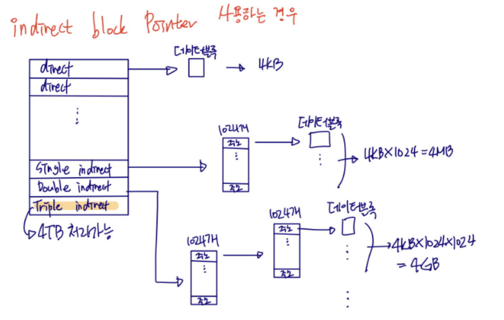
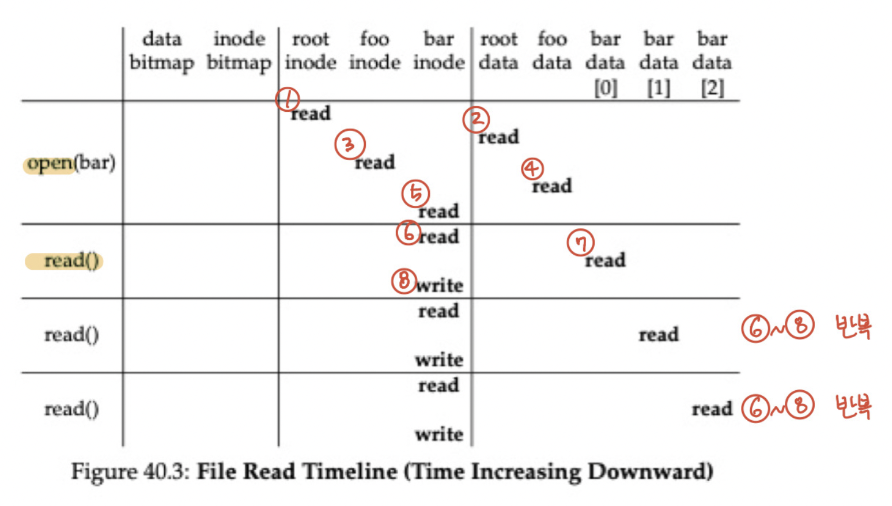
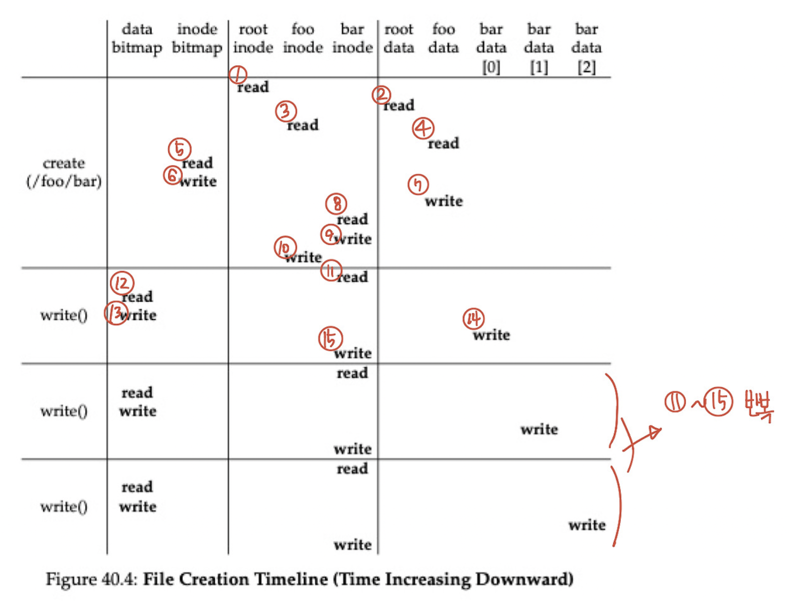
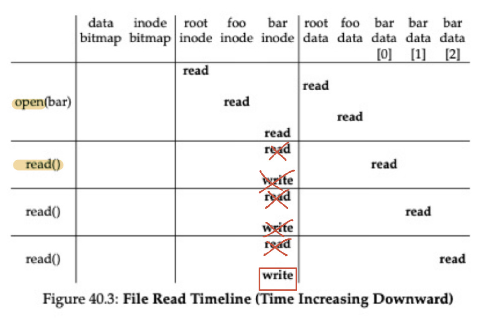

# Inode에 대해서 설명해주세요.

## Inode 필드

inode는 index node의 줄임말로 파일의 메타데이터 정보를 가지고 있다.  메타데이터의 크기는 256Byte 정도이며 내부에 있는 데이터 내용은 아래와 같다.

대략적으로 요약을 하면 파일의 크기, 파일의 소유자, 생성, 변경, 조회 시간, link count, disk내의 위치 정보 등을 담고 있다.

여기서 중요한 정보는 DISK와의 매핑을 가리키는 block 메타 데이터이며 4byte 당 1개의 디스크 블록을 가리킨다는 특징이 있다. 따라서 60byte로는 최대 60KB 크기의 파일만을 처리할 수 있다는 단점이 있다.

따라서, 이전에 Page Table Entry 같은 곳에서 Multi-Level로 관리를 했던 것과 유사한 방식으로 파일 블록에 대해서 Multi-Level로 관리를 한다. 이 때 다음을 가리키는 데이터 블록의 크기는 4KB이므로 Multi-Level의 깊이가 1개가 늘어나면 이전보다 1024배 추가적인 데이터를 가질 수 있다.

만약 Single Indirect라면 4MB 크기의 파일, Double Indirect라면 4GB 이런 식으로 말이다. 아래의 이미지를 보면 이해할 수 있다.

하지만 위의 문제점은 4KB보다 작은 파일의 경우에는 내부 단편화로 인해 메모리 낭비가 될 수 있다. 매우 작은 크기의 파일이 굉장히 많은 경우 4KB 단위로 파일 시스템을 구성하게 됐을 때 생길 문제를 해결하기 위해 파일 시스템에서 블록의 크기를 512Byte와 4KB를 혼용해서 사용한다.

## Inode를 통해 파일에 접근하는 방법

/foo/bar라는 12KB짜리 파일을 읽은 뒤 닫는 작업을 하면 파일 시스템에서 다음과 같은 일이 일어난다.

위의 과정은 아래와 같이 설명할 수 있다.

1-5. root 디렉토리의 inode로 가서 /foo/bar에 대한 경로를 알아낸다. 이 때 root 디렉토리는 파일 시스템이 올라가는 시점에 고정적으로 inode 2번에 할당된다.

- 이 정보를 통해 foo라는 디렉터리(파일)의 이름, inode 쌍을 찾고, foo 디렉터리의 inode에서 bar이라는 이름 inode 쌍을 찾는 행위를 반복한다. (inode는 이름과 inode 번호로 저장) 폴더의 깊이가 깊어질수록 다음 위치를 찾기 위해 이 과정이 더 반복되어야 한다.

6-7. bar라는 파일에 접근하게 되면 1번 질문에 있었던 block 데이터를 읽어서 bar의 첫 번째 4KB만큼의 정보를 디스크에 찾아가 읽어온다.

1. 데이터를 읽었던 내용을 기록하기 위해 1번 질문에 있었던 time 데이터를 갱신한다.

이후 12KB의 데이터를 읽어야하므로 6-7번의 과정이 총 3번 반복된다.

------

이제 새로운 파일을 써서 12KB 크기의 /foo/bar 파일을 만들기 위해서 접근하는 경우를 생각해보자.

1. 쓰기를 할 때에는 새로운 디스크 블록을 할당할 수 있기 때문에 data bitmap이 업데이트된다.
2. root inode를 읽어 foo폴더를 찾고 foo 폴더에서 bar라는 게 새로 생김을 표현해야 한다.
3. 마지막으로 실제 디스크에 데이터를 쓰고 있음을 알려야 하므로 data bitmap도 읽고 쓰여야 한다.

해당 과정을 이미지로 표현하면 아래와 같다.

1-4. root 디렉토리의 inode로 가서 foo의 inode에 대한 정보를 알아낸다. 이 때 root 디렉토리는 파일 시스템이 올라가는 시점에 고정적으로 inode 2번에 할당된다.

- 이 정보를 통해 foo라는 디렉터리(파일)의 이름, inode 쌍을 찾고, foo 디렉터리의 inode로 찾아간다.

5-10. 이전에는 있는 bar라는 파일을 읽어야 했지만 이젠 없는 데이터를 써야하므로 저장할 수 있는 inode를 찾고 사용 중임을 inode와 inode bitmap 모두에 표시한다.

또한, foo의 inode에 bar라는 파일이 있음을 표시해준다.

11-15. bar의 inode에 접근하여 사용하고 data bitmap 중 사용 가능한 곳을 찾아 해당 영역에 접근해 데이터를 쓰고 bar에 해당 디스크 위치 포인터를 저장한다.

해당 과정을 12KB만큼 쓰일 때까지 반복한다.

------

위의 과정을 보면 비효율적인 부분이 있다. 우선 읽기 부분에선 bar의 inode 정보를 계속 접근하고 파일이 변경됨을 써야한다. 그런데 실제로 bar data는 디스크 상에서 가까운 거리일 확률이 높고 페이지 단위로 읽어오는 특성상 공간 지역성을 활용하기 좋은 구조이다. 또한 bar inode를 읽었음은 마지막 bar data를 읽었을 때만 작성하면 된다.

따라서 캐시를 적용하면 아래와 같이 bar 파일의 inode에 대해 접근하고 마지막data를 읽었을 때만 읽었음을 표시하면 되므로 아래와 같이 변경할 수 있다.

이제 새로운 bar라는 파일을 작성할 때에서도 단점이 bar inode를 반복해서 읽어오고 data bitmap에 대해서도 계속 접근을 해야 하는 문제가 있다. 위의 과정에서 이제 data bitmap을 쓰는 과정이 마지막 디스크 블록에 쓸 때 작성한다는 내용만 추가됨을 아래의 이미지를 통해 확인할 수 있다.

