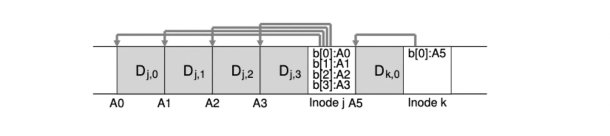

# Log Structed File System

Log structed file system은 데이터와 메타 데이터가 로그라고 하는 순환 버퍼에 순차적으로 기록되는 파일 시스템을 말한다.

LFS는 디스크에 데이터를 쓸 때 모든 업데이트를 메모리의 세그머트에 버퍼링한다. 그리고 이게 가득차면 한번에 업데이트한다. 그리고 값을 쓸 때 덮어쓰는 것이 아니라 항상 새로운 위치에 데이터를 쓰고 세그먼트 크기 때문에 디스크를 효율적으로 사용하게 되어 성능이 좋아진다.

### Write 연산

디스크 블록을 쓸 때 데이터 뿐 아니라 inode 같은 메타 데이터도 연속적으로 쓰게 된다. 이를 통해 업데이트할 때 seek time, rotate time이 필요하지 않게 된다. 하지만 순차적으로 쓰더라도 중간에 텀이 있다면 rotate time이 발생한다. 이를 좀 더 효율적으로 처리하기 위해서 세그먼트 단위로 버퍼링하고 가득차면 한번에 쓰기를 한다.

## inode를 찾는 방법

Log structed file system에서는 순차적으로 저장되기 때문에 inode가 세그먼트에 흩어져 있다. LFS에서는 흩어진 inode를 찾기 위해서 inode map을 사용한다.

### inode map

- inode map은 inode 번호를 입력받아서 최신 inode 디스크 주소를 생성한다.
- inode map은 inode가 쓰여지는 바로 옆에 저장된다.

inode map이 inode 옆에 쓰여지기 때문에 inode map도 마찬가지로 흩어진다. 때문에 이를 효율적으로 찾아야 하는데 여기에 Checkpoint Region이 사용된다.

### Checkpoint Region(CR)

inode map을 효율적으로 찾기 위해 디스크의 특정 부분에 checkpoint region(CR)이라는 inode map을 찾기 위한 데이터가 저장된다.
CR은 30초마다 주기적으로 업데이트되기 때문에 성능에 큰 영향을 주지 않는다.

## Directories

LFS에서 디렉토리 구조는 유닉스 파일 시스템과 동일하다. 디렉토리 자신에 포함된 파일의 inode가 저장되게 된다. 파일을 수정하게 되면 데이터블록, inode, inode map을 함께 만든다. 데이터가 업데이트되면 새로운 위치에 값을 쓰게 되는데 inode map을 활용하여 inode의 위치가 변경되더라도 디렉토리 자체는 변경되지 않도록 한다. 디렉토리는 이름-inode number(foo, k)를 쌍을 그대로 가지고 inode map만 업데이트 한다.

## Garbage Collection

위와 같이 파일에 갱신이 생긴 경우를 생각해보자.

이 경우 inode에 새로운 블록의 주소만 추가하고 기존 블록의 주소를 유지할 수 있다. 파일을 복원하거나 버전을 추적할 때 사용할 수 있을 것이다. 하지만 디스크의 공간은 한정적이고 버전을 유지하면 디스크 낭비가 발생할 수 있다. 때문에 기존 버전을 제거해줄 필요가 있고 이 작업을 Garbage Collection이라고 한다.

### LFS Cleaner

주기적으로 segment를 읽고 어떤 블록이 있는지 확인하고 유효한 블록들로 새로운 segment를 만들고 이전 segment를 제거한다.

**유효 블록 판단**

LFS에서는 segment헤더 블록에 존재하는 inode 번호와 offset를 함께 넣어둔다. 이를 통해서 블록이 유효한지 판단하게 된다.
ex) A0: (k, 0)

**Cleaner 동작**

Cleaner주기는 일정 시간마다 하거나 디스크가 가득차면 수행하면 된다. 어떤 블록을 정리할지가 문제인데 이를 위해서 segment를 hot, cold segment로 나눈다.

- hot segment는 데이터가 자주 덮어쓰이는 segment이다. 때문에 많은 블록을 모아서 한번에 처리하는 게 좋다.
- cold segment는 필요없는 게 있을 수 있지만 segment 자체에 영향을 주지 않는 segment이다.

## Crash Recovery

- checkpoint region 충돌
  - checkpoint region 업데이트를 원자적으로 수행하기 위해 디스크 양쪽에 checkpoint를 하나씩 유지하고 교대로 기록한다. (checkpoint가 2개)
  - 업데이트를 할 때 헤더, checkpoint region, 마지막 블록을 바꾸게 되는데 헤더와 마지막 블록에 시간을 넣게 된다.
  - 만약 충돌이 발생할 경우 헤더와 마지막 블록 시간을 확인하고 일치하지 않으면 다시 쓴다.
- segment 충돌
  - LFS에서 checkpoint region은 30초 주기로 업데이트되기 때문에 segment만 쓰고 checkpoint region은 업데이트되지 못하고 다운될 수 있다.
  - 재부팅 시 업데이트가 안된 checkout region정보로 복구하면 마지막 segment가 손실된다.
  - checkpoint region에서 시작하여 log의 끝을 찾아서 다음 segment를 읽고 업데이트가 존재하는지 확인하고 필요하면 이를 수정해준다.

### 참고자료

- https://icksw.tistory.com/208